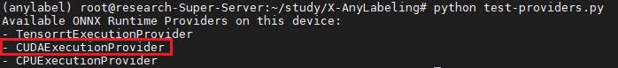
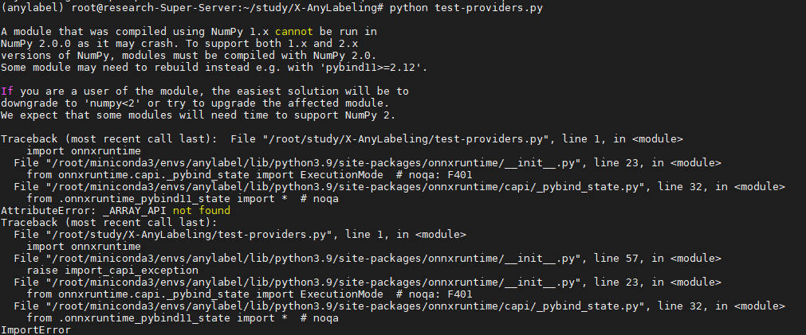
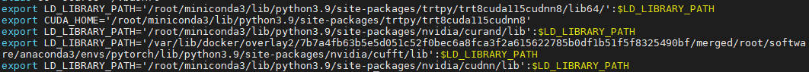
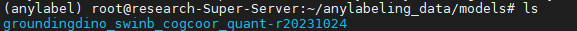
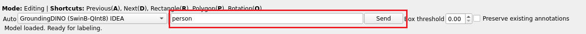
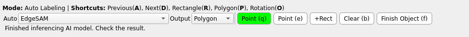

## 一、环境安装

**必须使用mobaXterm的终端运行，防止一些不必要的麻烦。且只能在宿主机中运行, 不能在容器中运行**

**[链接](https://pan.baidu.com/s/1NMrTg2xF2CZK9aCNi--2_A)：  提取码：xmbw**

创建一个虚拟的conda环境

下载源码[github官方地址](https://github.com/CVHub520/X-AnyLabeling)，进入到源码中：

```bash
pip install -r requirements-gpu-dev.txt
```

创建test-providers.py文件测试onnxruntime-gpu是否好用：

```python
import onnxruntime

def list_available_providers():
    # List the available providers in the current ONNX Runtime installation
    providers = onnxruntime.get_available_providers()
    print("Available ONNX Runtime Providers on this device:")
    for provider in providers:
        print(f"- {provider}")

if __name__ == "__main__":
    list_available_providers()
```

如果出现如下，则为好用：



如果出现如下报错，显示numpy版本不匹配：



那么解决方式如下：

```bash
pip install onnxruntime-gpu==1.11.0
pip install numpy==1.25.0
```

再次运行test-providers.py验证是否可出现CUDAExcutionProvider


验证成功后，更改源码文件下的anylabeling/app_info.py将设备由CPU改为GPU


在mobaxterm中运行

```bash
python anylabeling/app.py
```

如果出现以下报错，Qt启动失败：


则安装一些缺少的包：

```bash
sudo apt install libxcb-*
```


再次执行：

```bash
python anylabeling/app.py
```

如果出现以下报错，找不到libcublasLt等等一些包：


则安装torch，torch会自动安装这一些包，但是需要自己添加到环境变量搜索路径中。find一下无法找到的包的名字，看它在哪个路径下，然后将这些包的路径加入到系统环境变量文件~/.bashrc中



## 二. 开始标注

再次执行：

```bash
python anylabeling/app.py
```

弹出标注窗口后，选择AI，选择model，然后会自动下载模型权重


由于模型权重比较大，需要手动下载后再拷贝到服务器中。手动下载地址可以到[github官方地址](https://github.com/CVHub520/X-AnyLabeling) 中找[model zoo](https://github.com/CVHub520/X-AnyLabeling/blob/main/docs/en/model_zoo.md)，然后选择百度网盘的下载链接下载。


X-AnyLabeling默认的模型权重存储路径在用户根目录下，所以将已下载的模型权重放入根目录下的对应目录即可：




开始标注：

使用groundingdino多模态模型可以实现，输入关键词，自动标注



使用sam模型，需要增加promt点，在画面上点一下，确认后才可以标注。Point(q)代表需要被包含的点，Point(e)代表需要排除的点，+Rect可以将目标用一个粗略的框框起来，然后模型会自动在框内做一个精确的标注。



更多用法参考github官方文档


