## 一. 安装

```bash
# 创建环境
conda create -n label-studio python=3.9
conda activate label-studio
# 设置pip源
pip config set global.index-url https://pypi.tuna.tsinghua.edu.cn/simple
# 安装
pip install label-studio -U
```

## 二. 设置

### 1. 设置系统环境变量

```bash
# 如果不设置该, 在导入图片时最大upload数为100
DATA_UPLOAD_MAX_NUMBER_FILES=10000000
# 设置使用本地数据作为源
LABEL_STUDIO_LOCAL_FILES_SERVING_ENABLED=true
# 设置本地存储的数据集的根目录
LABEL_STUDIO_LOCAL_FILES_DOCUMENT_ROOT=E:\datasets
```

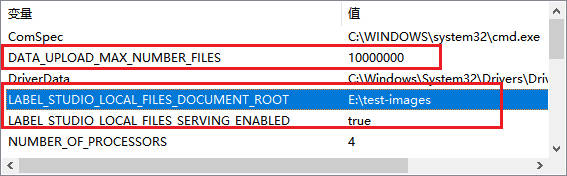

### 3. 启动

注意设置完环境变量后要重新打开cmd, 否则环境变量不生效

```bash
label-studio
```

## 4. 创建账户

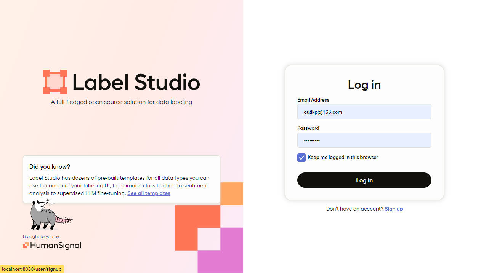

## 5. 创建工程并设置模板以及标签

创建工程:


选择模板:

标注HBB选择Object Detection with Bounding Boxes; 

标注OBB选择Semantic Segmentation with Polygans

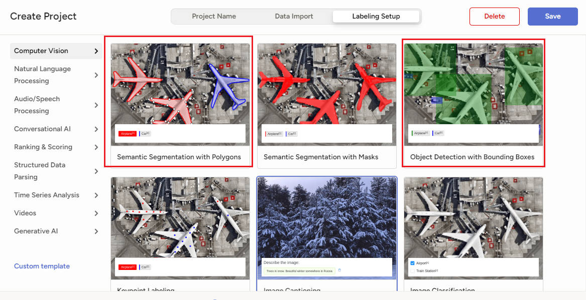

设置标签


### 6. 设置图片来源

进入工程---->settings---->cloud storage---->Add Source Storage/Add Target Storage

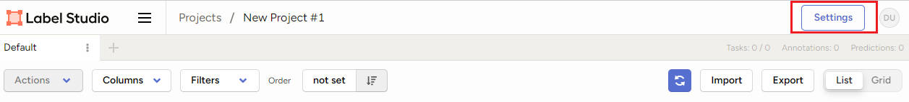


配置如下:


## 三. 开始标注

### 1. 正常标注

点击Label All Tasks

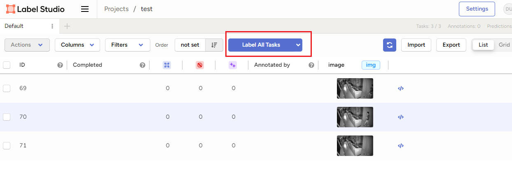

点击某一标签即可标注该框:

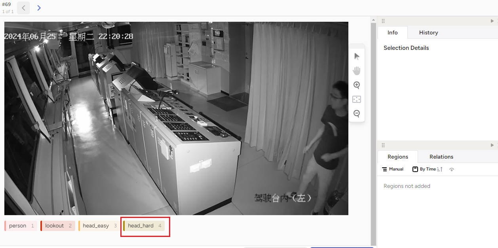

点击submit对本次标注进行确认

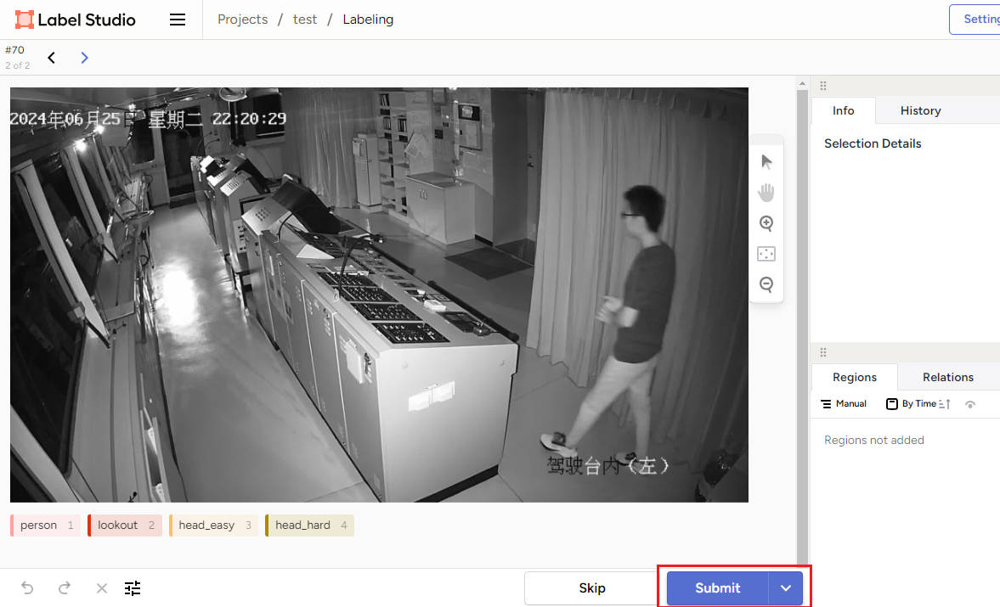

### 2. 修改标注

删除或者修改一个标注框:

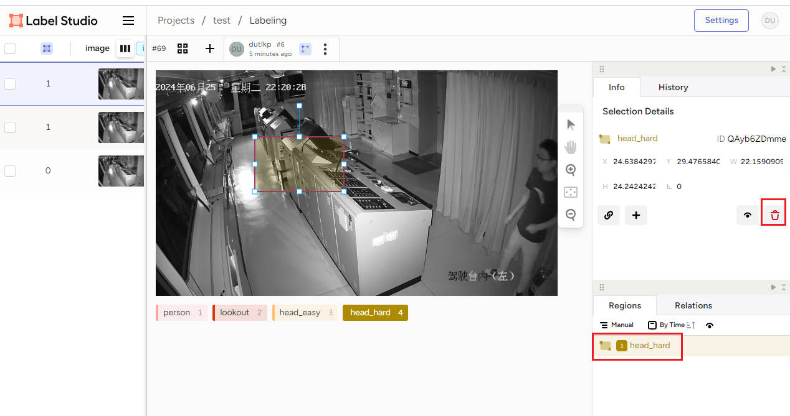

### 3. 导出标注


## 四. 查看标注

## 1. 查看原本在label-studio上的标注

通过过滤器过滤

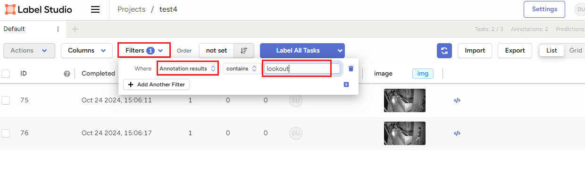

### 2. 在label-studio上查看使用labelImg的标注

[参考链接](https://github.com/HumanSignal/label-studio-converter?tab=readme-ov-file#tutorial-importing-yolo-pre-annotated-images-to-label-studio-using-local-storage)

* 安装label-studio-converter

  ```bash
  pip install -U label-studio-converter
  ```

  将使用labelImg标注好的图片以及文件放置在环境变量(LABEL_STUDIO_LOCAL_FILES_DOCUMENT_ROOT=E:\datasets)的根目录下, 结构如下

  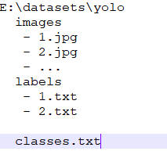


* 执行命令

  ```bash
  label-studio-converter import yolo -i E:\datasets\yolo -o E:\datasets\yolo\ls-tasks.json --image-root-url "/data/local-files/?d=yolo/images"
  ```

  image-root-url = absolute local path for images  -  LABEL_STUDIO_LOCAL_FILES_DOCUMENT_ROOT

  比如本例子: image-root-url = yolo/images =  E:\datasets\yolo\images  -  E:\datasets

* 将ls-tasks.json导入label-studio

  打开label-studio---->创建工程---->设置模板----> 添加标签----> 点击import---->上传ls-tasks.json即可看到原labelImg的标注

  

  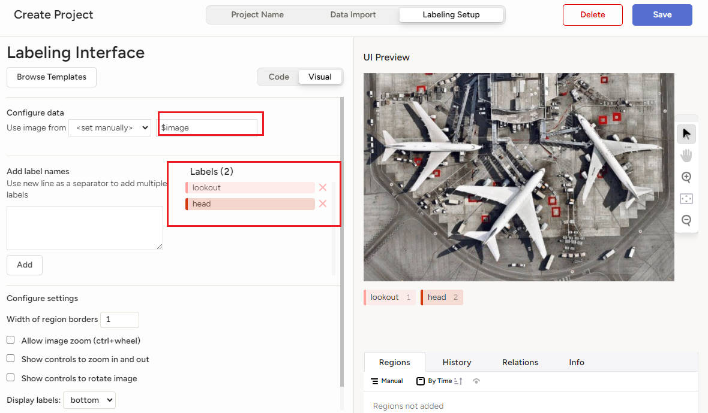

  

  

  ## 五. 一些快捷键

  ctrl+鼠标滚轮: 图片放大缩小

  ​

  ​

  ​

  ​


