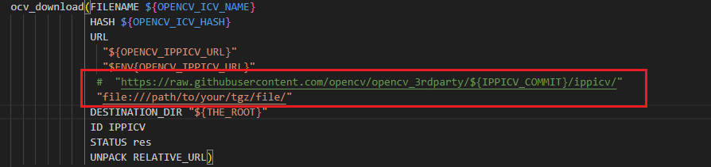

## 编译安装OpenCV

```bash
	可以直接使用本仓库中release的opencv4.2, 支持对视频的处理。将opencv4.2拷贝到目标机器后, 使用ldd查看lib中的库是否都可正常链接到
```

        安装cmake:  apt-get install cmake

        安装依赖: apt-get install build-essential libgtk2.0-dev libjpeg.dev libtiff5.dev libswscale-dev
        使用ffmpeg做后端: sudo apt-get install ffmpeg
        使用gstreamer做后端: sudo apt-get install libgstreamer1.0-dev libgstreamer-plugins-base1.0-dev gstreamer1.0-libav gstreamer1.0-plugins-bad gstreamer1.0-plugins-good gstreamer1.0-plugins-ugly
    
        下载OpenCV4.6.0: 链接：https://pan.baidu.com/s/1OuFZNub5VGMsoF8oOSNxjQ  提取码：5tgz
    
        解压进入opencv4.6.0文件夹,创建build文件夹, 进入build文件夹, 执行cmake, 执行make, 执行make install
    
        如果想将编译后头文件和库文件安装到指定目录, 在cmake编译时需要指定-DCMAKE_INSTALL_PREFIX=/path/to/custom/folder, 然后编译结束后make install就可以安装在指定目录中了
        使用ffmpeg做后端: -D WITH_FFMPEG=ON
        使用gstreamer做后端需指定参数-D WITH_GSTREAMER=ON
    
        下载IPPICV过慢问题解决方法: 手动下载压缩包: https://gitee.com/c1h2/ippicv_2020_lnx_intel64_20191018_general/blob/master/ippicv_2020_lnx_intel64_20191018_general.tgz
        修改opencv-x.x/3rdparty/ippicv/ippicv.cmake文件, 修改方式如下:



```bash
如果出现以下错误:By not providing "FindOpenCV.cmake" in CMAKE_MODULE_PATH this project has
asked CMake to find a package configuration file provided by "OpenCV", but
CMake did not find one.
 则需要在CMakeLists.txt中增加一行"set(OpenCV_DIR /path/to/opencv-4.6.0)", 指定opencv源码的根目录

    在/etc/ld.so.conf.d下创建文件OpenCV.conf, 写入"/usr/local/lib", 保存退出执行sudo ldconfig, 使opencv的动态库可以被系统链接到

    编写main.cpp, 验证opencv是否好用
```


