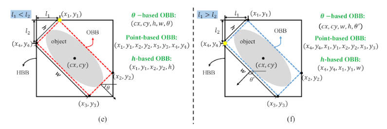

## yolov8-converter

[yolov8-obb文档](https://docs.ultralytics.com/datasets/obb/#can-i-use-my-own-dataset-with-oriented-bounding-boxes-for-yolov8-training-and-if-so-how)

OBB标注主要有以下三种方式, YOLOv8采用的是Point-based OBB的标注方法。

yolov8中训练用的标注数据(Point-based OBB)需要标注好满足旋转框的四个顶点坐标即可, 也就是class x1 y1 x2 y2 x3 y3 x4 y4。

四个顶点坐标放置的顺序需保持一致, 也就是要么都是顺时针, 要么都是逆时针。

起始点的选取最好遵循以下规则(非必要):

(1) 对于 e) 如果 L1 < L2，则表明当一侧 L1比另一侧L2短时，我们遵循特定顺序（从左上角顺时针方向）

(2) 对于 f) 如果 L1 > L2，当先前较短的边 (L1) 变得比另一边 (L2) 长时，这会重新排序起点，确保annotations与bounding box的方向保持一致

但是标注数据一般为语义分割的polygans点集, 因此yolov8-converter.py脚本实现了将语义分割的polygans点集转换为该训练代码需求的格式

