# 一. 卷积参数理解

1. in_channels：输入通道数，卷积核的深度

   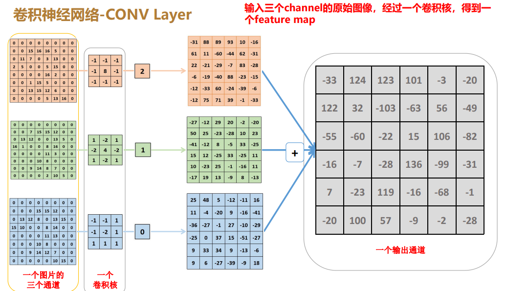

2. out_channels：输出通道数，卷积核的个数

   

3. kernel_size：卷积核大小，一般为1x1、3x3，感受野的大小

   感受野：感知范围的大小

4. stride：步长，为1不做下采样，为2做下采样

   

5. padding：是否填充，一般步长为1，需要填充以保证卷积前后图像尺寸大小不变

   

# 二. 空间金字塔池化SPP

以5x5、9x9、13x13大小的核&padding&步长为1，做最大池化（从而保证池化前后特征图大小不变），再与不做池化的原图一起做concat，再接卷积。

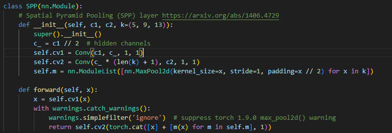

# 三. 标准化与归一化

为什么需要标准化、归一化？

特征的单位或者大小相差较大，或者某特征的方差相比其他的特征要大出几个数量级，

容易影响（支配）目标结果，使得一些算法无法学习到其它的特征。比如描述一个人：身高（1.72m）、体重（70kg）,很明显体重的变化影响支配了对这个人的描述。

1、归一化（值域[0, 1]）

2、标准化（值域(-无穷，+无穷)）

把数据变换到均值为0,标准差为1范围内

为什么有归一化，还要标准化？

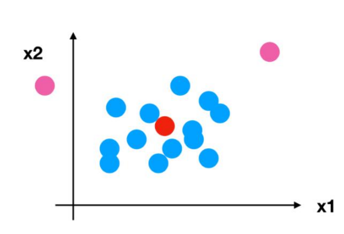

# 四. BN、LN、IN、GN

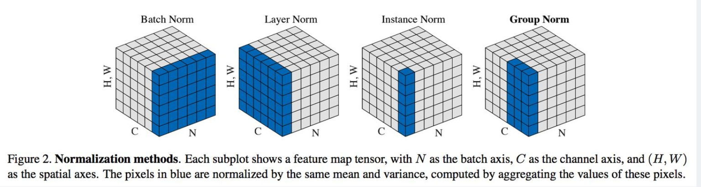

 1.BN是在batch上，对N、H、W做归一化，而保留通道 C 的维度。BN适用于固定深度的前向神经网络，如CNN，不适用于RNN；

 
​    2.LN在通道方向上，对C、H、W归一化，主要对RNN效果明显；
 3.IN在图像像素上，对H、W做归一化，用在风格化迁移；
 4.GN将Channel分组，然后再做归一化。
 上图中，每个子图表示一个特征图，其中N为批量，C为通道，（H，W）为特征图的高度和宽度。通过蓝色部分的值来计算均值和方差，从而进行归一化。
 比喻成一摞书，这摞书总共有 N 本，每本有 C 页，每页有 H 行，每行 有W 个字符：

 1.BN 求均值时，相当于把这些书按页码一一对应地加起来（例如第1本书第36页，第2本书第36页…），再除以每个页码下的字符总数：N×H×W，因此可以把 BN 看成求“平均书”的操作（注意这个“平均书”每页只有一个字），求标准差时也是同理。
 2.LN 求均值时，相当于把每一本书的所有字加起来，再除以这本书的字符总数：C×H×W，即求整本书的“平均字”，求标准差时也是同理。
 3.IN 求均值时，相当于把一页书中所有字加起来，再除以该页的总字数：H×W，即求每页书的“平均字”，求标准差时也是同理。
 4.GN 相当于把一本 C 页的书平均分成 G 份，每份成为有 C/G 页的小册子，求每个小册子的“平均字”和字的“标准差”。

# 五. 激活函数

1、sigmoid

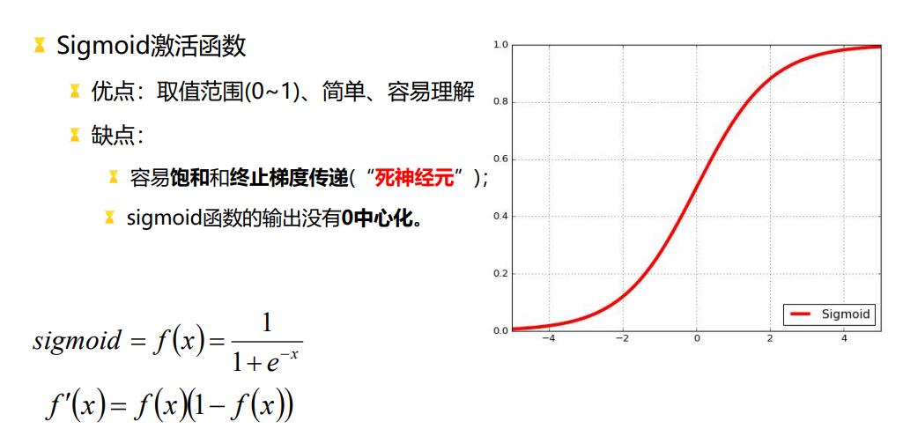

2、ReLU

3、Leaky ReLU

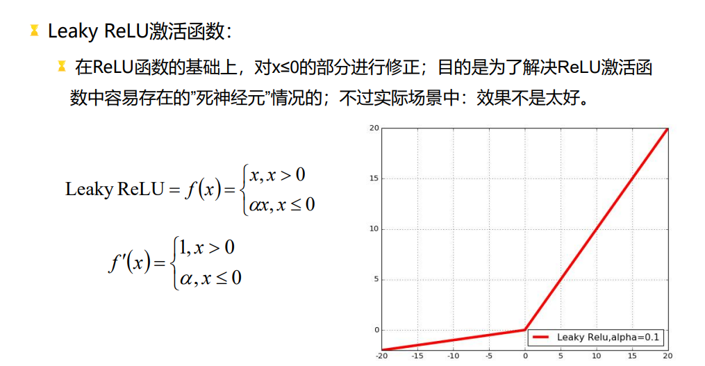

# 六. 前处理letterbox:自适应图片缩放

如何将一个任意尺寸大小的图像缩放到640*640?

将原图长边缩放到640,短边等比例缩放,然后短边再pad到640

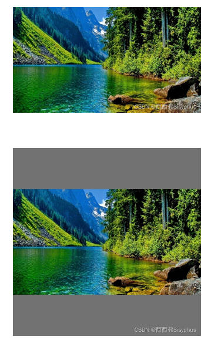

# 七. Anchor Box(锚框)

为降低模型学习的难度,从原来版本的直接预测框的绝对尺寸变为预测相对于Anchor Box(锚框)的偏移值.例如,假如一个ground truth(真实框)是80*120,原来是直接预测80*120,然后做损失,现在是预测80相对于59的偏移值,120相对于120的偏移值.

# 八. YOLOv5网络结构

# 九. YOLOv5思想

统一检测思想：

1. 将输入图像划分为S*S个grid cell(网格单元)；如果一个object物体的中心是位于
  这个grid cell内，那么这个grid cell就负责检测这个物体；
2. 每一个grid cell需要预测B个bounding boxes坐标信息(x,y,w,h)以及这些
  bounding boxes的置信度confidence。
3. 每个grid cell还需要预测C个类别的概率(conditional class probability)，
  以判断当前cell属于哪个类别C。
4. 每个grid cell的class信息和每个bounding box预测的confidence信息相乘，
  就可以得到每个bounding box的class-specific confidence score。

# 十、后处理NMS

流程：

step1: 根据置信度得分进行排序 

step2: 选择置信度最高的边界框添加到最终输出列表中，将其从边界框列表中删除

step3: 计算所有边界框的面积

step4: 计算置信度最高的边界框与其它候选框的IoU。

step5: 删除IoU大于阈值的边界框

重复上述过程，直至边界框列表为空。

# 十一、评估方法

## 1、accuracy、precision、recall、F1

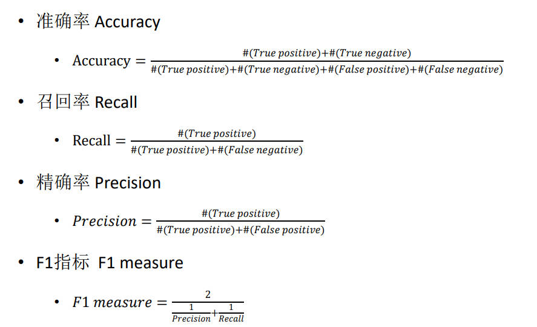

为什么准确率不能作为分类模型的评估指标？

一个1W的样本，吸毒人员只有100人，如果有一个模型，不管是什么输入，它都预测所有的人都不吸毒，那么准确率也有99%，但是这并不是一个有效的模型。

准确率：（实际不吸毒且预测不吸毒+实际吸毒且预测吸毒）/ 总样本

召回率：（实际吸毒且预测吸毒）/（所有实际吸毒） ---> 反应的是模型的漏检情况

精准率：（实际吸毒且预测吸毒）/（所有预测吸毒） ---> 反应的是模型的误检情况

F1：精准率和召回率的调和平均数 ---> 反应的是模型的综合能力

## 2、PR曲线

在根据测试集数据评估模型时，得到各特征线性组合后的置信度得分，当确定某阈值后，若得分小于阈值则判为负类，否则为正类，计算出此时的Precision和Recall结果并保存。将阈值从大往小调整得到不同阈值下的Precision和Recall，然后以Recall为横坐标，Precision为纵坐标绘制出P-R曲线图。如果检测器的Precision随着Recall的提升而保持较高，也就是说当改变阈值，Precision和Recall仍然很高，则表示性能较优

## 3、AP与mAP

PS:为了得到TP和FP，需要用到IOU，以判断检测结果正确还是错误，一般以0.5作为IOU的阈值。

如果IOU>0.5，认为检测结果为TP，

否则为FP。

可以直接将漏检的物体数目当做FN，

TN即实际是背景也检测为背景（未用到）。

AP流程：

假设已按照要求将低置信度的bounding box剔除（例如置信度小于0.2的bounding box全部认为是背景）

step1：按照模型预测的置信度将bounding box降序排序

step2：选取第一个置信度作为标准

step3：计算当前标准下所有图片的precision值和recall值（precision=TP/(TP+FP)，recall=TP/(TP+FN))，一般ground truth和bounding box的IoU大于0.5认为是TP)

step4：选取第二个置信度作为标准，重复step3

step5：将计算所得到的所有precision和recall值以recall值为横坐标，precision值为纵坐标画折线图并将(0,0)和(1,0)两点加入到首位两端

step6：从左到右以当前点向左侧作垂线，与前一个点与x轴的垂线围成一个个的矩形

step7：将step6所有的矩形面积求和即为AP值

AP只针对一个类别，mAP为所有类别的AP值求平均

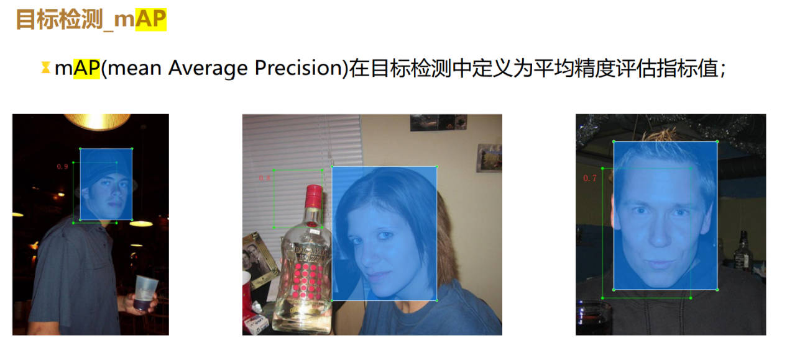

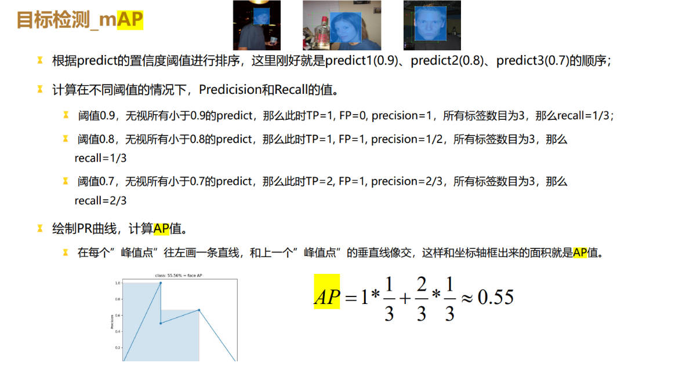

# 十二. 损失函数

YOLOv5损失函数:[知乎链接](https://zhuanlan.zhihu.com/p/458597638)

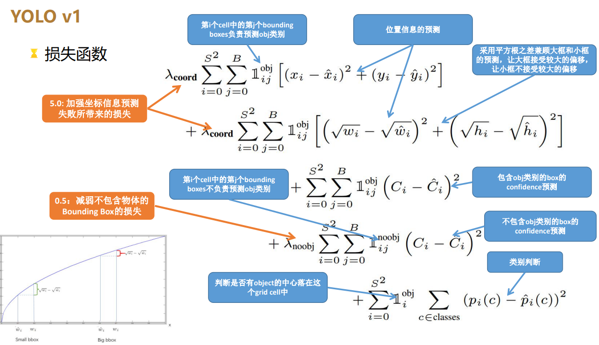