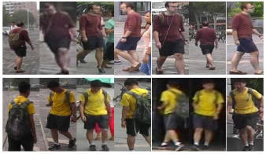

# 一. ReID问题

从图像库中找到要检索的行人图片

# 二. ReID评估指标

## 1. Rank-1

表示在候选库中得到与检索目标相似度排名最高的图片为目标行人的概率。

## 2. **mAP**

假如从检索得分最高的K个中计算:

precision: 正确被检测的(TP)占所有实际被检测(TP+FP)的比例

precision = 查询返回的正确个数 / 返回的总个数 

recall: 正确被检测的(TP)占所有应该被检测(TP+FN)的比例
recall = 查询返回的正确个数 / 该查询对象在gallery中的总个数

AP为PR曲线的下面积; mAP为AP求平均

## 3. CMC

Rank-K的集合

例如CMC(10)=[Rank-1, Rank-2, Rank-3, Rank-4......Rank-10]