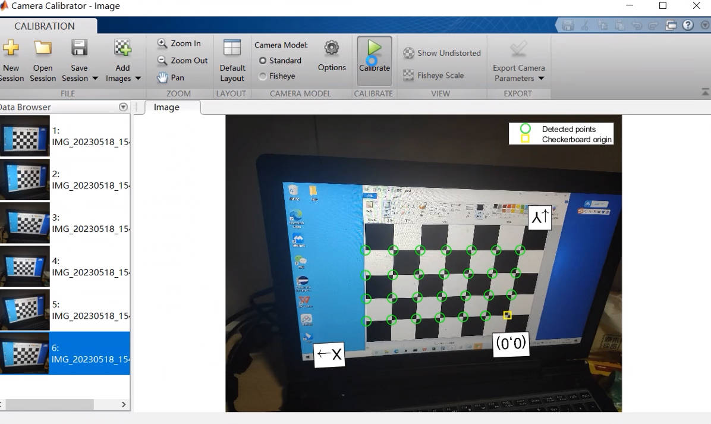

# (I) 相机模型

参考: https://blog.csdn.net/ajaccio8899/article/details/129945072

实际真实相机模型, 相机为透镜, 具有聚焦的功能, 也就是会把被摄物体的点发射的所有光线, 聚焦到成像平面的一个点上:

小孔相机模型, 简化相机透镜为小孔, 且假设成像平面就在焦距上, 简化版的真实相机模型:

## 一. 四个坐标系

1. 世界坐标系, 三维, 自定义选取世界中的坐标原点、XYZ轴, 符合右手原则。单位是米。
2. 相机坐标系，三维，以相机光心为原点，水平向右为X轴，垂直向上为Y轴，视线向前为Z轴的负方向，符合右手规则。单位是米。
3. 视平面坐标系，二维，相机靶面（即成像平面）的对称面所在的平面，靶心为原点，X轴和Y轴与相机坐标系同向。单位是米。
4. 照片坐标系，二维，照片左上角为原点，水平向右为X轴，垂直向下为Y轴。单位是像素。

## 二. 四个坐标系之间的坐标转换

1. 世界坐标系到相机坐标系的转换

   原理: 矩阵的刚性变换

   下图中Xw, Yw, Zw是某一点在世界坐标系的坐标; Xc, Xc, Zc 是该点在相机坐标系的坐标

   

   写成齐次坐标:

   

2. 相机坐标系到视平面坐标系的转换

   原理:相似三角形

   下图中Xc, Yc, Zc是某一点在相机坐标系中的坐标; x, y是该点在视平面坐标系中的坐标

   

   3. 视平面坐标系到照片坐标系的转换

      原理: 视平面坐标系和照片坐标系都在成像平面上，只是各自的原点和度量单位不一样。视平面坐标系的原点为相机光轴与成像平面的交点，通常情况下是成像平面的中点或者叫principal point。视平面坐标系的单位是m，属于物理单位，而像素坐标系的单位是pixel，我们平常描述一个像素点都是几行几列。所以这二者之间的转换如下：其中dx和dy表示每一列和每一行分别代表多少米，即**1pixel=dx m**, 注意dx与dy是不一定相等的

      下图中u0, v0是某一点在视平面坐标系中的坐标; u, v是该点在照片坐标系中的坐标; dx, dy是在行与列方向上1个像素代表多少米

      

   ## 三. 相机内参与相机外参

   

   其中相机内参是一个相机的固有参数(通过标定获得), 相机外参需要自己计算

   ## 四. 畸变

   畸变分为径向畸变(最主要需要考虑的畸变)和切向畸变。

   所谓径向畸变是沿径向产生的畸变，它产生的原因是光线在远离透镜中心的地方偏折更大，表现为桶形畸变或枕形畸变。

   

   切向畸变产生的原因是透镜不完全平行于图像平面。

   畸变的矫正应该在**视平面坐标系**上完成：照片坐标系坐标转换为视平面坐标系坐标后，应用畸变矫正公式进行矫正，然后再转变为相机坐标系坐标；反之，在用相机坐标系坐标转换为视平面坐标系坐标后，应用上述矫正公式的逆过程进行畸变转换，然后再转变为照片坐标系坐标。

   

   其中x是畸变前的坐标值, x_corrected是畸变矫正后的坐标值, k1、k2、k3是系数, $r^{2} = x^{2} + y^{2}$(圆的半径公式)

   

   其中x是畸变前的坐标值, x_corrected是畸变矫正后的坐标值, p1、p2是系数, $r^{2} = x^{2} + y^{2}$(圆的半径公式)

   这样，我们就得到了相机的5个畸变参数：k1、k2、k3、p1、p2

   如果同时考虑两种畸变，则有：

   

   ​

   # (II) 相机标定

   张正友标定数学原理:<https://zhuanlan.zhihu.com/p/94244568>

   购买相机标定板, 拍摄棋盘格的图片 , 要求固定标定板的位置, 然后使用相机在各个位置和角度拍摄图片, 注意图片并不是越多越好, 20张以内效果最好

   打开Matlab, 输入cameraCalibrator----> 选择棋盘格图片----> 输入标定板中每个黑(白)单元格的面积 ----> 点击确定, 等待Matlab添加图片----> 点击options----> 勾选需要的参数(2阶径向畸变, 3阶径向畸变, 切向畸变, 偏度)----> 点击Calibrate开始标定----> 点击Export Camera Parameters, 选择workspace----> 返回到Matlab主界面即可查看相机参数

   

   

   * 如何验证标定参数是否准确?

     假如标定得到的内部参数为：fx=409、fy=408、u0=237、v0=171（单位为像素）。这些图像含536×356 个像素。从标定结果可以看出，主点确实非常靠近图像中心点，但仍相距几个像素。查看该相机的说明书，说明书中给出它的焦距为18mm, 它的传感器尺寸为 23.5 mm×15.7 mm，即像素宽度为 0.0438 mm(23.5/536)。计算得到实际焦距 17.8 mm(409*0.0438)，与实际使用的镜头一致。

   ​

