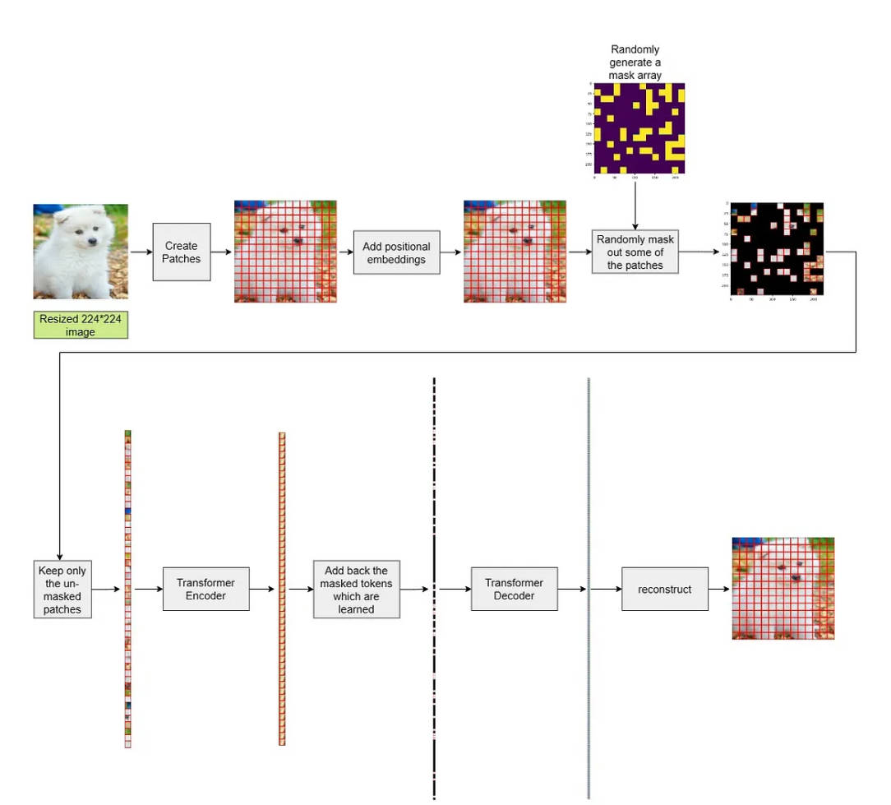

[参考链接](https://itnext.io/masked-autoencoders-are-scalable-vision-learners-122a75b54470)

任务目标：将图片mask住很多个像素块，通过模型重建整张图片

算法步骤：

1. 首先，我们从图像创建patches。在 NLP 训练中，每个patch都可以被视为一个单词。接下来，我们随机丢弃 75% 的patches。
2. 现在，对于编码器，我们只传递上一步中未丢弃的patches。因为我们没有处理所有patches，所以训练过程变得更快（如何将每个patch的图片变成固定长度的向量，这里的技巧是比如每个patch大小为16*16，那么对每个patch做一个卷积核大小也为16的卷积即可将每个patch的图片变成一个向量）
3. 请注意，进入编码器的unmasked patches不遵循任何顺序。我们在mask之前添加positional embedding，这样即使我们对输入patches进行任何排列，模型也始终了解有关patches的位置信息。
4. 一旦我们从transformer编码器中获得了unmasked patches的特征，我们就会为他添加回masked patches信息。我们以特殊方式添加回来的这些masked patches，它们被称为masked tokens。这些masked tokens是需要在训练期间学习的
5. 此外，我们重新排列patches，使其保持原始顺序。实际上，我们会跟踪原始图像中非mask pathes的索引，并将它们放在正确的位置，并用masked tokens填充其余的空位置。
6. 接下来，我们将它们传递给解码器。 Transformer 编码器是来自 ViT 的编码器。解码器的架构也没有改变。
7. 一旦我们有了解码器的输出，我们就根据相应的标记重建每个补丁(从Transformer得到的输出维度为[N, patch_size x patch_size, patch_w x patch_h x 3], reshape成[N, patch_size x patch_size, patch_w, patch_h , 3], 再reshape成[N, patch_size x patch_w,  patch_size x patch_h , 3]， 从而重建出原图)

