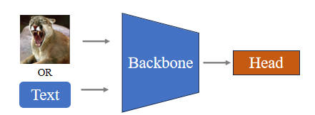
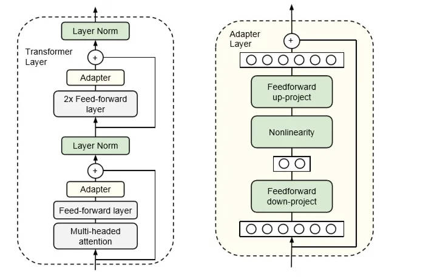
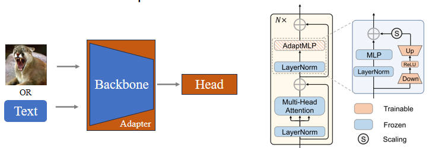

# 大模型微调方法

## 一. 线性探测

例如对于ViT来说, 只微调最后一个MLP分类层, 其他所有层的参数全部冻结。

缺点: 由于可学习的参数过少, 很有可能学不会(欠拟合)

## 二. 全量微调

例如对于ViT来说, 所有层的参数全部参与微调。

缺点: 由于可学习的参数过多, 模型过于复杂, 很有可能学习了过多的训练集特征(过拟合)

## 三. Adapter

目前大模型的架构基本都是基于transformer, 对于其中的transformer模块增加一些MLP层, 这样除了增加的层的参数是可学习的, 其他的参数都冻结

优点: 避免了学些参数过少或者过多的情况

缺点: 由于改变网络结构, 需要重写网络构建代码

