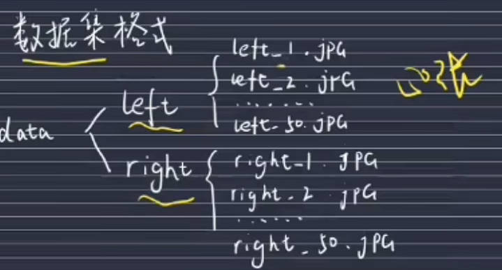
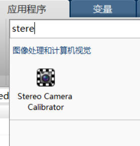
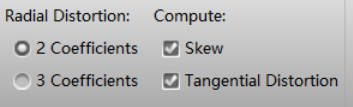
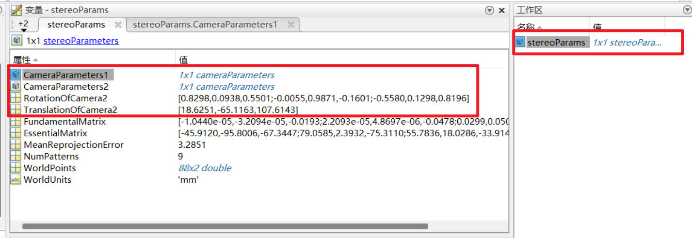
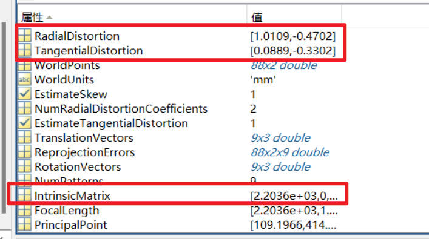
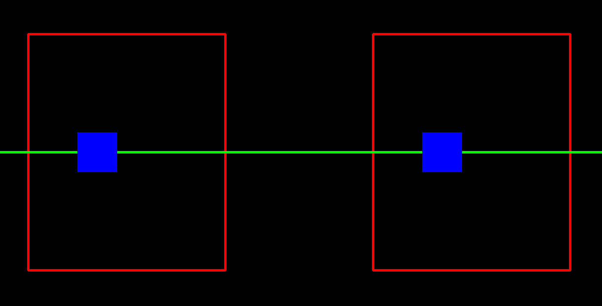

[medium讲解](https://medium.com/analytics-vidhya/distance-estimation-cf2f2fd709d8)

### 1. 相机模型

实际真实相机模型, 相机为透镜, 具有聚焦的功能, 也就是会把被摄物体的点发射的所有光线, 聚焦到成像平面的一个点上:

小孔相机模型, 简化相机透镜为小孔, 且假设成像平面就在焦距上, 简化版的真实相机模型:

由相似三角形我们可得:

同理, 对于相机坐标系下的一个三维点[X, Y, Z]投射到相机的成像平面上的二维点[x,y]应为:

写成其次坐标, 也就是:

### 2. 对极线与极点与基础矩阵

我们知道，沿着三维点 X 和相机中心点之间的连线，可在图像上找到对应的点 x;

对于三维点 X, 它在相机1的成像平面上的点为x, 那么根据x能否判断出X的位置呢? 不能, 因为在成像平面上的点x可能是Xx连线上的任意一点投影得到的;

点X对应于相机2中的成像平面上的点为X_proj(X'对应于X'_proj), 我们会发现, 无论X在Xx的直线上如何移动, 该点在相机2中的成像平面上的点始终在一条直线上, 我们称为对极线;

也就是说, 如果两个相机位姿固定, 那么根据相机1成像平面上中的一点想要求得该点在相机2成像平面上的位置, 需要在相机2成像平面上的一条直线上找, 我们称该直线为对极线(图中的l');

同时我们发现, 两个相机位姿固定时, 相机2成像平面中所有的对极线都会通过一点e'(在相机1中为e), 我们称该点为极点;这个点对应着一个相机中心点在另一个相机上的投影

图像上的点和它的对极线之间的关系，在数学上可以用下面的 3×3 矩阵表示：

上述公式中的 $l_1'$、$l_2'$ 、$l_3'$ 代表一条对极线, 在投影几何学中，可以用三维向量表示二维直线(一条对极线)。它就是一些二维点 (x', y') 的集合，满足公式 $l_1'x'+l_2'y'+l_3' = 0$（上标符号'表示这条线属于第二幅图像）。因此，矩阵 F（称为基础矩阵）的作用就是把一个视图上的二维图像点映射到另一个视图上的对极线上。

### 3. 双目深度估计的原理

一个立体视觉系统通常需要两台并排的相机，并且都对准同一个场景。下面是一个立体视觉系统的示意图，其中两台相机完全对齐。

在这种理想情况下，两台相机之间只有水平方向的平移，因此它们的所有对极线都是水平方向的。这意味着所有关联点的 y 坐标都是相同的，只需要在一维的线条上寻找匹配项即可。关联点 x 坐标的差值则取决于点的深度。无穷远处的点对应图像点的坐标相同，都是(x, y)，而它们离装置越近，x 坐标的差值就越大。这种现象可以在投影方程中反映出来。如果两台相机之间只有水平方向的平移，第二台（右侧）相机的投影方程就变为：

其中[X,Y,Z]为物体某一点在相机1的相机坐标系下的坐标, [x', y']为该点在相机2的图像坐标系下的坐标; B为两个相机之间的基线距离, f为相机的焦距(实际焦距/感光传感器单位长度的像素数)

为了简化，我们假定图像为正方形，两台相机的标定参数相同。这时计算差值 x-x'（注意要除以 s 以符合齐次坐标系），并分离出 z 坐标，可得到：$Z = \frac{f \times B}{d}$ , 其中 $d=x-x'$ , 也就是说d的最小值为1个像素, 因此知道了f和B, 可以算出该双目相机理论上最大能估计的深度距离(注意f是以像素为单位的焦距, 也就是实际焦距/1像素的物理长度)

这个x-x'就是视差。因此, 有了基线距离, 标定好相机内参, 计算出物体在两张图上的视差, 就可以计算出该物体距离相机的深度了

###4. 双目相机标定

1. 标定方法

   (1) 标定图片应不少于20张, 拍摄时, 需要同时拍摄左右相机中的棋盘格, 拍摄时注意要有意的做一些倾斜向下或者倾斜向上的棋盘格, 数据放置格式:

   

   (2) 应选用matlab中应用程序菜单中的Stereo Camera Calibrator应用程序, 将left images和right images添加到matlab中

   

   (3) 勾选Skew和Tangential Distortion选项, 点击Calibrate开始标定

   

   (4) 标定结束后查看误差图, 可以选择删除掉误差较大的图, 重新标定, 如果标定比较准确, 误差应该都在1像素以内

   

   (5) 回到工作区, 查看标定后的参数, 需要用到的参数如下:

   

   其中, 点进CameraParameters1和CameraParameters2中需要用到的参数如下:

   

2. 标定结果检查

   (1)检查内参矩阵3x3

   假如标定得到的内部参数为：fx=409、fy=408、u0=237、v0=171（单位为像素）。这些图像含536×356个像素。标定结果的Tx和Ty值应该在268和178左右。查看该相机的说明书，说明书中给出它的焦距为18mm, 它的传感器尺寸为 23.5 mm×15.7 mm，即像素宽度为 0.0438 mm(23.5/536)。计算得到实际焦距 17.8 mm(409*0.0438)，与实际使用的镜头一致。

   (2)检查畸变系数1x4

   畸变系数应为均趋近于0的很小的数

   (3)检查旋转矩阵3x3

   旋转矩阵应为对角线值趋近于1, 其余值趋近于0的3x3矩阵

   (4)平移矩阵1x3

   平移矩阵的第一个值为标定出的两个相机的基线距离(可用尺量一下与实际相差多少), 其余的值应趋近于0

### 5. SGBM算法参数解释

**cv2.StereoSGBM_create参数解释** 

(1) minDisparity: 两张图之间同一个block沿着对极线搜索时视差像素的最低值, 单位: 像素(偏移小于该像素的将不会被考虑), 需要大于0

下图中, 假设在搜索时, 将p_left点与p_right点匹配上了(真实世界中的同一物体), 如果d1-d2<, 也就是这两点的视差小于minDisparity, 那么该点将会被忽略

minDisparity控制的是深度估计的最大值, 该值越大, 能估计的最大深度越小

(2) numDisparities: 两张图之间同一个block沿着对极线搜索时视差像素的最大值, 单位: 像素(偏移大于该像素的将不会被考虑), 需要被16整除, 越大精度越好, 速度越慢

上图中, 假设在搜索时, 将p_left点与p_right点匹配上了(真实世界中的同一物体), 如果d1-d2>(minDisparity+numDisparities), 那么该点将会被忽略

numDisparities控制的是深度估计的最小值, 该值越小, 能估计的最小深度越大

(3) blockSize: 两张图之间匹配时block的大小, 奇数, 3...11之间

下图中蓝色方块的大小

(4) P1: 平滑系数, 增加P1使算法对视差变化的惩罚更大, 从而导致视差图更平滑, 相邻像素之间的视差跳跃更小, 推荐值8 * img_channels * blockSize * blockSize

(5) P2: 平滑系数, 控制相邻像素之间较大视差跳跃的惩罚; 增加P2意味着算法强烈阻止视差的突然变化, 强制实现更平滑的过渡, 尤其是跨对象边界, 推荐值32 * img_channels * blockSize * blockSize

(6) disp12MaxDiff: 左右视差检查（视差一致性检查）中允许的最大差异。负值会禁用检查; 通常，该参数确保左右图像生成的视差图彼此一致。典型值可能类似于 1 或 2

(7) preFilterCap: 用于预过滤图像的截断值。它在视差计算之前限制像素值以减少图像噪声的影响; 该值控制在视差计算之前如何剪切图像强度, 具体为计算x方向的梯度, x方向梯度超过[-preFilterCap, preFilterCap]区间的会被裁剪。通常，它设置得较高（例如 31 或 63), 目的是标准化输入图像的强度范围，以便极端的强度变化不会对立体匹配产生负面影响。立体算法通常依赖于图像区域的相似性，亮度或极端像素值的太大变化可能会混淆匹配过程

(8) uniquenessRatio: 为10意味着所选视差必须比下一个最佳候选视差好至少 10%。这有助于通过确保视差唯一性来减少噪音并提高准确性; 推荐值5-15

(9) speckleWindowSize: 为100意味着具有相似视差值且少于 100 个像素的区域将被视为噪声并被删除。这有助于减少随机的小视差伪影

(10) speckleRange: 如果一个区域内最大视差变化超过该值, 那么该区域被视为噪声, 会被去除。如果进行散斑过滤，将参数设置为正值，它将隐式乘以16。建议值1或2

(11) mode: sgbm算法选择模式，以速度由快到慢为：STEREO_SGBM_MODE_SGBM_3WAY、STEREO_SGBM_MODE_HH4、STEREO_SGBM_MODE_SGBM、STEREO_SGBM_MODE_HH。精度反之

​