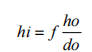
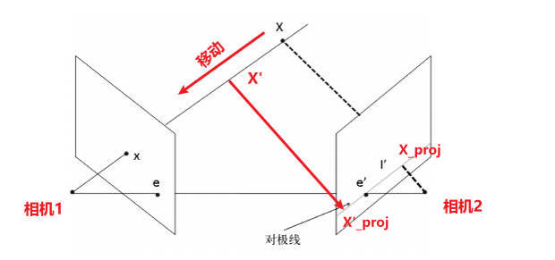
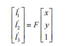
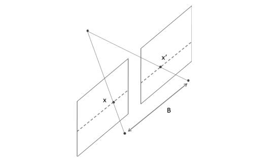
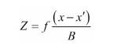

### 1. 相机模型

实际真实相机模型, 相机为透镜, 具有聚焦的功能, 也就是会把被摄物体的点发射的所有光线, 聚焦到成像平面的一个点上:

小孔相机模型, 简化相机透镜为小孔, 且假设成像平面就在焦距上, 简化版的真实相机模型:

由相似三角形我们可得:

同理, 对于相机坐标系下的一个三维点[X, Y, Z]投射到相机的成像平面上的二维点[x,y]应为:

写成其次坐标, 也就是:

### 2. 对极线与极点与基础矩阵

我们知道，沿着三维点 X 和相机中心点之间的连线，可在图像上找到对应的点 x;

对于三维点 X, 它在相机1的成像平面上的点为x, 那么根据x能否判断出X的位置呢? 不能, 因为在成像平面上的点x可能是Xx连线上的任意一点投影得到的;

点X对应于相机2中的成像平面上的点为X_proj(X'对应于X'_proj), 我们会发现, 无论X在Xx的直线上如何移动, 该点在相机2中的成像平面上的点始终在一条直线上, 我们称为对极线;

也就是说, 如果两个相机位姿固定, 那么根据相机1成像平面上中的一点想要求得该点在相机2成像平面上的位置, 需要在相机2成像平面上的一条直线上找, 我们称该直线为对极线(图中的l');

同时我们发现, 两个相机位姿固定时, 相机2成像平面中所有的对极线都会通过一点e'(在相机1中为e), 我们称该点为极点;这个点对应着一个相机中心点在另一个相机上的投影

图像上的点和它的对极线之间的关系，在数学上可以用下面的 3×3 矩阵表示：

上述公式中的 $l_1'$、$l_2'$ 、$l_3'$ 代表一条对极线, 在投影几何学中，可以用三维向量表示二维直线(一条对极线)。它就是一些二维点 (x', y') 的集合，满足公式 $l_1'x'+l_2'y'+l_3' = 0$（上标符号'表示这条线属于第二幅图像）。因此，矩阵 F（称为基础矩阵）的作用就是把一个视图上的二维图像点映射到另一个视图上的对极线上。

### 3. 双目深度估计的原理

一个立体视觉系统通常需要两台并排的相机，并且都对准同一个场景。下面是一个立体视觉系统的示意图，其中两台相机完全对齐。

在这种理想情况下，两台相机之间只有水平方向的平移，因此它们的所有对极线都是水平方向的。这意味着所有关联点的 y 坐标都是相同的，只需要在一维的线条上寻找匹配项即可。关联点 x 坐标的差值则取决于点的深度。无穷远处的点对应图像点的坐标相同，都是(x, y)，而它们离装置越近，x 坐标的差值就越大。这种现象可以在投影方程中反映出来。如果两台相机之间只有水平方向的平移，第二台（右侧）相机的投影方程就变为：

其中[X,Y,Z]为物体某一点在相机1的相机坐标系下的坐标, [x', y']为该点在相机2的图像坐标系下的坐标; B为两个相机之间的基线距离, f为相机的焦距(实际焦距/感光传感器单位长度的像素数)

为了简化，我们假定图像为正方形，两台相机的标定参数相同。这时计算差值 x-x'（注意要除以 s 以符合齐次坐标系），并分离出 z 坐标，可得到：

这个x-x'就是视差。因此, 有了基线距离, 标定好相机内参, 计算出物体在两张图上的视差, 就可以计算出该物体距离相机的深度了