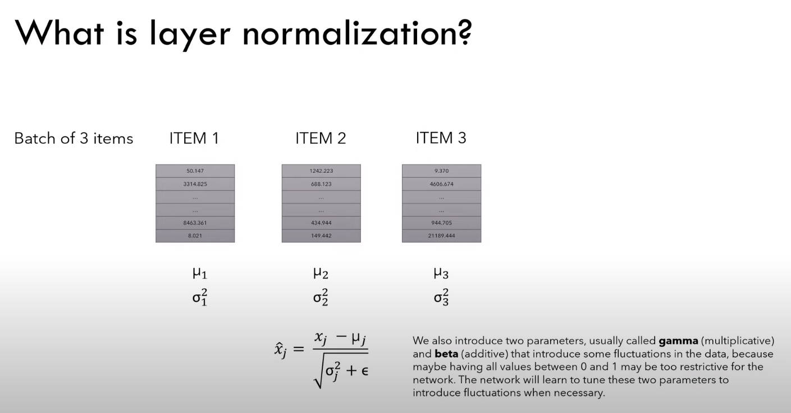
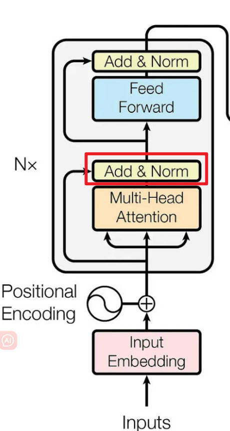
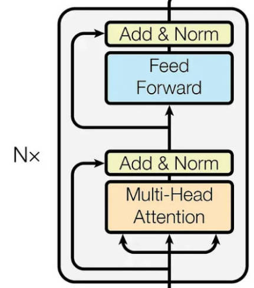
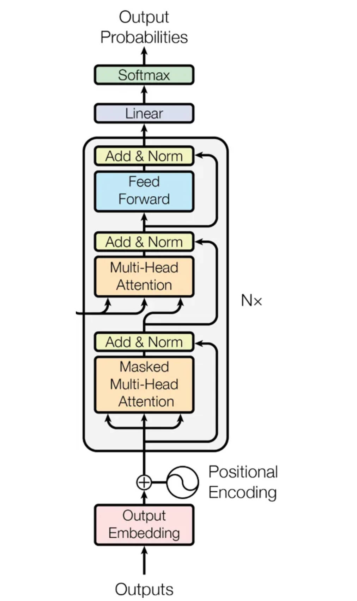
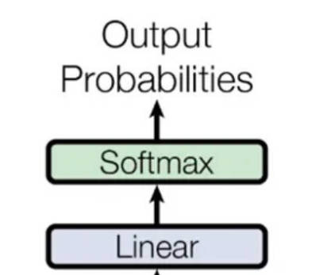
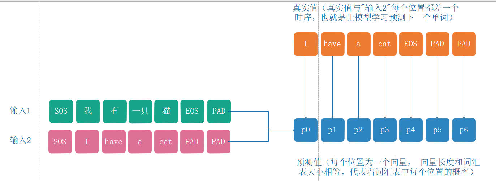
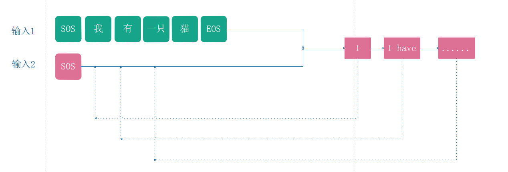

[文章链接](https://medium.com/ai-in-plain-english/building-and-training-a-transformer-from-scratch-fdbf3db00df4)

[视频讲解链接](https://www.youtube.com/watch?v=ISNdQcPhsts&t=9595s)

[代码实现](https://github.com/hkproj/pytorch-transformer)


# 一. Encoder构建

## 1. input embedding


主要作用就是将每个位置序号化的单词转换为固定维度的向量

```python
# Creating Input Embeddings
class InputEmbeddings(nn.Module):
    
    def __init__(self, d_model: int, vocab_size: int):
        super().__init__()
        self.d_model = d_model # Dimension of vectors (512)
        self.vocab_size = vocab_size # Size of the vocabulary
        self.embedding = nn.Embedding(vocab_size, d_model) # PyTorch layer that converts integer indices to dense embeddings
        
    def forward(self, x):
        return self.embedding(x) * math.sqrt(self.d_model) # Normalizing the variance of the embeddings
```

## 2. positional embedding


主要作用就是为每个位置的单词赋予一个位置编码信息，编码信息分为在sentence_sequence维度上的信息和在embedding维度上的信息。在sentence_sequence维度上的信息使用pos赋予，在embedding维度上的信息使用i赋予。

```python
# Creating the Positional Encoding
class PositionalEncoding(nn.Module):
    
    def __init__(self, d_model: int, seq_len: int, dropout: float) -> None:
        super().__init__()
        self.d_model = d_model # Dimensionality of the model
        self.seq_len = seq_len # Maximum sequence length
        self.dropout = nn.Dropout(dropout) # Dropout layer to prevent overfitting
        
        # Creating a positional encoding matrix of shape (seq_len, d_model) filled with zeros
        pe = torch.zeros(seq_len, d_model) 
        
        # Creating a tensor representing positions (0 to seq_len - 1)
        position = torch.arange(0, seq_len, dtype = torch.float).unsqueeze(1) # Transforming 'position' into a 2D tensor['seq_len, 1']
        
        # Creating the division term for the positional encoding formula
        div_term = torch.exp(torch.arange(0, d_model, 2).float() * (-math.log(10000.0) / d_model))   # 这里是先计算分母的对数，然后将计算结果再求e的指数，和原式是等价的
        
        # Apply sine to even indices in pe
        pe[:, 0::2] = torch.sin(position * div_term)
        # Apply cosine to odd indices in pe
        pe[:, 1::2] = torch.cos(position * div_term)
        
        # Adding an extra dimension at the beginning of pe matrix for batch handling
        pe = pe.unsqueeze(0)
        
        # Registering 'pe' as buffer. Buffer is a tensor not considered as a model parameter
        self.register_buffer('pe', pe)  # 如果不使用register_buffer，那么如果将模型放在cuda上运行会报错，因为pe在cpu上，但是x在gpu上
        
    def forward(self, x):
        # Addind positional encoding to the input tensor X
        x = x + (self.pe[:, :x.shape[1], :]).requires_grad_(False)
        return self.dropout(x) # Dropout for regularization
```

## 3. layer normarlization



主要作用就是让网络参数不要太发散

```python
# Creating Layer Normalization
class LayerNormalization(nn.Module):
    
    def __init__(self, eps: float = 10**-6) -> None: # We define epsilon as 0.000001 to avoid division by zero
        super().__init__()
        self.eps = eps
        
        # We define alpha as a trainable parameter and initialize it with ones
        self.alpha = nn.Parameter(torch.ones(1)) # One-dimensional tensor that will be used to scale the input data
        
        # We define bias as a trainable parameter and initialize it with zeros
        self.bias = nn.Parameter(torch.zeros(1)) # One-dimensional tenso that will be added to the input data
        
    def forward(self, x):
        mean = x.mean(dim = -1, keepdim = True) # Computing the mean of the input data. Keeping the number of dimensions unchanged
        std = x.std(dim = -1, keepdim = True) # Computing the standard deviation of the input data. Keeping the number of dimensions unchanged
        
        # Returning the normalized input
        return self.alpha * (x-mean) / (std + self.eps) + self.bias
```

## 4. feed forward


```python
# Creating Feed Forward Layers
class FeedForwardBlock(nn.Module):
    
    def __init__(self, d_model: int, d_ff: int, dropout: float) -> None:
        super().__init__()
        # First linear transformation
        self.linear_1 = nn.Linear(d_model, d_ff) # W1 & b1
        self.dropout = nn.Dropout(dropout) # Dropout to prevent overfitting
        # Second linear transformation
        self.linear_2 = nn.Linear(d_ff, d_model) # W2 & b2
        
    def forward(self, x):
        # (Batch, seq_len, d_model) --> (batch, seq_len, d_ff) -->(batch, seq_len, d_model)
        return self.linear_2(self.dropout(torch.relu(self.linear_1(x))))
```

## 5. multi-head attention


多头注意力模块接收分为查询、键和值的输入数据，并组织成矩阵 𝑄、𝐾 和 𝑉。每个矩阵包含输入的不同方面，并且它们具有与输入相同的维度。

然后，我们通过各自的权重矩阵 𝑊^Q、𝑊^K 和 𝑊^V 对每个矩阵进行线性变换。这些转换将产生新的矩阵 𝑄′、𝐾′ 和 𝑉′，它们将被分割成对应于不同头 ℎ 的更小的矩阵，从而允许模型并行处理来自不同表示子空间的信息。这种分割为每个头创建多组查询、键和值。

最后，我们将所有的头concat成一个 𝐻 矩阵，然后由另一个权重矩阵 𝑊𝑜 进行转换以产生多头注意力输出，即保留输入维度的矩阵 𝑀𝐻−𝐴。

下面代码中的mask代表的意思是，如果一个单词序列中有些单词我不想让它参加注意力的计算，那么我就要将他mask住，这里采用的技巧是，将需要mask的位置的值设置为非常小的值，这样接着下一步做softmax计算的时候就不会产生任何影响了

```python
# Creating the Multi-Head Attention block
class MultiHeadAttentionBlock(nn.Module):
    
    def __init__(self, d_model: int, h: int, dropout: float) -> None: # h = number of heads
        super().__init__()
        self.d_model = d_model
        self.h = h
        
        # We ensure that the dimensions of the model is divisible by the number of heads
        assert d_model % h == 0, 'd_model is not divisible by h'
        
        # d_k is the dimension of each attention head's key, query, and value vectors
        self.d_k = d_model // h # d_k formula, like in the original "Attention Is All You Need" paper
        
        # Defining the weight matrices
        self.w_q = nn.Linear(d_model, d_model) # W_q
        self.w_k = nn.Linear(d_model, d_model) # W_k
        self.w_v = nn.Linear(d_model, d_model) # W_v
        self.w_o = nn.Linear(d_model, d_model) # W_o
        
        self.dropout = nn.Dropout(dropout) # Dropout layer to avoid overfitting
        
    
    @staticmethod
    def attention(query, key, value, mask, dropout: nn.Dropout):# mask => When we want certain words to NOT interact with others, we "hide" them
        """
        	q, k, v: [bs, h, seq_len, d_k]
        """
        
        d_k = query.shape[-1] # The last dimension of query, key, and value
        
        # We calculate the Attention(Q,K,V) as in the formula in the image above 
        # shape : [bs, h, seq_len, seq_len]
        attention_scores = (query @ key.transpose(-2,-1)) / math.sqrt(d_k) 
        
        # Before applying the softmax, we apply the mask to hide some interactions between words
        if mask is not None: # If a mask IS defined...
            attention_scores.masked_fill_(mask == 0, -1e9) # Replace each value where mask is equal to 0 by -1e9
        attention_scores = attention_scores.softmax(dim = -1) # Applying softmax
        if dropout is not None: # If a dropout IS defined...
            attention_scores = dropout(attention_scores) # We apply dropout to prevent overfitting
            
        return (attention_scores @ value), attention_scores # Multiply the output matrix by the V matrix, as in the formula
        
    def forward(self, q, k, v, mask): 
        
        query = self.w_q(q) # Q' matrix
        key = self.w_k(k) # K' matrix
        value = self.w_v(v) # V' matrix
        
        
        # Splitting results into smaller matrices for the different heads
        # Splitting embeddings (third dimension) into h parts
        # [bs, seq_len, d_model] --> [bs, seq_len, h, d_k]--> [bs, h, seq_len, d_k]
        query = query.view(query.shape[0], query.shape[1], self.h, self.d_k).transpose(1,2) # Transpose => bring the head to the second dimension
        key = key.view(key.shape[0], key.shape[1], self.h, self.d_k).transpose(1,2) # Transpose => bring the head to the second dimension
        value = value.view(value.shape[0], value.shape[1], self.h, self.d_k).transpose(1,2) # Transpose => bring the head to the second dimension
        
        # Obtaining the output and the attention scores
        x, self.attention_scores = MultiHeadAttentionBlock.attention(query, key, value, mask, self.dropout)
        
        # Obtaining the H matrix
        # [bs, h, seq_len, d_k] --> [bs, seq_len, h, d_k] --> [bs, seq_len, d_model]
        x = x.transpose(1, 2).contiguous().view(x.shape[0], -1, self.h * self.d_k)
        
        return self.w_o(x) # Multiply the H matrix by the weight matrix W_o, resulting in the MH-A matrix
```

## 6. Add & Norm



```python
# Building Residual Connection
class ResidualConnection(nn.Module):
    def __init__(self, dropout: float) -> None:
        super().__init__()
        self.dropout = nn.Dropout(dropout) # We use a dropout layer to prevent overfitting
        self.norm = LayerNormalization() # We use a normalization layer 
    
    def forward(self, x, sublayer):
        # We normalize the input and add it to the original input 'x'. This creates the residual connection process.
        return x + self.dropout(sublayer(self.norm(x))) 
```

## 7.组合成Encoder



```python
# Building Encoder Block
class EncoderBlock(nn.Module):
    
    # This block takes in the MultiHeadAttentionBlock and FeedForwardBlock, as well as the dropout rate for the residual connections
    def __init__(self, self_attention_block: MultiHeadAttentionBlock, feed_forward_block: FeedForwardBlock, dropout: float) -> None:
        super().__init__()
        # Storing the self-attention block and feed-forward block
        self.self_attention_block = self_attention_block
        self.feed_forward_block = feed_forward_block
        self.residual_connections = nn.ModuleList([ResidualConnection(dropout) for _ in range(2)]) # 2 Residual Connections with dropout
        
    def forward(self, x, src_mask):
        # Applying the first residual connection with the self-attention block
        x = self.residual_connections[0](x, lambda x: self.self_attention_block(x, x, x, src_mask)) # Three 'x's corresponding to query, key, and value inputs plus source mask
        
        # Applying the second residual connection with the feed-forward block 
        x = self.residual_connections[1](x, self.feed_forward_block)
        return x # Output tensor after applying self-attention and feed-forward layers with residual connections.
```

```python
# Building Encoder 
# An Encoder can have several Encoder Blocks
class Encoder(nn.Module):
    
    # The Encoder takes in instances of 'EncoderBlock'
    def __init__(self, layers: nn.ModuleList) -> None:
        super().__init__()
        self.layers = layers # Storing the EncoderBlocks
        self.norm = LayerNormalization() # Layer for the normalization of the output of the encoder layers
        
    def forward(self, x, mask):
        # Iterating over each EncoderBlock stored in self.layers
        for layer in self.layers:
            x = layer(x, mask) # Applying each EncoderBlock to the input tensor 'x'
        return self.norm(x) # Normalizing output
```

# 二. Decoder构建



## 1. Decoder

注意decoder中中间的多头注意力中的query来自于output，key和value来自于encoder的输出

```python
# Building Decoder Block
class DecoderBlock(nn.Module):
    
    # The DecoderBlock takes in two MultiHeadAttentionBlock. One is self-attention, while the other is cross-attention.
    # It also takes in the feed-forward block and the dropout rate
    def __init__(self,  self_attention_block: MultiHeadAttentionBlock, cross_attention_block: MultiHeadAttentionBlock, feed_forward_block: FeedForwardBlock, dropout: float) -> None:
        super().__init__()
        self.self_attention_block = self_attention_block
        self.cross_attention_block = cross_attention_block
        self.feed_forward_block = feed_forward_block
        self.residual_connections = nn.ModuleList([ResidualConnection(dropout) for _ in range(3)]) # List of three Residual Connections with dropout rate
        
    def forward(self, x, encoder_output, src_mask, tgt_mask):
        
        # Self-Attention block with query, key, and value plus the target language mask
        x = self.residual_connections[0](x, lambda x: self.self_attention_block(x, x, x, tgt_mask))
        
        # The Cross-Attention block using two 'encoder_ouput's for key and value plus the source language mask. It also takes in 'x' for Decoder queries
        x = self.residual_connections[1](x, lambda x: self.cross_attention_block(x, encoder_output, encoder_output, src_mask))
        
        # Feed-forward block with residual connections
        x = self.residual_connections[2](x, self.feed_forward_block)
        return x
```

```python
# Building Decoder
# A Decoder can have several Decoder Blocks
class Decoder(nn.Module):
    
    # The Decoder takes in instances of 'DecoderBlock'
    def __init__(self, layers: nn.ModuleList) -> None:
        super().__init__()
        
        # Storing the 'DecoderBlock's
        self.layers = layers
        self.norm = LayerNormalization() # Layer to normalize the output
        
    def forward(self, x, encoder_output, src_mask, tgt_mask):
        
        # Iterating over each DecoderBlock stored in self.layers
        for layer in self.layers:
            # Applies each DecoderBlock to the input 'x' plus the encoder output and source and target masks
            x = layer(x, encoder_output, src_mask, tgt_mask)
        return self.norm(x) # Returns normalized output
```

## 2. projection



```python
# Buiding Linear Layer
class ProjectionLayer(nn.Module):
    def __init__(self, d_model: int, vocab_size: int) -> None: # Model dimension and the size of the output vocabulary
        super().__init__()
        self.proj = nn.Linear(d_model, vocab_size) # Linear layer for projecting the feature space of 'd_model' to the output space of 'vocab_size'
    def forward(self, x):
        return torch.log_softmax(self.proj(x), dim = -1) # Applying the log Softmax function to the output
```

# 二. Transformer构建

```python
# Creating the Transformer Architecture
class Transformer(nn.Module):
    
    # This takes in the encoder and decoder, as well the embeddings for the source and target language.
    # It also takes in the Positional Encoding for the source and target language, as well as the projection layer
    def __init__(self, encoder: Encoder, decoder: Decoder, src_embed: InputEmbeddings, tgt_embed: InputEmbeddings, src_pos: PositionalEncoding, tgt_pos: PositionalEncoding, projection_layer: ProjectionLayer) -> None:
        super().__init__()
        self.encoder = encoder
        self.decoder = decoder
        self.src_embed = src_embed
        self.tgt_embed = tgt_embed
        self.src_pos = src_pos
        self.tgt_pos = tgt_pos
        self.projection_layer = projection_layer
        
    # Encoder     
    def encode(self, src, src_mask):
        src = self.src_embed(src) # Applying source embeddings to the input source language
        src = self.src_pos(src) # Applying source positional encoding to the source embeddings
        return self.encoder(src, src_mask) # Returning the source embeddings plus a source mask to prevent attention to certain elements
    
    # Decoder
    def decode(self, encoder_output, src_mask, tgt, tgt_mask):
        tgt = self.tgt_embed(tgt) # Applying target embeddings to the input target language (tgt)
        tgt = self.tgt_pos(tgt) # Applying target positional encoding to the target embeddings
        
        # Returning the target embeddings, the output of the encoder, and both source and target masks
        # The target mask ensures that the model won't 'see' future elements of the sequence
        return self.decoder(tgt, encoder_output, src_mask, tgt_mask)
    
    # Applying Projection Layer with the Softmax function to the Decoder output
    def project(self, x):
        return self.projection_layer(x)
```

假设我们要构建一个机器翻译的模型

```python
# Building & Initializing Transformer

# Definin function and its parameter, including model dimension, number of encoder and decoder stacks, heads, etc.
def build_transformer(src_vocab_size: int, tgt_vocab_size: int, src_seq_len: int, tgt_seq_len: int, d_model: int = 512, N: int = 6, h: int = 8, dropout: float = 0.1, d_ff: int = 2048) -> Transformer:
    
    # Creating Embedding layers
    src_embed = InputEmbeddings(d_model, src_vocab_size) # Source language (Source Vocabulary to 512-dimensional vectors)
    tgt_embed = InputEmbeddings(d_model, tgt_vocab_size) # Target language (Target Vocabulary to 512-dimensional vectors)
    
    # Creating Positional Encoding layers
    src_pos = PositionalEncoding(d_model, src_seq_len, dropout) # Positional encoding for the source language embeddings
    tgt_pos = PositionalEncoding(d_model, tgt_seq_len, dropout) # Positional encoding for the target language embeddings
    
    # Creating EncoderBlocks
    encoder_blocks = [] # Initial list of empty EncoderBlocks
    for _ in range(N): # Iterating 'N' times to create 'N' EncoderBlocks (N = 6)
        encoder_self_attention_block = MultiHeadAttentionBlock(d_model, h, dropout) # Self-Attention
        feed_forward_block = FeedForwardBlock(d_model, d_ff, dropout) # FeedForward
        
        # Combine layers into an EncoderBlock
        encoder_block = EncoderBlock(encoder_self_attention_block, feed_forward_block, dropout)
        encoder_blocks.append(encoder_block) # Appending EncoderBlock to the list of EncoderBlocks
        
    # Creating DecoderBlocks
    decoder_blocks = [] # Initial list of empty DecoderBlocks
    for _ in range(N): # Iterating 'N' times to create 'N' DecoderBlocks (N = 6)
        decoder_self_attention_block = MultiHeadAttentionBlock(d_model, h, dropout) # Self-Attention
        decoder_cross_attention_block = MultiHeadAttentionBlock(d_model, h, dropout) # Cross-Attention
        feed_forward_block = FeedForwardBlock(d_model, d_ff, dropout) # FeedForward
        
        # Combining layers into a DecoderBlock
        decoder_block = DecoderBlock(decoder_self_attention_block, decoder_cross_attention_block, feed_forward_block, dropout)
        decoder_blocks.append(decoder_block) # Appending DecoderBlock to the list of DecoderBlocks
        
    # Creating the Encoder and Decoder by using the EncoderBlocks and DecoderBlocks lists
    encoder = Encoder(nn.ModuleList(encoder_blocks))
    decoder = Decoder(nn.ModuleList(decoder_blocks))
    
    # Creating projection layer
    projection_layer = ProjectionLayer(d_model, tgt_vocab_size) # Map the output of Decoder to the Target Vocabulary Space
    
    # Creating the transformer by combining everything above
    transformer = Transformer(encoder, decoder, src_embed, tgt_embed, src_pos, tgt_pos, projection_layer)
    
    # Initialize the parameters
    for p in transformer.parameters():
        if p.dim() > 1:
            nn.init.xavier_uniform_(p)
            
    return transformer 
```

# 三、训练和推理流程

SOS：start of the sentence

EOS：end of the sentence

训练过程如下，模型接受两个输入，输入1是原文，输入2是翻译后的文，预测为翻译后的文（注意输入2和预测之间差一个时序）

因为有**decoder_mask**的存在(decoder_mask是一个维度seq_len*seq_len的下三角全部为1且对角也全部为1的掩码矩阵），所以实际上是    输入1全部+输入2的SOS---->预测"I"   输入1全部+输入2的SOS+I---->预测"have"    输入1全部+输入2的SOS+I+have---->预测"a"......




推理过程如下，输入1是原文，输入2先使用SOS，然后每次只推理出一个单词，然后将该单词作为输入再推理下一个单词，然后将SOS与预测出的单词作为输入2连同输入1再次输入到模型中预测，循环往复，直到超过最大允许token长度或者遇到EOS为止。这也就是为什么transformer计算量大的原因，因为在推理过程中transformer要调用很多次decoder解码器进行计算

