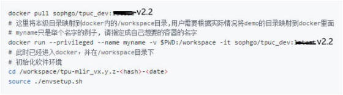
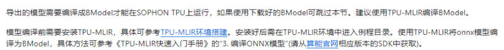
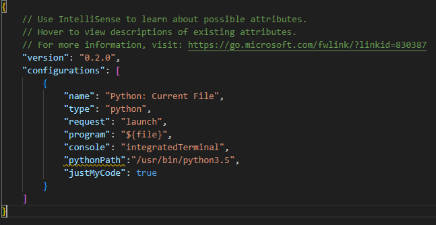
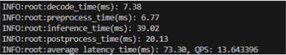
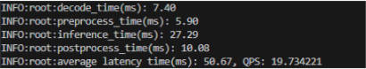
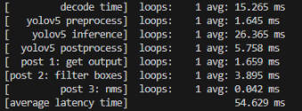
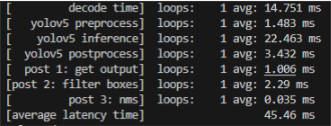

产品型号: SE-5

算丰官方SDK以及modules等技术资料[下载地址](https://developer.sophgo.com/site/index/material/29/all.html)

算丰官方给出的[YOLOv5的案例](https://github.com/sophgo/sophon-demo/tree/release/sample/YOLOv5)

# 一. 基本配置

## 1. 网络配置

账号: linaro          密码:linaro                  初始IP: 192.168.103.251         端口: 22
root账号: root     密码:landsea123$              IP: 192.168.103.251         端口: 22
进入root模式: sudo -i   
更改sshd_config配置使root账号可以连接: vim /etc/ssh/sshd_config
更改以下配置:
​    
重启ssh服务:  service ssh restart
更改IP: ifconfig eth0 192.168.103.251, 更改后用root账号重新连接
更改路由:  ip route add default via 192.168.103.5
测试网络: ping www.baidu.com

## 2. 盒子换源

如果盒子装的是算能官方环境, 则该步骤无需设置

执行以下命令换源, 否则apt-get install 不好用:

```bash
cp -r /etc/apt/sources.list /etc/apt/sources.list.bak;echo -e "deb http://deb.debian.org/debian/ buster main contrib non-free\ndeb-src http://deb.debian.org/debian/ buster main contrib non-free\ndeb http://deb.debian.org/debian/ buster-updates main contrib non-free\ndeb-src http://deb.debian.org/debian/ buster-updates main contrib non-free\ndeb http://deb.debian.org/debian/ buster-backports main contrib non-free\ndeb-src http://deb.debian.org/debian/ buster-backports main contrib non-free\ndeb http://deb.debian.org/debian-security/ buster/updates main contrib non-free\ndeb-src http://deb.debian.org/debian-security/ buster/updates main contrib non-free" > /etc/apt/sources.list;cat /etc/apt/sources.list
apt-get update
apt-get upgrade
```

# 二. 免费教程

[硬十](https://www.hw100k.com/play?id=175)

# 三. 模型编译

这两种模型编译方式的docker环境已拉到在2070Super服务器上, 名字叫sophon

启动命令:

```bash
sudo docker start sophon
sudo docker exec -it sophon /bin/bash
```

## 1. 编译方式一(使用bmneto编译):

**使用此种方式, 不需要自己写后处理(乘以anchor那些), 但是这种方式只能编译出FP32精度的模型. 编不出FP16或者Int8的(待确认)。**

流程: 拉取docker镜像----> 将SDK拖进镜像中---->运行SDK包的bash脚本初始化环境---->使用bmneto模块将将onnx模型编译成bm模型

### (I) 模型编译环境搭建


   注意这里要拉取v2.2版本的镜像



下载[SDK包 2.6.0](https://developer.sophgo.com/site/index/material/17/all.html)

将SDK包拖进容器中, 解压后进入scripts目录下, 执行source envsetup_cmodel.sh

执行以下两行, 其中bmnn_sdk_root_dir是刚解压的SDK包的根目录

```bash
export LD_LIBRARY_PATH=${bmnn_sdk_root_dir}/lib/bmcompiler/:$LD_LIBRARY_PATH
export LD_LIBRARY_PATH=${bmnn_sdk_root_dir}/lib/thirdparty/x86:$LD_LIBRARY_PATH
```

输入:python -m bmneto --help  如果有输出, 则证明环境搭建成功

### (II) 编译模型

(1) 修改代码, 去掉Detect模块中forward冗余的输出

只返回torch.cat(z, 1)


(2) 将pt模型导出为onnx模型(任意设备)

导出一定要用opset_version=11, 不然把onnx转成mlir时resize节点会报错。

(3) 优化onnx
首先安装onnx-simplifier: pip install onnx-simplifier
执行命令进行优化: python -m onnxsim weights/yolov5s.onnx weights/yolov5s-sim.onnx
(4) 将onnx模型移到docker容器中, 编写下图的脚本, 编译模型

​		

bmneto.compile入参数说明:   https://www.hw100k.com/play?id=175&chapterId=2227

## 2. 编译方式二:

使用此种方式, 需要自己写后处理(乘以anchor那些), 但是这种方式可以编译出FP32FP16或者Int8精度的模型。

流程: 拉取docker镜像----> 将TPU-MLIR(TPU-NNTC)包拖进镜像中---->运行TPU-MLIR(TPU-NNTC)包的bash脚本初始化环境---->使用TPU-MLIR(TPU-NNTC)包中的py文件将onnx模型编译成bm模型

### (I) 模型编译环境搭建

官方提供了两种编译工具TPU-MLIR和TPU-NNTC, 官方建议使用TPU-MLIR。



官方提供的[TPU-MLIR环境搭建链接](https://github.com/sophgo/sophon-demo/blob/release/docs/Environment_Install_Guide.md#1-tpu-mlir%E7%8E%AF%E5%A2%83%E6%90%AD%E5%BB%BA)
搭建TPU-MLIR环境需要具备的条件:


官方提供的[TPU-NNTC环境搭建链接](https://github.com/sophgo/sophon-demo/blob/release/docs/Environment_Install_Guide.md#2-tpu-nntc%E7%8E%AF%E5%A2%83%E6%90%AD%E5%BB%BA)
搭建TPU-MLIR环境需要具备的条件:


注意: 
​    (1)TPU-MLIR包一定要从算能官网下载, 不能从github下载, 官方对TPU-MLIR的代码进行了大量的修改重写。
​    (2)模型编译需在docker环境(镜像名字sophgo/tpuc_dev:v2.2)中进行

### (II) 编译模型

(1) 去掉后处理(去掉的后处理需要在推理代码中自己写)


(2) 将pt模型导出为onnx模型(任意设备)
​     导出一定要用opset_version=11, 不然把onnx转成mlir时resize节点会报错。
(3) 优化onnx
​      首先安装onnx-simplifier: pip install onnx-simplifier
​      执行命令进行优化: python -m onnxsim weights/yolov5s.onnx weights/yolov5s-sim.onnx
(4)使用netron查看输出节点的名字
​      因为去掉了后处理, 所以模型输出是三个([1,3,80,80,85], [1,3,40,40,85], [1,3,20,20,85]), 输出的名字分别叫output, 360, 364

(5) 将onnx模型编译出mlir模型(任意x86设备+上述提到的sophgo/tpuc_dev:latest的docker镜像中(已拉取到2070Super服务器上))
​     执行命令:
​     model_transform.py --model_name yolov5s --model_def ./yolov5s-sim.onnx --input_shapes [[1,3,640,640]] --keep_aspect_ratio --pixel_format rgb --output_names 360,364,output  --mlir yolov5s.mlir
(6) 将mlir模型编译出bmodel模型(与步骤5在同一环境中)

​    执行命令(注意--chip 一定指定为1684x而不能是1684, 指定为1684会报错):

​    model_deploy.py --mlir yolov5s.mlir --quantize F16 --chip bm1684x --model yolov5s_1684x_f16.bmodel

注意: 

​        (1)由于官方提到了编译模型需要在x86+sophgo/tpuc_dev:latest的docker镜像中编译完成, 但是我们的算法盒子是arm版的, 运行不起来sophgo/tpuc_dev:latest的docker镜像

​        (2)docker hub上所有版本的sophgo/tpuc_dev镜像全部都是amd64位的, 没有arm版的。

​        (3)因此可以使用其他x86服务器启动镜像, 进行模型编译。

# 四. 模型推理

使用bm-smi命令可以看到, 该设备型号为1684-SOC

模型推理参考文档:              [python版](https://github.com/sophgo/sophon-demo/blob/release/sample/YOLOv5/python/README.md)                    [C++版](https://github.com/sophgo/sophon-demo/tree/release/sample/YOLOv5/cpp)

使用bmrt_test进行理论性能测试, 类似于trtexec: 

```bash
bmrt_test --bmodel  ${bmodel_path}
```

## 1. Python版

### (I) Python版推理环境的搭建

**如果是锐景智能的环境**

(1)系统已内置推理所需的库: sophon、sophon.sail、sail.Bmcv等推理所需要的库,  无需自己编译

 如果要使用内置库, 必须只能使用内置的3.5版本的python:

​		

(2)由于vscode已不支持python3.7以下的代码debug, 所以需要手动安装旧扩展插件

更换vscode的python插件(否则不能debug python3.5)
[更换方法教程](https://blog.csdn.net/Judikator/article/details/125781089)
老版本vscode-python插件[下载地址](https://marketplace.visualstudio.com/_apis/public/gallery/publishers/ms-python/vsextensions/python/2021.5.829140558/vspackage)

如果安装不上, 需要找到盒子上.vscode-server文件夹的位置, 将该文件夹删除然后再重新安装

launch.json的配置, 需要指定pythonPath:



(3) 安装pip

```bash
apt-get install python3-pip
pip换源:
/usr/bin/python3.5 -m pip config set global.index-url https://pypi.tuna.tsinghua.edu.cn/simple
```

(4) pip安装包到指定版本的python

```bash
/usr/bin/python3.5 -m pip install tqdm
```

(5) 安装numpy

①numpy必须用到, 模型推理出的结果是bm版本的tensor, 目前所知,  只能先转换成numpy再转成list

②安装python-dev(实际上应该安装python3.5-dev, 但是apt-get install python3.5-dev是安不上的):         

```bash
apt-get install python-dev    
```

python-dev与python的关系, 有些库由于底层利用到了C++所以需要和python的头文件、库文件一起编译, 所以才有了python-dev

安装python3.5-dev的头文件: 

将以下压缩包中的python3.5m的整个文件夹复制放在/usr/include下即可

地址:链接：https://pan.baidu.com/s/1IxFJsATt8rrF9q0lmca3DA 提取码：dma7 

③安装cython0.29.24:   

```bash
/usr/bin/python3.5 -m pip install cython==0.29.24
```

④下载numpy1.16.4源码:

```bash
wget https://github.com/numpy/numpy/releases/download/v1.16.4/numpy-1.16.4.tar.gz
# 解压进入文件夹后执行编译安装:   
/usr/bin/python3.5  setup.py install 
# 或者 
/usr/bin/python3.5 -m pip install numpy==1.16.4
```

**如果是算能官方的环境**

​	todo:

### (II) python版推理(在锐景智能的环境中)

推理执行时, 需指定python路径, 例如: /usr/bin/python3.5 inference.py

 yolov5s在640*640的输入分辨率以及FP32精度下使用bmcv对图像进行处理推理速度:

​		

yolov5s在640*384(必须是8的倍数, 因为下采样[8, 16, 32]倍)的输入分辨率以及FP32精度下使用bmcv对图像进行处理推理速度:

​		

##2. C++版

### (I) C++版推理环境的搭建

**锐景智能的环境和算能官方镜像的环境搭建是一样的**

**如果是使用bmcv**

①编译安装libsophon、sophon-opencv和sophon-ffmpeg

直接按照该链接的步骤编译安装配置: [网址](https://github.com/sophgo/sophon-demo/blob/release/sample/YOLOv5/cpp/README.md#22-soc%E5%B9%B3%E5%8F%B0)

已编译打包好的libsophon、sophon-opencv和sophon-ffmpeg已全部在2070Super服务器上的名字叫test的容器中, 路径: /root/work/sophon_cpp_env

推理所需的libsophon、sophon-opencv和sophon-ffmpeg的所有的头文件和库文件已经全部放在路径:/root/work/sophon_cpp_env中的soc-sdk-bmcv文件夹下,

只需要将该soc-sdk-bmcv文件夹整个拷贝至算能设备中工程目录下即可, 编译的时候要和自己写的代码一起编译

②安装其他所需头文件及源文件

下载sophon-demo:

```bash
git clone https://github.com/sophgo/sophon-demo.git
```

将sophon-demo下的include文件夹拷贝至算能设备中工程目录下即可, 编译的时候要和自己写的代码一起编译

将sophon-demo下的src文件夹拷贝至算能设备中工程目录下即可, 编译的时候要和自己写的代码一起编译

 **如果是使用sail**

todo

### (II) C++版推理(在算能官方的环境中)

编译推理文件所需要链接的动态库名字:

系统目录(/usr/lib/aarch64-linux-gnu/)下的: pthread 

soc-sdk下的: avcodec,  avformat, avutil, bmlib, bmrt, bmcv, yuv

soc-sdk下的opencv相关的库: opencv_imgproc,  opencv_core,  opencv_highgui,  opencv_imgcodecs, opencv_videoio

yolov5s在640*640的输入分辨率以及FP32精度下使用bmcv对图像进行处理推理速度:

​	

​	

# 四. 如何刷机

锐景智能环境的刷机包: <https://cowtransfer.com/s/38323333922244> 点击链接查看 [ sdcard.tgz ] ，或访问奶牛快传 [cowtransfer.com](http://cowtransfer.com/) 输入传输口令 1n3zg3 查看；

算能官方的刷机包: <https://developer.sophgo.com/site/index/material/29/all.html>, 下载sophon-img, 解压后在sophon-img文件夹中有一个sdcard.tgz

需要准备不小于16G的sd卡以及读卡器, 并将sd卡格式化为FAT32格式

刷机方法: 将刷机包放入SD卡根目录下，设备插入SD后上电，此时STAT灯常亮，等待10分钟左右STAT等闪烁后即为刷机成功，断电取出SD卡后重新上电即可

刷机后的网络配置(盒子自带两个网卡, eth1用来局域网LAN口连接,eth0用来广域网WAN口连接):

将网线一端插入盒子的LAN口, 另一端插入电脑的网口, 将电脑设置为150网段(192.168.150.xxx), 此时电脑和盒子在同一局域网, 在电脑上打开网址:192.168.150.1:80可以打开web配置界面

web配置界面登录账号: admin  密码: admin

在web配置界面中通过手动配置eth0的IP,。

如果不能手动配置, 可以在web界面中的terminal中配置, 使用sudo -i 进入root权限界面, 密码是admin, 然后按照"0. 基本配置"中再配置一下ip路由ssh等

配置好后, 将网线从LAN口拔出, 通过WAN口正常连接网络, 在电脑端ssh即可登录

# 五. 尚未解决的问题

1, 使用bmneto可以正常编译出fp32的模型, 能否编译出fp16或者int8类型的模型?

因为bmneto.compile接口中没有一个可以指定精度类型的参数

2, 使用tpu-mlir能否编译出bm1684-soc平台的模型?

尝试过使用tpu-mlir编译出bm1684x平台的模型, 但是编译bm1684-soc平台的模型会报错(使用model_deploy.py进行编译时, 如果指定--chip为bm1684x可以编译通过, 但是如果指定–chip为bm1684则会报错)

3, 使用python版本做yolov5推理时, 解码、前处理、后处理时间过长

在跑sophon-demo中关于yolov5的案例代码时, 在fp32精度下, 解码、前处理几乎都长达10ms, 后处理(numpy版本的nms)甚至长达接近20ms

5, 尝试使用sophon-demo中yolov5-opt(对后处理进行优化)的代码运行, 无法运行成功

报错代码为: sail.tpu_kernel_api_yolov5_detect_out

报错原因为: sail中无tpu_kernel_api_yolov5_detect_out接口


