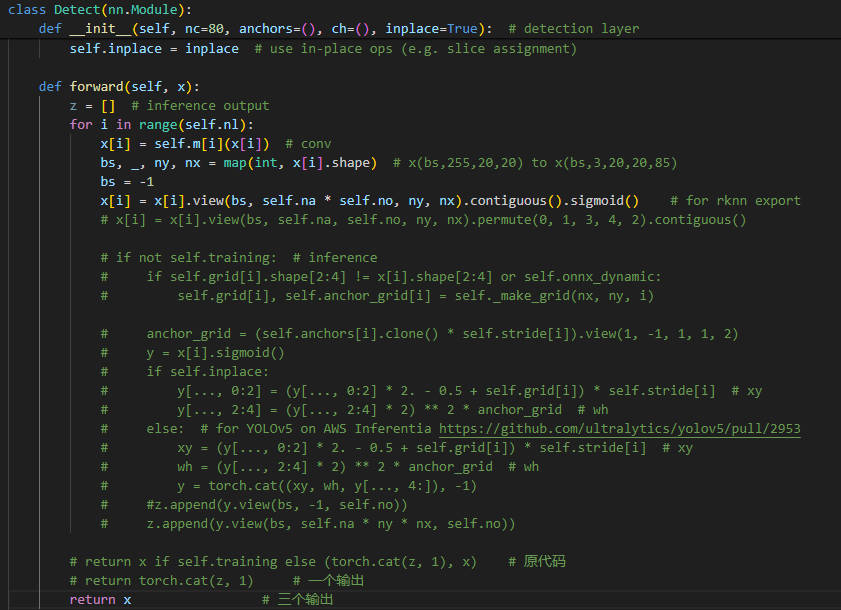

# 一. 参考文档

**RKNN操作步骤参考:**

**[官方github](https://github.com/rockchip-linux/rknn-toolkit2)提供的RKNPU2_SDK中的v1.6.0(或者更高的release版本)下的Quick_Start文档**

# 二. ssh的安装

```bash
 apt-get remove openssh*
 apt install openssh-client
 apt install openssh-server
```

# 三. 查看NPU和GPU使用率

```bash
cat /sys/kernel/debug/rknpu/load
cat /sys/class/devfreq/fb000000.gpu/load
```

# 四. 模型编译

**编译环境搭建: **

创建一个新的conda环境, 指定好python版本, 按照本文件夹下的requirements对应的python版本安装, 建议指定使用阿里源, 否则安装会出现 No matching distribution found for tf-estimator-nightly==2.8.0.dev2021122109
**模型编译:**

使用该文件夹下的convert.py

**注意:**

在YOLOv5中, 如果是想使用fp16类型在RK平台上推理的话, 将模型正常导出即可;

如果是想使用Int8量化后在RK平台上推理, 那么模型导出前需要去掉乘以anchor那些操作, 因为如果乘以anchor那些操作加进去, 模型的输出值的范围就是[0, 640], 但是模型的置信度以及类别概率的值域范围仍然为[0, 1]之间, 但是xywh的值域范围已经到[0, 640]之间了, 如果做量化, 那么就会把[0, 640]之间的数映射到[-128, 127]之间, 但是置信度以及类别概率又是集中于范围边界的[0, 1]之间, 他们量化后集中在[-128, 127]的一个bin中, 这样Int8模型在推理出结果后, 想再反量化回来的时候, xywh是可以反量化回来的, 但是置信度以及类别概率是反量化不回来了

在导出前, 需要修改的代码如下:



