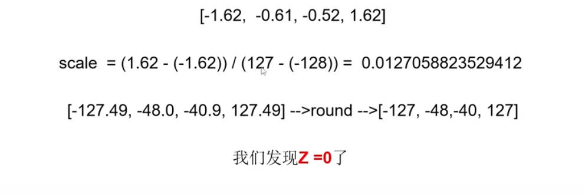
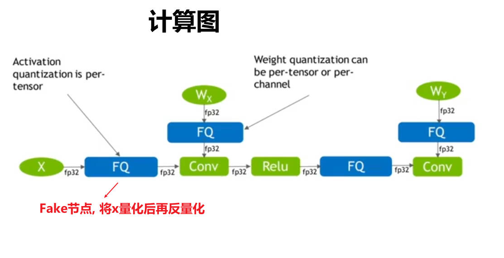
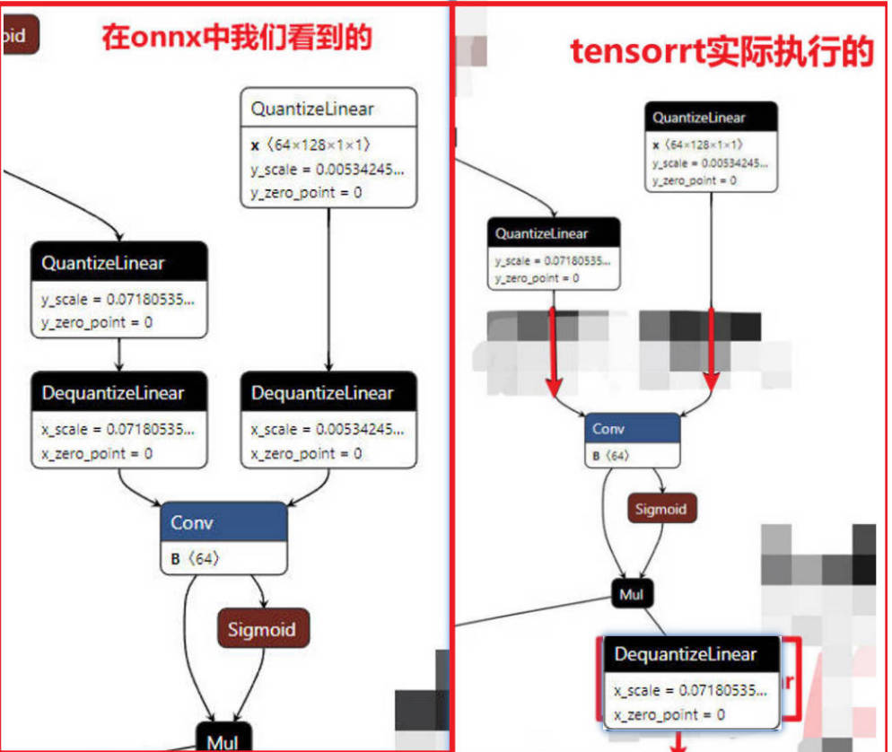

# 一. 量化基础
##  1. 对称量化与非对称量化

### (1) 偏移方式的非对称量化

公式推导:

对于任意一个数组, 将其归一化到0-1之间: $$\frac{Xmax-X}{Xmax-Xmin}$$ 

对于int8类型的任意数据([-128,127]之间的值), 将其归一化到0-1之间: $$\frac{Qmax-Q}{Qmax-Qmin}$$

令 $$\frac{Qmax-Q}{Qmax-Qmin} = \frac{Xmax-X}{Xmax-Xmin}$$  , 则可求得:

$$Q=Qmax- \frac{Qmax - Qmin}{ Xmax - Xmin} * (Xmax - X)$$

则可写为:

$$scale=\frac{ Xmax - Xmin}{Qmax - Qmin}$$

$$Z=Qmax-Round(\frac{Xmax}{scale})$$

量化操作: $$ Q=Round(\frac{X}{Scale}+Z)$$

反量化操作: $$Xreversed=(Q-Z)*scale$$

示例代码:

```python
import numpy as np
x = np.random.randn(7).astype("float32")
scale = (x.max() - x.min()) / (127 - (-128))
z = 127 - np.round(x.max() / scale)
q = np.round(x / scale + z)
x_ = (q - z) * scale
```

### (2) 绝对值方式的对称量化

问题引入:



因此, 可以将数组中绝对值的最大值对称到零点另一侧, 然后再量化就可以使得偏移值z为0


公式为:

$$scale = \frac{|Xmax|}{|Qmax|}$$

量化操作: $$Q = Round(\frac{X}{scale})$$

反量化操作: $$Xreversed = Q*scale$$

```python
import numpy as np
x = np.random.randn(7).astype("float32")
scale = np.abs(x.max())/ np.abs(127)
q = np.round(x / scale)
x_ = q * scale
```

绝对值方式的对称量化优缺点: 

优点是不用计算Z, 节省一些计算量;

缺点是少了一部分精度数据的表达, 精度损失比非对称量化更多

绝对值方式的为非饱和量化, 偏移方式的为饱和量化


## 2. 动态范围计算方式

问题引入:

如果有一种数据分布如下, 也就是说, 数据中存在离群点, 即数据的绝大部分会集中在一小段值域区间范围内, 其余的大部分值域并没有有效表达, 那么这样的数据量化后也会存在一样的问题


### (1) 通过直方图统计的方式确定数据的范围

思路: 将数据划分到直方图中一个一个bin中, 然后找到那个包含绝大多数数据的最小值域范围

实现方式为使用相向双指针, 每次移动后统计双指针范围内的数据数量, 如果小于要求, 则停止


```python
def histo(x, bins, reserved_ratio, use_symmetry=False):
    hist, values = np.histogram(x, bins)
    total = len(x)
    left = 0
    right = len(hist)
    curr_ratio = hist[left:right].sum() / total
    while curr_ratio > reserved_ratio:
        if hist[left] > hist[right-1]:
            right -= 1
        else:
            left += 1
        curr_ratio = hist[left:right].sum() / total
    if use_symmetry:
        x_max = np.maximum([np.abs(values[left]), np.abs(values[right])])
        scale = x_max / 127
        z = 0
    else:
        scale = (values[right] - values[left]) / (127 - (-128))
        z = 127 - np.round(x.max() / scale)
    return scale, z


if __name__ == "__main__":
    x = np.random.rand(10000)
    scale, z = histo(x, 100, 0.8)
```

### (2) 通过entropy的方式确定数据的范围

我们知道, 衡量两组数据分布差异性可以通过计算两组数据的KL散度;

放在量化中, 我们的目标就是将一组FP32的数据量化后与Int8数据的的KL散度值非常小即可;

注: KL散度计算方式: 将两组数据划分到数量相等的bins中, 然后将每个bin的数据数量除以整组数据的总量得到每个bin的概率, 然后通过以下公式计算这两组数据的KL散度即可

 $$ D_{KL} = \sum_i P(x_i) \log(\frac{P(x_i)}{Q(x_i)})$$

**流程: **

**将FP32的模型权重值量化---->将FP32的模型权重值和量化后的Int8模型权重值分别划分到同样个数的bins中---->计算每个bins的概率---->计算量化两种数据分布的KL散度**

一个示例:

```python
import numpy as np


def quant(x):
    scale = (x.max() - x.min()) / (127 - (-128))
    z = 127 - np.round(x.max() / scale)
    q = np.round(x / scale + z)
    return q


def cal_kl(p, q):
    assert len(p) == len(q), "legth of p must be equal with length of q"
    kl_value = 0.
    for i in range(len(p)):
        kl_value += p[i] * np.log(p[i] / q[i])
    return kl_value


if __name__ == "__main__":
    size = 2560
    bins = 256
    x = np.random.rand(size)
    q = quant(x)    # 量化
    x_hist, _ = np.histogram(x, bins)
    q_hist, _  = np.histogram(q, bins)
    x_prob= x_hist / bins   # 获得每个bin的概率
    q_prob = q_hist / bins
    kl_value = cal_kl(x_prob, q_prob)   # 计算KL散度
    print(kl_value)
```

但是, 从上面的代码中可以很明显的看出这样的方式存在一个问题, 那就是x_prob和q_prob的bins数必须相等, 但是受制于q_prob均分布在(-128, 127]之间, 且为整数, 那么最多也就能划分为256个bin, 但实际上由于x是float类型的数据, 它可以被划分到更多的bins中;


所以英伟达提出了一种可以将x划分到更多的bins中, q划分到更少的bins中, 且能计算两者KL散度的方法:

假如, 一组float数据为[0.1, 0.2, 0.1, 0.3, 0.5, 0.5, 0.5, 0.5, 0.2, 0.8, 0.6]共10个数, 需要将它划分到8个bins中, 那么划分后每个位置的bin中的数据的数量为[2, 2, 1, 0, 4, 1, 0, 1]

假设, 量化后的数据最多只能被划分到4个bins, 那么怎么衡量这两组数据之间分布的差异性呢?

做法是, 先将已被划分的8个bins(float类型数据的bins)等分为4个bins, 然后将这4个bins求平均, 反映射回8个bins, 再计算原8个bins的数据分布与反映射回去的数据分布之间的KL散度, 即认为是量化后数据与量化前数据之间的KL散度

具体做法: 将[2, 2, 1, 0, 4, 1, 0, 1]再次划分到4个bins中, 为[[2, 2], [1, 0], [4, 1], [0, 1]]

然后, 标记每个bins中非0元素的数量, 由[[2, 2], [1, 0], [4, 1], [0, 1]]得到[2, 1, 2, 1]

然后, 每个bins再求和, 由[[2, 2], [1, 0], [4, 1], [0, 1]]得到[4, 1, 5, 1]

然后, 求每个bins中的平均值, 由[4, 1, 5, 1]中每个元素除以[2, 1, 2, 1]中每个元素得到[2, 1, 2.5, 1]

然后, 反映射, 由[2, 1, 2.5, 1]按照非零处使用平均值填充, 零处使用0填充的规则, 结合[[2, 2], [1, 0], [4, 1], [0, 1]], 可以得到反映射回去的数组为[[2, 2], [1, 0], [2.5, 2.5], [0, 1]], 也就是[2, 2, 1, 0, 2.5, 2.5, 0, 1]

这样只要计算原8个bins的数组[2, 2, 1, 0, 4, 1, 0, 1]与反映射回8个bins的数组[2, 2, 1, 0, 2.5, 2.5, 0, 1]的KL散度即可

**流程: **

**将FP32的模型权重值划分到n1(较大)个bins中---->将划分到n1个bins中的频数再划分到n2(256)个bins中---->将n2个bins中的频数反映射回n1个bins中(为0的位置还为0, 不为0的位置使用平均值填充)---->计算反映射回n1个bins中的数据的概率分布与原被划分到n1个bins中的概率分布之间的KL散度**

```python
import numpy as np


def cal_kl(p, q):
    assert len(p) == len(q), "legth of p must be equal with length of q"
    kl_value = 0.
    for i in range(len(p)):
        kl_value += p[i] * np.log(p[i] / q[i])
    return kl_value


if __name__ == "__main__":
    x = np.random.rand(20000)
    x_bins = 2560
    x_hist, _ = np.histogram(x, x_bins) # 将x划分到2560个bins中
    q_bins = 256
    x_hist_splits = np.array_split(x_hist, q_bins)   # 将x_hist等分成256份
    x_hist_reversed = []    # x_hist_reversed为反映射回2560个bins的x_hist
    for x_hist_split in x_hist_splits:  # 遍历每一份
        avg = np.sum(x_hist_split) / np.count_nonzero(x_hist_split) # 计算每一份的的平均值(值为0的排除在外)
        for item in x_hist_split:
            if item != 0:
                x_hist_reversed.append(avg.item())    # 值不为0的添加平均数
                continue
            x_hist_reversed.append(0)   # 值为0的依然添加0
    x_prob = x_hist / np.sum(x_hist)    # 将bins的频数转换为概率
    x_reversed_prob = x_hist_reversed / np.sum(x_hist_reversed) 
    kl_value = cal_kl(x_prob, x_reversed_prob)  # 计算KL散度
    print(kl_value)
```

上面这种计算方式还有个问题, 那就是, 根据KL散度的计算公式, $${Q(x_i)}$$作为分母值却很可能为0,  同时 $$P(x_i)$$ 作为分也很可能为0(log的值永远大于0), 这样计算出的KL散度值很有可能出现nan

 $$ D_{KL} = \sum_i P(x_i) \log(\frac{P(x_i)}{Q(x_i)})$$

一个常规的解决思路就是在分母上加一个极小值epsilon, 但是这样会带来一个新的问题, 因为  $${Q(x_i)}$$ 代表的是某个bins的概率值, 如果为它加上一个epsilon, 那么 $$\sum_i Q(x_i)$$ 之和将不等于1, 而是等于  $$\sum_i (Q(x_i) + eps) = \sum_i (Q(x_i) )+ \sum_i(eps) = 1 + \sum_i(eps)$$  , 因此解决办法就是将概率为0的位置加一个epsilon, 同时将这个epsilon平均分到每个概率不为0的bins上扣除; 对于 $$P(x_i)$$ 也同理

**流程: **

**将FP32的模型权重值划分到n1(较大)个bins中---->将划分到n1个bins中的频数再划分到n2(256)个bins中---->将n2个bins中的频数反映射回n1个bins中(为0的位置还为0, 不为0的位置使用平均值填充)---->计算反映射回n1个bins中的数据的概率与原被划分到n1个bins中的概率---->将反映射回n1个bins中的数据的概率与原被划分到n1个bins中的概率进行平滑(使每一个位置的概率值都不为0)---->计算平滑后的两个数据分布之间的KL散度**

```python
import numpy as np


def cal_kl(p, q):
    assert len(p) == len(q), "length of p must be equal with length of q"
    kl_value = 0.
    for i in range(len(p)):
        if q[i] == 0.:
            print()
        kl_value += p[i] * np.log(p[i] / q[i])
    return kl_value


def smooth_data(q, eps=1e-5):
    zeros_mask = q == 0
    nonzeros_mask = q != 0
    q[zeros_mask] += eps
    eps_sub = eps * zeros_mask.size / nonzeros_mask.size
    q[nonzeros_mask] -= eps_sub
    return q
    

if __name__ == "__main__":
    x = np.random.randn(3000)
    x_bins = 2560
    x_hist, _ = np.histogram(x, x_bins) # 将x划分到2560个bins中
    q_bins = 256
    x_hist_splits = np.array_split(x_hist, q_bins)   # 将x_hist等分成256份
    x_hist_reversed = []    # x_hist_reversed为反映射回2560个bins的x_hist
    for x_hist_split in x_hist_splits:  # 遍历每一份
        if np.count_nonzero(x_hist_split) != 0:
            avg = np.sum(x_hist_split) / np.count_nonzero(x_hist_split) # 计算每一份的的平均值(值为0的排除在外)
        for item in x_hist_split:
            if item != 0:
                x_hist_reversed.append(avg.item())    # 值不为0的添加平均数
                continue
            x_hist_reversed.append(0)   # 值为0的依然添加0
    x_prob = x_hist / np.sum(x_hist)    # 将bins的频数转换为概率
    x_reversed_prob = x_hist_reversed / np.sum(x_hist_reversed) 
    x_prob = smooth_data(x_prob)
    x_reversed_prob = smooth_data(x_reversed_prob)
    kl_value = cal_kl(x_prob, x_reversed_prob)  # 计算KL散度
    print(kl_value)
```

上面这种计算方式还有一个问题就是, 要求FP32的模型权重文件划分到的bins数需要可以被256(tensorrt中是128)整除

[NVIDIA量化文档](https://on-demand.gputechconf.com/gtc/2017/presentation/s7310-8-bit-inference-with-tensorrt.pdf)

**TensorRT中量化的最终流程:**

**将FP32的模型权重值划分到2048个bins中---->对这2048个bins从第128遍历到第2048, 这样每次遍历截取到前128、129、130、131......2048个bins---->将每次遍历截取到的前n个bins划分到128个bins中(如果不能整除, 将最后的几个全部加到末尾, 比如将129个bins划分到128个bins中, 就将第128和第129个bin中的频数全部划分到第128个bin中)---->将被划分成的128个bins反映射回n个bins(为0的位置还为0, 不为0的位置使用平均值填充)---->计算反映射回n个bins中的数据的概率与原被划分到n个bins中的概率---->将反映射回n个bins中的数据的概率与原被划分到n个bins中的概率进行平滑(使每一个位置的概率值都不为0)---->计算平滑后的两个数据分布之间的KL散度**

```python
import random
import numpy as np
import matplotlib.pyplot as plt 


def generator_P(size):
    walk = []
    avg = random.uniform(3.000, 600.999)
    std = random.uniform(500.000, 1024.959)
    for _ in range(size):
        walk.append(random.gauss(avg, std)) 
    return walk

def smooth_distribution(p, eps=0.0001):
    is_zeros = (p == 0).astype(np.float32)
    is_nonzeros = (p != 0).astype(np.float32)
    n_zeros = is_zeros.sum()
    n_nonzeros = p.size - n_zeros
    if not n_nonzeros:
        raise ValueError('The discrete probability distribution is malformed. All entries are 0.')
    eps1 = eps * float(n_zeros) / float(n_nonzeros)
    assert eps1 < 1.0, 'n_zeros=%d, n_nonzeros=%d, eps1=%f' % (n_zeros, n_nonzeros, eps1)
    hist = p.astype(np.float32)
    hist += eps * is_zeros + (-eps1) * is_nonzeros
    assert (hist <= 0).sum() == 0
    return hist
 
import copy
import scipy.stats as stats
def threshold_distribution(distribution, target_bin=128):
    distribution = distribution[1:]
    length = distribution.size
    threshold_sum = sum(distribution[target_bin:])
    kl_divergence = np.zeros(length - target_bin)
    
    for threshold in range(target_bin, length):
        sliced_nd_hist = copy.deepcopy(distribution[:threshold])

        # generate reference distribution p
        p = sliced_nd_hist.copy()
        p[threshold - 1] += threshold_sum
        threshold_sum = threshold_sum - distribution[threshold]

        # is_nonzeros[k] indicates whether hist[k] is nonzero
        is_nonzeros = (p != 0).astype(np.int64)
        
        quantized_bins = np.zeros(target_bin, dtype=np.int64)
        # calculate how many bins should be merged to generate 
        # quantized distribution q
        num_merged_bins = sliced_nd_hist.size // target_bin

        # merge hist into num_quantized_bins bins
        for j in range(target_bin):
            start = j * num_merged_bins
            stop = start + num_merged_bins
            quantized_bins[j] = sliced_nd_hist[start:stop].sum()
        quantized_bins[-1] += sliced_nd_hist[target_bin * num_merged_bins:].sum()

        # expand quantized_bins into p.size bins
        q = np.zeros(sliced_nd_hist.size, dtype=np.float64)
        for j in range(target_bin):
            start = j * num_merged_bins
            if j == target_bin - 1:
                stop = -1
            else:
                stop = start + num_merged_bins
            norm = is_nonzeros[start:stop].sum()
            if norm != 0:
                q[start:stop] = float(quantized_bins[j]) / float(norm)
        
        p = smooth_distribution(p)
        q = smooth_distribution(q)

        # calculate kl_divergence between q and p
        kl_divergence[threshold - target_bin] = stats.entropy(p, q)

    min_kl_divergence = np.argmin(kl_divergence)
    threshold_value = min_kl_divergence + target_bin

    return threshold_value

if __name__ == '__main__':
 
    size = 20480
    P = generator_P(size)
    P = np.array(P)
    P = P[P>0]
    print("最大的激活值", max(np.absolute(P)))

    hist, bins = np.histogram(P, bins =2048)  
    threshold = threshold_distribution(hist, target_bin=128)
    print("threshold 所在组:", threshold)
    print("threshold 所在组的区间范围:", bins[threshold])
    # 分成split_zie组, density表示是否要normed
    plt.title("Relu activation value Histogram")
    plt.xlabel("Activation values")
    plt.ylabel("Normalized number of Counts")
    plt.hist(P, bins=2047)
    plt.vlines(bins[threshold], 0, 30, colors = "r", linestyles = "dashed")
    plt.savefig("nvidia-entropy.jpg")
    # plt.show()
```

# 二. PTQ和QAT

## 1. PTQ

**流程:**

**选定校准数据集(一般应为几百张图, 可以很好的代表生产中的数据分布, tensorrt会使用这些校准数据集送入模型中, 得到模型每一层的输出)---->对于已训练好的模型, 进行每一层的参数统计(包括模型参数值以及模型输出值)---->计算量化后的参数---->量化模型**

## 2. QAT

主要思想就是: 将量化和反量化过程插入到模型的计算图中, 将每一种运算都先量化再反量化(产生精度损失), 然后进行finetune, 优化目标是插入QDQ节点的每一层的输出结果与原模型对应层的输出结果进行MSE损失计算, 这样在模型训练过程中, 模型会学习并适应减少量化误差(注意, 在finetune过程中更新的仍然是模型的权重值, 一般不会更新量化的scale值)

**流程:**

**预训练模型---->插入QDQ节点---->量化校准(PTQ)---->微调---->保存微调后的模型**



### 3. 通过pytorch_quantization库实现自动插入QDQ节点

[参考链接](https://github.com/NVIDIA/TensorRT/tree/release/10.2/tools/pytorch-quantization)

注意: 

1. pytorch_quantization库中默认为对称量化, 因此没有zero_point, 只有scale

```python
# 安装:
# 方式一: pip install pytorch-quantization --extra-index-url https://pypi.ngc.nvidia.com
# 方式二: git clone https://github.com/NVIDIA/TensorRT.git
#        cd tools/pytorch-quantization
#        python setup.py install
# 无论使用哪种方式都是需要自己安装cuda的, 不能使用trtpy安装cuda环境
```

使用pytorch_quantization对resnet18自动插入QDQ节点

```python
import warnings
warnings.filterwarnings("ignore")

import torch
import torchvision
from pytorch_quantization import tensor_quant
from pytorch_quantization import quant_modules
from pytorch_quantization import nn as quant_nn


quant_modules.initialize()
model = torchvision.models.resnet18()
inputs = torch.randn(1, 3, 224, 224, dtype=torch.float32)
quant_nn.TensorQuantizer.use_fb_fake_quant = True
torch.onnx.export(
    model,
    inputs,
    'resnet18-quant.onnx',
    opset_version=13
)
```

注意: 

pytorch_quantization默认对同一层的输入是整体量化(也就是一层内的输入共用一个scale)

但是对一层内的权重是分通道量化的, 输出通道有几个就有几个scale


### 4. 通过pytorch_quantization库实现手动插入QDQ节点: 方式一 

先使用pytorch_quantization将模型全部插入QDQ节点, 然后将某些不需要插入QDQ节点的位置disable掉

```python
import warnings
warnings.filterwarnings("ignore")

import torch
import torchvision
from pytorch_quantization import tensor_quant
from pytorch_quantization import quant_modules
from pytorch_quantization import nn as quant_nn
from pytorch_quantization.nn.modules import _utils as  quant_nn_utils
from pytorch_quantization import calib
from typing import List, Callable, Union, Dict


class disable_quantization:
    def __init__(self, model):
        self.model  = model

    def apply(self, disabled=True):
        for name, module in self.model.named_modules():
            if isinstance(module, quant_nn.TensorQuantizer):
                module._disabled = disabled


class enable_quantization:
    def __init__(self, model):
        self.model  = model

    def apply(self, enabled=True):
        for name, module in self.model.named_modules():
            if isinstance(module, quant_nn.TensorQuantizer):
                module._disabled = not enabled


def quantizer_state(module):
    for name, module in module.named_modules():
        if isinstance(module, quant_nn.TensorQuantizer):
            print(name, module)


if __name__ == "__main__":
    quant_modules.initialize()                  # 调用该接口, 模型的所有层都会自动插入QDQ节点
    model = torchvision.models.resnet18()
    disable_quantization(model.conv1).apply()   # 指定某一层不插入QDQ节点, model.conv1会比原模型多一个Identity节点
    # enable_quantization(model.conv1).apply()    # 指定某层插入QDQ节点
    # quantizer_state(model)                    # 打印所有已插入QDQ节点的层信息
    inputs = torch.randn(1, 3, 224, 224)
    quant_nn.TensorQuantizer.use_fb_fake_quant =True
    torch.onnx.export(
        model, 
        inputs, 
        'resnet18_quant_disable_conv1.onnx',
        opset_version=13
    )
```

### 4. 通过pytorch_quantization库实现手动插入QDQ节点: 方式二 

直接对原模型指定哪些层插入QDQ节点

```python
import warnings
warnings.filterwarnings("ignore")

import torch
import torchvision
from pytorch_quantization import tensor_quant
from pytorch_quantization import quant_modules
from pytorch_quantization import nn as quant_nn
from pytorch_quantization.nn.modules import _utils as  quant_nn_utils
from pytorch_quantization import calib
from typing import List, Callable, Union, Dict


def quantizer_state(module):
    for name, module in module.named_modules():
        if isinstance(module, quant_nn.TensorQuantizer):
            print(name, module)


def transfer_torch_to_quantization(nninstance : torch.nn.Module, quantmodule):

    quant_instance = quantmodule.__new__(quantmodule)       # new出来一个新的quantmodule
    for k, val in vars(nninstance).items():                 # 将原torch.nn.Module的实例的属性的key, value赋值给新的quantmodule实例
        setattr(quant_instance, k, val)

    def __init__(self):
      
        if isinstance(self, quant_nn_utils.QuantInputMixin):    # 如果只是输入量化(比如BatchNorm2d层等, 没有权重参数)
            self._input_quantizer.enabled = True
            quant_desc_input = quant_nn_utils.pop_quant_desc_in_kwargs(self.__class__,input_only=True)
            self.init_quantizer(quant_desc_input)

            # Turn on torch_hist to enable higher calibration speeds
            if isinstance(self._input_quantizer._calibrator, calib.HistogramCalibrator):
                self._input_quantizer._calibrator._torch_hist = True
        else:                                                   # 如果是权重和输入都量化(比如Conv2d等, 需要将权重和输入都量化)
            quant_desc_input, quant_desc_weight = quant_nn_utils.pop_quant_desc_in_kwargs(self.__class__)
            self.init_quantizer(quant_desc_input, quant_desc_weight)

            # Turn on torch_hist to enable higher calibration speeds
            if isinstance(self._input_quantizer._calibrator, calib.HistogramCalibrator):
                self._input_quantizer._calibrator._torch_hist = True
                self._weight_quantizer._calibrator._torch_hist = True

    __init__(quant_instance)
    return quant_instance


def replace_to_quantization_module(model : torch.nn.Module, ignore_policy : Union[str, List[str], Callable] = None):

    module_dict = {}        # module_dict存储的是: id(nn.Module) -> quant_nn.module
    for entry in quant_modules._DEFAULT_QUANT_MAP:
        module = getattr(entry.orig_mod, entry.mod_name)
        module_dict[id(module)] = entry.replace_mod

    def recursive_and_replace_module(module, prefix=""):
        for name in module._modules:
            submodule = module._modules[name]
            path      = name if prefix == "" else prefix + "." + name
            recursive_and_replace_module(submodule, path)       # 直接找到最naive的module(也就是没有子module的module)

            submodule_id = id(type(submodule))
            if submodule_id in module_dict:  
                module._modules[name] = transfer_torch_to_quantization(submodule, module_dict[submodule_id])    # 

    recursive_and_replace_module(model)


if __name__ == "__main__":
    model = torchvision.models.resnet18()
    # quantizer_state(model)
    replace_to_quantization_module(model)       # todo: 这里还有点问题, 直接指定子module(比如只量化resnet18的conv1)并不会只替换子module
    inputs = torch.randn(1, 3, 224, 224)
    quant_nn.TensorQuantizer.use_fb_fake_quant =True
    torch.onnx.export(
        model, 
        inputs, 
        'resnet18_quant_enable_conv1.onnx',
        opset_version=13
    )
```

# 三. Q&A

**Question:** 量化的时候不是应该只量化模型参数吗? 这些参数训练后不就是一些固定值了吗? 为什么PTQ中要制定量化校准数据集, 将这些数据集送入模型中得到每一层的输出的意义是什么?

**Answer:**  输入，参数和输出都需要量化。量化为INT8是为了加快运算，input和weight类型类型需要一致，也就是说不但需要有模型参数的量化校准表也需要有输入输出的量化校准表, 那么输入输出的量化校准表就需要由一些量化校准数据集来计算

**Question:** 做完PTQ或者QAT量化后转换出的onnx模型, 查看节点, 发现都是QuantizeLinear后紧接着跟着DequantizeLinear, 正常比如对于一个卷积层的计算来说, 最终形态不应该是对该卷积层的输入进行Quantize、权重进行Quantize, 然后进行int8精度的卷积计算, 然后将计算结果进行Deqauntize再送入下一层吗?

**Answer:**  tensorrt会根据你在onnx里面插入的QDQ节点的位置，在对应的位置做优化，也就是原来是先dequant，后conv。tensorrt会先conv，再dequant




**Question:**  


