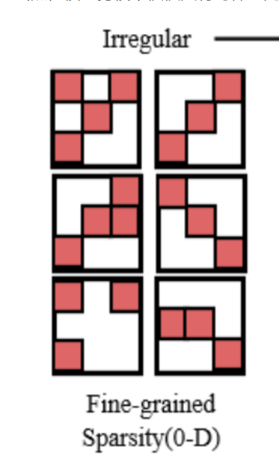
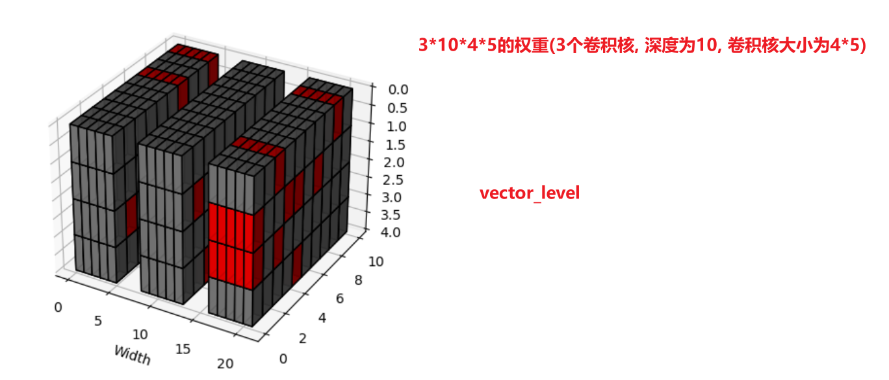
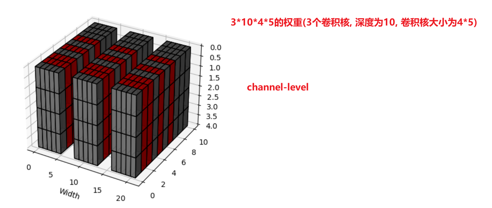

# 一. 细粒度剪枝(填0剪枝)

实现思路:

获得卷积层的权重---->将权重展开成一维---->将权重按大小排序---->计算按照剪枝率需要剪枝的阈值---->将小于阈值的权重置为0---->将剪枝后的权重重新赋值给卷积层

实现代码:fine_grained_pruning.py

# 二. 向量剪枝(填0剪枝)

实现思路:

pass

# 三. 滤波器剪枝(填0剪枝) 

实现思路:

获得卷积层的权重---->计算每一个卷积核的L2范数(卷积核维度[Cout, Cin, k, k], 合并(2,3,4)维度, 保留1维度)---->按L2范数大小排序---->将剪枝比率内较小的卷积核所有权重置为0---->将剪枝后的权重重新赋值给卷积层

# 四. 剪枝可视化(填0剪枝)

代码:viz_pruning.py

# 五. 修剪标准

1. 基于权重大小的剪枝

2. 基于梯度幅值的剪枝(不合理,因为反向传播时梯度值较小不代表权重值不重要,有可能已经更新到最优的权重值了)

3. 基于权重与梯度幅值乘积的剪枝

   代码: weight_grad_product_pruning.py

# 六. 几种剪枝框架

## 1. 训练-->剪枝-->微调

代码: train-prune-finetune.py

## 2. 边训练边剪枝

代码: pruning-with-training.py

# 七. 直接remove的剪枝(非填0剪枝)

实现思路: 

训练(训练代码的网络结构中要实现计算每一个卷积层的L1范数, 输出通道数多少就计算多少个L1范数)---->保存模型权重---->加载模型---->遍历每一个module获得每一个卷积层的L1范数---->对第一层L1范数排序---->按照剪枝比率获得剪枝的L1范数的阈值---->按照阈值得到保留的L1范数的索引---->按照该索引对卷积权重进行保留并重新赋值(0维度Cout)---->重新设置该层卷积的输出通道数属性---->对于下一层的卷积---->按照L1范数计算topK个保留的索引---->按照该索引对卷积权重进行保留并重新赋值(1维度Cin)---->重新设置该层卷积的输入通道数属性---->保存模型---->加载模型---->finetune训练

代码:  remove_elements_code文件夹

# 八. 稀疏训练

实现思路:  (本例子是有两层全连接的网络)

将网络中的权重值使用一定比率进行掩码(掩码部分权重值置为0)(下图中黄色部分为被掩码部分, 白色部分为没有被掩码部分)---->训练一个epoch---->将掩码部分选取一定比率使掩码失活(红色部分变成白色)---->将非掩码部分选取一定比率使掩码激活(绿色部分变成黄色)---->训练一个epoch---->将掩码部分选取一定比率使掩码失活(红色部分变成白色)......循环

代码: sparsity_training.py

