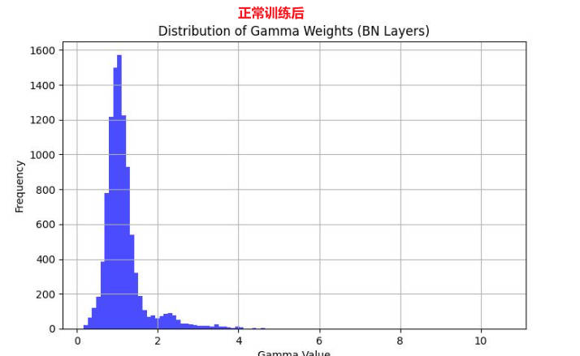

# YOLOv8剪枝


## 相关原理：

Learning Efficient Convolutional Networks Through Network Slimming（[https://arxiv.org/abs/1708.06519）](https://arxiv.org/abs/1708.06519%EF%BC%89)

Pruning Filters for Efficient ConvNets（[https://arxiv.org/abs/1608.08710）](https://arxiv.org/abs/1608.08710%EF%BC%89)

Reference: https://github.com/midasklr/yolov5prune


## 剪枝方法

基于BN层系数gamma剪枝。

在一个卷积-BN-激活模块中，BN层可以实现通道的缩放。如下：


BN层的具体操作有两部分：


在归一化后会进行线性变换，那么当系数gamma很小时候，对应的激活（Zout）会相应很小。这些响应很小的输出可以裁剪掉，这样就实现了bn层的通道剪枝。

通过在loss函数中添加gamma的L1正则约束，可以实现gamma的稀疏化。


上面损失函数L右边第一项是原始的损失函数，第二项是约束，其中g(s) = |s|，λ是正则系数，根据数据集调整

实际训练的时候，就是在优化L最小，依据梯度下降算法：

​								𝐿′=∑𝑙′+𝜆∑𝑔′(𝛾)=∑𝑙′+𝜆∑|𝛾|′=∑𝑙′+𝜆∑𝛾∗𝑠𝑖𝑔𝑛(𝛾)

所以只需要在BP传播时候，在BN层权重乘以权重的符号函数输出和系数即可，对应添加如下代码:

```python
                # # ============================= sparsity training ========================== #
                if self.sr is not None:
            		# 线性衰减的L1正则化系数
                    srtmp = self.sr * (1 - 0.9 * self.epoch / self.epochs)  
                    ignore_bn_list = []
                    for k, m in self.model.named_modules():
                        if isinstance(m, Bottleneck):
                            # 只有Bottleneck模块(对应于网络结构图中的Res Unit)中才做add操作(不剪)
                            if m.add:    
                                # C2f模块中的第一个卷积层的bn层
                                ignore_bn_list.append(k.rsplit(".", 2)[0] + ".cv1.bn") 
                                # C2f模块中的BottleNeck模块中的第二个卷积层
                                ignore_bn_list.append(k + '.cv2.bn')                    
                        if isinstance(m, nn.BatchNorm2d) and (k not in ignore_bn_list):
                            m.weight.grad.data.add_(srtmp * torch.sign(m.weight.data))  # L1
                # # ============================= sparsity training ========================== #
```

这里并未对所有BN层gamma进行约束, 这里对C2f结构中的Bottleneck结构中有shortcut的连接不进行剪枝，主要是为了保持tensor维度可以加：


## 使用方法

下载本仓库的代码, 在本仓库中除了YOLOv8的官方代码, 还包含train.py、train_sparsity.py、prune.py、finetune.py、val.py

这里在某个单类别检测数据集上实验(其他数据集同理)。

### 首先使用train-normal.py进行正常训练:

```python
from ultralytics import YOLO

model = YOLO("weights/yolov8s.pt")
# L1正则的惩罚项系数sr=0
model.train(
    sr=0,
    data="ultralytics/cfg/datasets/coco.yaml", 
    epochs=200, 
    project='.', 
    name='runs/train-norm', 
    batch=48, 
    device=0
)
```

需要下载好权重文件放在train-normal.py同级目录的weights文件夹下;

配置好datasets的yaml文件,  配置方式参考YOLOv8官方代码: ultralytics/cfg/datasets/coco128.yaml;

指定训练代数, 制定sr=0(L1正则项惩罚系数为0)


### 然后使用train_sparsity.py稀疏训练：

```python
from ultralytics import YOLO

model = YOLO("runs/train-norm/weights/best.pt")
# L1正则的惩罚项系数sr
model.train(
    sr=1e-2, 
    lr0=1e-3,
    data="ultralytics/cfg/datasets/coco.yaml", 
    epochs=50, 
    patience=50, 
    project='.', 
    name='runs/train-sparsity', 
    batch=48, 
    device=0
)
```

这里要指定sr的值, 因为要进行稀疏训练, 所以惩罚项一定要有值; 该值越大, 惩罚力度越大, BN层的gamma值的稀疏度就越高

## 使用vis-bn-weight.py可以查看一下, 稀疏前后bn层gamma值的分布变化, 可以明显看到等于0的gamma值在变多



### 训练完成后使用prune.py进行剪枝, 代码详见prune.py:

```python
def parse_opt():
    parser = argparse.ArgumentParser()
    parser.add_argument('--data', type=str, default=ROOT / 'ultralytics/cfg/datasets/coco.yaml', help='dataset.yaml path')
    parser.add_argument('--weights', nargs='+', type=str, default=ROOT / 'runs/train-sparsity/weights/last.pt', help='model.pt path(s)')
    parser.add_argument('--cfg', type=str, default=ROOT / 'ultralytics/cfg/models/v8/yolov8.yaml', help='model.yaml path')
    parser.add_argument('--model-size', type=str, default='s', help='(yolov8)n, s, m, l or x?')
    parser.add_argument('--prune-ratio', type=float, default=0.7, help='prune ratio')
    parser.add_argument('--save-dir', type=str, default=ROOT / 'weights', help='pruned model weight save dir')
    opt = parser.parse_args()
    return opt
```

这里--data、--weights改成自己的,  --cfg不要变, --model-size要保持和前面训练的模型一致(前面是yolov8s, 这里也要指定为s), --prune-ratio为剪枝比率, --save-dir为剪枝后的模型存储的目录

剪枝以后产生的权重文件名为prune.pt


### 使用finetune.py进行微调：

```python
from ultralytics import YOLO

model = YOLO("weights/pruned.pt")
# finetune设置为True
model.train(data="ultralytics/cfg/datasets/coco.yaml", epochs=200, finetune=True)
```

这里设置好微调的轮数, 一定要制定finetune=True

微调产生的模型文件在runs文件夹下


### 使用val.py进行验证, 使用export.py导出为onnx......

## 注意事项
稀疏训练时需禁用amp, 禁用scaler, 禁用grad_clip_norm
想要看到所有针对源码的更改代码, 在该工程下全局搜索'===========', 所有的代码改动前后均使用'==========='包覆

## TODO
多卡DDP模式下, 稀疏训练无法产生稀疏效果


## 剪枝结果比较:

以YOLOv8s为例, 在某单类别检测数据集上的结果:

未剪枝:

```bash
Ultralytics YOLOv8.0.231 🚀 Python-3.9.17 torch-2.1.1+cu121 CUDA:0 (NVIDIA GeForce RTX 2070 SUPER, 7972MiB)
Model summary (fused): 168 layers, 11125971 parameters, 0 gradients, 28.4 GFLOPs
                 Class     Images  Instances      Box(P          R      mAP50  mAP50-95): 
                   all        137        224      0.949      0.929      0.964      0.688
Speed: 3.7ms preprocess, 1.6ms inference, 0.0ms loss, 0.5ms postprocess per image
```

剪枝20%:

``` bash
Ultralytics YOLOv8.0.231 🚀 Python-3.9.17 torch-2.1.1+cu121 CUDA:0 (NVIDIA GeForce RTX 2070 SUPER, 7972MiB)
Model summary (fused): 168 layers, 7470527 parameters, 0 gradients, 20.2 GFLOPs
                 Class     Images  Instances      Box(P          R      mAP50  mAP50-95): 
                   all        137        224      0.962      0.929      0.969      0.704
Speed: 3.7ms preprocess, 1.5ms inference, 0.0ms loss, 0.5ms postprocess per image
```

剪枝40%:

```python
Ultralytics YOLOv8.0.231 🚀 Python-3.9.17 torch-2.1.1+cu121 CUDA:0 (NVIDIA GeForce RTX 2070 SUPER, 7972MiB)
Model summary (fused): 168 layers, 4750968 parameters, 0 gradients, 15.3 GFLOPs
                 Class     Images  Instances      Box(P          R      mAP50  mAP50-95):
                   all        137        224       0.95      0.929      0.972      0.701
Speed: 3.7ms preprocess, 1.2ms inference, 0.0ms loss, 0.5ms postprocess per image
```

剪枝60%:

```python
Ultralytics YOLOv8.0.231 🚀 Python-3.9.17 torch-2.1.1+cu121 CUDA:0 (NVIDIA GeForce RTX 2070 SUPER, 7972MiB)
Model summary (fused): 168 layers, 3039249 parameters, 0 gradients, 11.3 GFLOPs
                 Class     Images  Instances      Box(P          R      mAP50  mAP50-95): 
                   all        137        224      0.971      0.906      0.964      0.694
Speed: 3.7ms preprocess, 1.1ms inference, 0.0ms loss, 0.5ms postprocess per image
```

| 剪枝比例 | onnx文件大小 |
| :--: | :------: |
|  0%  |   43M    |
| 20%  |   29M    |
| 40%  |   19M    |
| 60%  |   12M    |
| 80%  |   7.7M   |

**通过以上例子, 可以看出, 在剪枝20%, 40%时, mAP50甚至还有提升, 剪枝60%时, mAP50不变**


