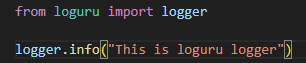
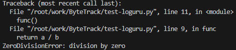

## 推荐使用loguru

[ loguru官方链接](https://github.com/Delgan/loguru)

## 1. 问题由来 

使用python自带日志库logging在定义一个logger时需要写很多行


但是使用loguru时就只需要写一行



而且loguru中的logger提供了一个装饰器, 可以捕获异常, 将发生异常时的变量的值打印出来

普通报错:



loguru报错:


## 2. loguru一些常用用法

```python
from loguru import logger

logger.debug("This is debug")
logger.info("This is info")
logger.warning("This is warning")
logger.error("This is error")
```

```C++
# 自定义日志输出格式
logger.add(sys.stderr, format="{time} {level} {message}", filter="my_module", level="INFO")
# 一个自定义的比较美观的日志输出格式
loguru_format = (
    "<green>{time:YYYY-MM-DD HH:mm:ss}</green> | "
    "<level>{level: <8}</level> | "
    "<cyan>{name}</cyan>:<cyan>{line}</cyan> - <level>{message}</level>"
)
logger.add(sys.stderr, format=loguru_format, level="INFO")
```

```python
logger.add("file_1.log", rotation="500 MB")    # 文件过大（超过500M）就会重新生成一个文件
logger.add("file_2.log", rotation="12:00")     # 每天12点创建新文件
logger.add("file_3.log", rotation="1 week")    # 文件时间过长就会创建新文件
logger.add("file_4.log", retention="10 days")  # 一段时间后会清空
logger.add("file_5.log", compression="zip")    # 保存zip格式
```

```python
# 使用python的格式化字符串可以省略f和.format关键字
logger.info("If you're using Python {}, prefer {feature} of course!", 3.6, feature="f-strings")	
```

```python
# 使用装饰器对某个函数进行异常捕获(可以打印出报错位置的变量值)
@logger.catch
def func():
    a = 100
    b = 0
    return a / b

func()
```

更多用法参考[ loguru官方链接](https://github.com/Delgan/loguru)