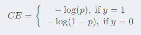

## 一. FL(Focal Loss)

**代码见本文件夹内**

Focal Loss 的引入主要是为了解决难易样本数量不平衡（注意, 有区别于正负样本数量不平衡）的问题, 实际可以使用的范围非常广泛。比如单阶段的目标检测器通常会产生高达 100 k 的候选目标，只有极少数是正样本，正负样本数量非常不平衡。在计算分类的时候常用的损失一一交叉熵的公式如下:



为了解决正负样本不平衡的问题，通常会在交叉熵损失的前面加上一个参数 α，即：


但这无法解决全部问题。根据正、负、难、易, 样本一共可以分为以下四类：


尽管 α 平衡了正负样本， 但对难易样本的不平衡没有任何帮助。而实际上，目标检测中大量的候选目标都是像下图一样的易分样本。


这些样本损失很低，但由于数量极不平衡，易分样本的数量相对来讲太多，最终主导了总的损失。而Focal loss的作者认为，易分样本（即置信度高的样本）对模型的提升效果非常小，模型应该主要关注与那些难分样本, 这时候, Focal Loss 就上场了。

一个简单的思想：把高置信度p样本的损失再降低一些不就好了吗。


举例， r 取 2 时, 如果 p = 0.968 , ( 1 − 0.968 ) ^2 ≈ 0.001 损失衰减了 1000 倍!


 实验表明r 取 2 , alpha 取 0.25的时候效果最佳

## 二. QFL

参考链接写的很好, 先看参考链接:https://zhuanlan.zhihu.com/p/147691786

**在目标检测中主要用在边框类别损失, 代码见本文件夹内**

问题引入: 


**总结一下**: 主要是比如在yolov5中, 会预测三类值(置信度, 边框的xywh以及类别概率), 在训练的时候置信度的损失与类别的损失是独立的, 但是推理的时候却要将置信度与类别概率相乘, 训练和推理是存在gap的

而focal loss是只能作用在置信度损失上的, 无法作用在类别损失上。那么如果我们要消除gap, 就要去掉置信度, 只预测类别概率, 那么这样的话如何让focal loss作用在类别损失上呢? 因此有了QFL, 更一般化的Focal Loss

$ QFL(\sigma) = -\left|y - \sigma\right|^2\left((1 - y)\log(1 - \sigma) + y\log(\sigma)\right)$

其中, y是真实值, sigma是预测值

****

## 三. DFL

参考链接写的很好, 先看参考链接:https://zhuanlan.zhihu.com/p/147691786

在目标检测中主要用在边框回归损失

**代码见本文件夹内**

模型在预测边框的大小时, 不再预测xywh而是预测ltrb(left top right bottom), 也就是预测最后大中小三个特征图中每个单元格中心点到边框的四个边的距离, 而这个距离也不是直接预测的, 而是预测16(16这个数可调)个值。

这16个值代表什么意思呢? 代表某一侧的边框距离单元格中心点0、1、2、3......个像素位置的16个概率, 将这16个概率中的每一个概率乘以对应位置, 就得到了预测边框距离单元格中心点的预测距离。

**推理阶段**: 

```python
# 伪代码
reg = torch.randn([16]).softmax(0)		# 16个位置的概率分布(和为1)
indexes = torch.arange(16)			    # 16个位置的索引
dist = torch.sum(reg * indexes)			# 概率乘以索引求和即是某一边距离单元格中心点的预测值
```

**训练阶段**:  

模型输出的这16个值, 然后对这16个值做softmax, 代表16个位置的概率预测分布。

真实框在哪一单元格以及距离该单元格中心点的上下左右的距离是确定的。

那么只需要将真实框所在左右位置的索引处的概率值最大就行。

例如, 某目标的中心点(这里待确认, 是像YOLOv5一样, 某个物体的中心点落在某个单元格内, 就由该单元格负责预测该中心点)落在中心点坐标为(4.5, 8.5)的单元格中, 该目标边框的左边距离中心点偏移为2.3, 那么在就要让这16个预测概率的第2个位置和第3个位置的值最大尽量接近1	, 也就是优化目标是[0, 0, 1, 1, 0, 0, 0......], 注意在计算损失的时候是将两个softmax损失乘以对应的权重系数后相加, 并不是多标签损失。

**注意: 不但DFL可以产生损失, IoU依然也可以产生损失, 在训练阶段, 将16个位置的概率值转换成预测框的位置, 然后就可以计算预测框与真实框的IoU(GIoU、DIoU、CIoU等)从而产生IoU损失**


