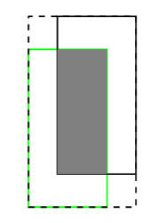
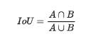
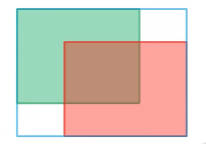
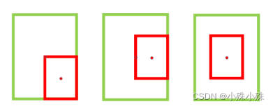
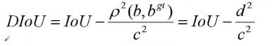
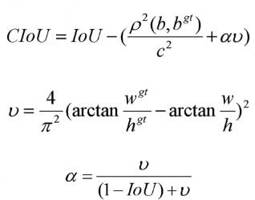
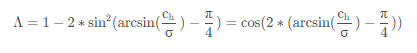
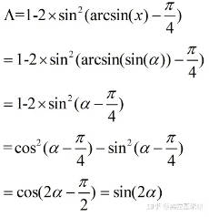

## 一. IoU





值域: [0, 1]

缺点: 当预测框和真实框之间的交集为0时, 无论预测框与真实框之间的距离有多远, IoU都为0, 损失值(1- IoU)都一样, 这不公平。应当是距离越远,  损失值越大。

## 二. GIoU



​									

​						**C代表蓝色的框，最大的矩形框。A∪B代表GT和预测框的并集**

值域: [-1, 1]

优点: 解决了IoU的问题, 当IOU为0时，意味着A与B没有交集，这个时候两个框离得越远，GIOU越接近-1；两框重合，GIOU=1

缺点: 当两个框属于包含关系时，GIoU会退化成IoU，无法区分其相对位置关系



由于GIoU仍然严重依赖IoU，因此在两个垂直方向，误差很大，很难收敛。两个框在相同距离的情况下，水平垂直方向时，此部分面积最小，对loss的贡献也就越小，从而导致在垂直水平方向上回归效果较差。

​        如下图，三种情况下GIoU的值一样，GIoU将很难区分这种情况。


## 三. DIoU


​							

值域: [-1, 1]

优点：（1）DIoU loss可以直接最小化两个目标框的距离，因此比GIoU loss收敛快得多。

   	    （2）对于包含两个框在水平方向和垂直方向上这种情况，DIoU损失可以使回归非常快。

​            （3）DIoU还可以替换普通的IoU评价策略，应用于NMS中，使得NMS得到的结果更加合理和有效。

缺点： 虽然DIOU能够直接最小化预测框和真实框的中心点距离加速收敛，但是Bounding box的回归还有一个重要的因素纵横比暂未考虑。如下图，三个红框的面积相同，但是长宽比不一样，红框与绿框中心点重合，这时三种情况的DIoU相同，证明DIoU不能很好的区分这种情况。


## 四. CIoU




相对于DIoU增加了长宽比损失

## 五. SIoU

**SIoU = 角度损失 + 距离损失 + 形状损失**

### 1. 角度损失:




​		可以推导为:



### 2. 距离损失


### 3. 形状损失


## 六. IoU、GIoU、DIoU、CIoU、SIoU代码实现

```python
def bbox_iou(box1, box2, x1y1x2y2=True, GIoU=False, DIoU=False, CIoU=False, SIoU=False, eps=1e-7):
    # Returns the IoU of box1 to box2. box1 is 4, box2 is nx4
    box2 = box2.T

    # Get the coordinates of bounding boxes
    if x1y1x2y2:  # x1, y1, x2, y2 = box1
        b1_x1, b1_y1, b1_x2, b1_y2 = box1[0], box1[1], box1[2], box1[3]
        b2_x1, b2_y1, b2_x2, b2_y2 = box2[0], box2[1], box2[2], box2[3]
    else:  # transform from xywh to xyxy
        b1_x1, b1_x2 = box1[0] - box1[2] / 2, box1[0] + box1[2] / 2
        b1_y1, b1_y2 = box1[1] - box1[3] / 2, box1[1] + box1[3] / 2
        b2_x1, b2_x2 = box2[0] - box2[2] / 2, box2[0] + box2[2] / 2
        b2_y1, b2_y2 = box2[1] - box2[3] / 2, box2[1] + box2[3] / 2

    # Intersection area
    inter = (torch.min(b1_x2, b2_x2) - torch.max(b1_x1, b2_x1)).clamp(0) * \
            (torch.min(b1_y2, b2_y2) - torch.max(b1_y1, b2_y1)).clamp(0)

    # Union Area
    w1, h1 = b1_x2 - b1_x1, b1_y2 - b1_y1 + eps
    w2, h2 = b2_x2 - b2_x1, b2_y2 - b2_y1 + eps
    union = w1 * h1 + w2 * h2 - inter + eps

    iou = inter / union
    if GIoU or DIoU or CIoU:
        cw = torch.max(b1_x2, b2_x2) - torch.min(b1_x1, b2_x1)  # convex (smallest enclosing box) width
        ch = torch.max(b1_y2, b2_y2) - torch.min(b1_y1, b2_y1)  # convex height
        if CIoU or DIoU:  # Distance or Complete IoU https://arxiv.org/abs/1911.08287v1
            c2 = cw ** 2 + ch ** 2 + eps  # convex diagonal squared
            rho2 = ((b2_x1 + b2_x2 - b1_x1 - b1_x2) ** 2 +
                    (b2_y1 + b2_y2 - b1_y1 - b1_y2) ** 2) / 4  # center distance squared
            if DIoU:
                return iou - rho2 / c2  # DIoU
            elif CIoU:  # https://github.com/Zzh-tju/DIoU-SSD-pytorch/blob/master/utils/box/box_utils.py#L47
                v = (4 / math.pi ** 2) * torch.pow(torch.atan(w2 / h2) - torch.atan(w1 / h1), 2)
                with torch.no_grad():
                    alpha = v / (v - iou + (1 + eps))
                return iou - (rho2 / c2 + v * alpha)  # CIoU
        else:  # GIoU https://arxiv.org/pdf/1902.09630.pdf
            c_area = cw * ch + eps  # convex area
            return iou - (c_area - union) / c_area  # GIoU
    elif SIoU:  # SIoU Loss https://arxiv.org/pdf/2205.12740.pdf
        cw = torch.max(b1_x2, b2_x2) - torch.min(b1_x1, b2_x1)
        ch = torch.max(b1_y2, b2_y2) - torch.min(b1_y1, b2_y1)
        s_cw = (b2_x1 + b2_x2 - b1_x1 - b1_x2) * 0.5 # 真实框和预测框中心点的宽度差
        s_ch = (b2_y1 + b2_y2 - b1_y1 - b1_y2) * 0.5 # 真实框和预测框中心点的高度差
        sigma = torch.pow(s_cw ** 2 + s_ch ** 2, 0.5) #真实框和预测框中心点的距离
        sin_alpha_1 = torch.abs(s_cw) / sigma #真实框和预测框中心点的夹角β
        sin_alpha_2 = torch.abs(s_ch) / sigma #真实框和预测框中心点的夹角α
        threshold = pow(2, 0.5) / 2 #夹角阈值
        sin_alpha = torch.where(sin_alpha_1 > threshold, sin_alpha_2, sin_alpha_1) #α大于45°则考虑优化β，否则优化α
        angle_cost = torch.cos(torch.arcsin(sin_alpha) * 2 - math.pi / 2)  # 角度损失
        rho_x = (s_cw / cw) ** 2 
        rho_y = (s_ch / ch) ** 2
        gamma = angle_cost - 2
        distance_cost = 2 - torch.exp(gamma * rho_x) - torch.exp(gamma * rho_y) #距离损失
        omiga_w = torch.abs(w1 - w2) / torch.max(w1, w2)
        omiga_h = torch.abs(h1 - h2) / torch.max(h1, h2)
        shape_cost = torch.pow(1 - torch.exp(-1 * omiga_w), 4) + torch.pow(1 - torch.exp(-1 * omiga_h), 4) #形状损失
        return iou - 0.5 * (distance_cost + shape_cost) #siou
    else:
        return iou  # IoU
```

