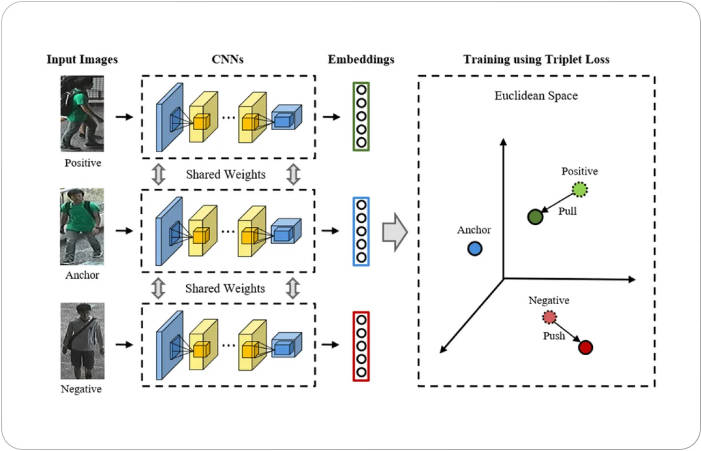

**triplet loss适用于少样本的精细物体分类问题**

原理是将每张图片使用一个分类网络提取一个固定维度的特征向量

然后每个batch要iter出三种东西, 一个是anchor, 一个是positive, 一个是negtive, 在计算损失的时候, 对于anchor中的每个图, 计算一个anchor与postive、anchor与negtive的三元组损失, 然后反向传播. 当使用triplet loss训练好网络后, 我们并不知道网络输出的特征向量到底是哪一个类, 可以再训练个SVM分类器对特征向量进行分类



三元组损失计算公式如下:

$$Loss(a, p, n) = \max \{d(a_i, p_i) - d(a_i, n_i) + {\rm margin}, 0\}$$

其中a代表anchor, p代表positive, n代表negtive, 默认的距离计算为欧式距离, 也可以换成类似于人脸识别的余弦距离或者arcface距离

示例代码如下:

```python
import torch
import torch.nn as nn


if __name__ == "__main__":
    # pytorch还提供了一种可自定义距离计算方式的接口torch.nn.TripletMarginWithDistanceLoss
    triplet_loss = nn.TripletMarginLoss(margin=1, p=2)
    anchor = torch.randn(128, 512).requires_grad_(True)
    pos = torch.randn(128, 512).requires_grad_(True)
    # 假设为每个batch的每张图选9个负样本
    neg = torch.randn(128, 9, 512).requires_grad_(True)
    # 计算每张图与这9个负样本之间的欧式距离
    d_an = ((anchor.unsqueeze(1) - neg) ** 2).sum(-1)
    # 从这d_an降序排列, 选择三个距离最大的负样本
    indices = d_an.argsort(-1, descending=True)[:, :3]
    # 从这三个距离最大的负样本中随机选一个作为计算损失的负样本
    sampled_idx = torch.randint(3, (128,))
    hard_negtive = indices[torch.arange(128), sampled_idx]
    loss = triplet_loss(anchor, pos, neg[torch.arange(128), hard_negtive, :])
    loss.backward()
```


