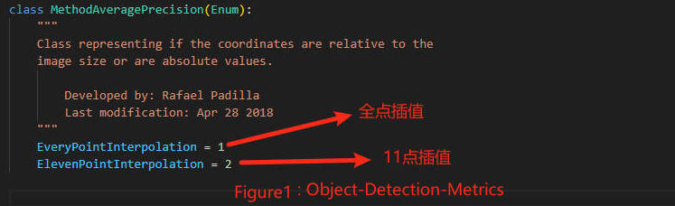
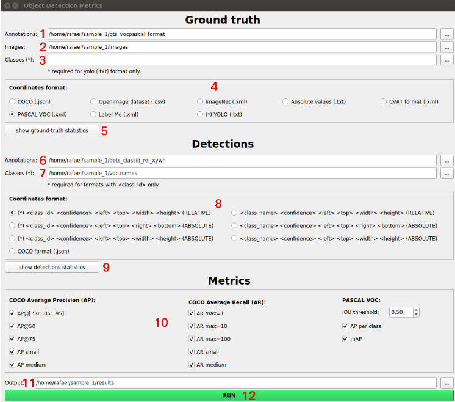

## 使用方法

### 方式一:

步骤一: 

坐标格式转换(convert文件夹下)

1. 将检测框的文件放入dt下, 格式为cls+xywh+conf; 将真实框的文件放入gt下, 格式为cls+xywh, 这两个文件夹下的边框坐标均为值在0-1之间的相对坐标; 将图片放在images文件夹下。三个文件夹中的文件名要一一对应
2. 将类别名字按序写入class_list.txt文件
3. 使用yolo2voc.py将dt和gt中yolo格式的相对坐标转换为voc格式的绝对坐标(也就是将相对值乘以图像宽高), 输出文件产生在dt-output和gt-output中

步骤二: 

计算评估指标

1. 克隆代码 

```bash
git clone https://github.com/rafaelpadilla/Object-Detection-Metrics
```

2. 进入Object-Detection-Metrics文件夹中运行pascalvoc.py文件, 并指定参数获取结果

   注: 这几个参数的含义可以到[github](https://github.com/rafaelpadilla/Object-Detection-Metrics) 主页上查看

```bash
python pascalvoc.py -gt ../convert/gt-output -det ../convert/dt-output -gtformat xyrb -detformat xyrb
```

**! 注意: 步骤二中使用的仓库Object-Detection-Metrics中对于AP的计算方法支持两种, 一种是全点插值法, 一种是11点插值法, 默认为全点插值法(Figure1);**

**yolov5中AP的计算方法支持两种, 一种是全点插值法, 一种是101点插值法, 默认为101点插值法(Figure2);**

**所以要想一起使用需要将yolov5中的计算方法也改为全点插值法, 才能保证一致性。**

**即使保持了一致性, 这两种方式计算出的结果也会有0.2%左右的差异(正常现象)**




### 方式二:

使用cocoapi进行评估

安装cocoapi:

```bash
pip3 install cython
pip3 install 'git+https://github.com/cocodataset/cocoapi.git#subdirectory=PythonAPI'
```

创建coco格式的标注文件annotations.json(详情见该文件), 其中bbox为xc、yc、w、h形式, area和iscrowd是必须字段;

创建coco格式的预测值文件predictions.json(详情见该文件), 其中bbox也为xc、yc、w、h形式;

评估的API见cocoapi.py


### 方式三:

可视化的方式评估, [链接]((https://github.com/rafaelpadilla/review_object_detection_metrics))




