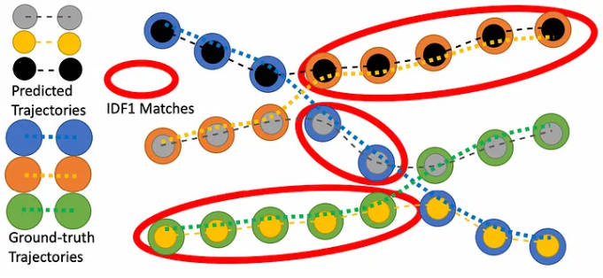
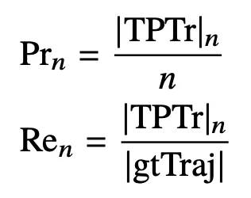

# 一. 基础指标

FN(对于检测而言): 真实框存在但是预测框丢失

FP(对于检测而言): 真实框不存在但是预测框存在

ID switch(对于跟踪而言): 两个或者多个预测跟踪框的ID交换了

Fragmentation(对于跟踪而言): 真实的跟踪框还在, 但是预测跟踪框已经不跟踪了

# 二. 各种评估指标

## 1. MOTA(第一常用)

[代码链接](https://github.com/JonathonLuiten/TrackEval/blob/master/trackeval/metrics/clear.py)

**检测级别**的评估指标: MOTA 是最具代表性的衡量标准，与人类视觉评估的吻合程度最高。

缺点: MOTA过度关注检测器性能, 过少关注预测轨迹与真实轨迹的匹配程度

## 2. IDF1(第二常用)

[代码链接](https://github.com/JonathonLuiten/TrackEval/blob/master/trackeval/metrics/identity.py)

IDF1关注**匹配准确率**, 把预测框与跟踪框的交并比大于阈值的叫做IDTP, IDF1重点关注的是IDTP占的比率

缺点: IDF1过度关注预测轨迹与真实轨迹的匹配程度, 过少关注检测器性能

在上图中, IDTP是红色椭圆圈起来的点, IDFN是蓝色、橘色、绿色中未被红色圈起来的点, IDFP是灰色、黄色、黑色中未被红色圈起来的点

## 3. HOTA(第三常用)

[代码链接](https://github.com/JonathonLuiten/TrackEval/blob/master/trackeval/metrics/hota.py)

[文章链接](https://jonathonluiten.medium.com/how-to-evaluate-tracking-with-the-hota-metrics-754036d183e1)

HOTA是对检测器性能以及匹配准确率进行balance的一个评价指标

## 4. Track-mAP(不常用)

[代码链接](https://github.com/JonathonLuiten/TrackEval/blob/master/trackeval/metrics/track_map.py)

**轨迹级别**的评估指标: Track-mAP需要一个轨迹相似度得分, 只有预测的轨迹与真实轨迹的相似度得分大于阈值时才会算作匹配

**TPTr** : 真阳轨迹, 也就是预测轨迹与真实轨迹的相似度得分大于阈值的轨迹

**FPTr**: 假阳轨迹, 除了真阳轨迹以外的预测轨迹

假如预测轨迹有n个, 那么此时对应的precision和recall值如下:

Track mAP 分数是通过针对所有 n 值绘制 precision与recall 曲线下的积分。

