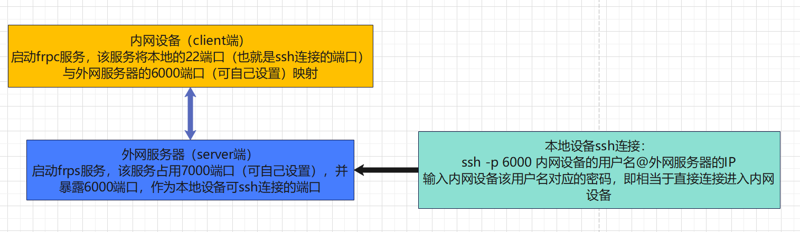

# 一、下载

   在本文件夹内

# 二、原理

​    

# 三、快捷启动脚本

## 1，server端

```bash
#! /bin/bash
cd ~/frp_0.51.3_linux_amd64            # 改成自己的路径
if pgrep -x "frps" >/dev/null          # 检查frps服务是否已经启动
then
    echo "frps is already running!"
else
    nohup ./frps -c frps.ini > /dev/null 2>&1 &    # 保持不断开启动frps服务
    sleep 1  # Give it a moment to start
    if pgrep -x "frps" >/dev/null
    then
        echo "frps started"
    fi
fi
```


## 2，client端

```bash
check_frpc_status() {                                                                                        
    cd /home/research/software/frp_0.51.3_linux_amd64              # 改成自己的路径                                                      
    server_addr=$(awk -F' = ' '/server_addr/{print $2}' frpc.ini)  # 获取server端的服务IP                                          
    remote_port=$(awk -F' = ' '/remote_port/{print $2}' frpc.ini)  # 获取server端的服务端口                                        
    if pgrep -x "frpc" >/dev/null                                  # 判断frpc服务是否已启动                                                                     
    then                                                                                                     
        echo "frpc is already running"                                                                       
        echo "Command to connect: ssh -p $remote_port root@$server_addr    Password: 111111"                 
    else                                                                                                     
        nohup ./frpc -c frpc.ini > /dev/null 2>&1 &                # 启动frpc服务                                                    
        sleep 1  # Give it a moment to start                                                                 
        if pgrep -x "frpc" >/dev/null                              # 再次判断frpc是否已启动                                                   
        then                                                                                                 
            echo "frpc started"                                                                              
            echo "Command to connect: ssh -p $remote_port root@$server_addr    Password: 111111"             
        else                                                                                                 
            echo "Whoops, frpc started failure. Please make sure frps (frp server) is started already"       
        fi                                                                                                   
    fi                                                                                                       
}                                                                                                                                                                                                              
check_frpc_status 
```

