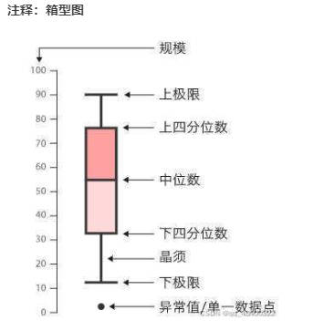

# 0、一些设置

```python
导包：from matplotlib import pyplot as plt

设置绘图：
pycharm中：设置绘制的图像为弹窗模式：settings -->>tools>>python scientific -->>show plots in tool windows

jupyter中：
%matplotlib inline
%matplotlib tk

# 常用设置
plt.rcParams["font.sans-serif"] = ["SimHei"]  #设置字体防止中文乱码
plt.rcParams['axes.unicode_minus']=False   #设置可以显示负号
```

# 一、图像绘制

```python
#画折线图
plt.figure(figsize=(8,5),num="num1")   #设置展示窗口大小为8*5，名字为num1
plt.subplot(211)             # 子图；211代表：2行1列第1个子图
plt.plot(x, y1,"r-o",label="y1")   #绘制图像1,"r"代表红色"-"代表实线"o"代表每一个点都标注出来
plt.subplot(212)             # 子图；211代表：2行1列第2个子图
plt.plot(x,y2,"b--X",label="y2")   #绘制图像2，"b"代表蓝色"--"代表虚线"X"代表每一个点都使用x标注出来
plt.text(x,y,s)  #x和y为要标注信息点的坐标，s为标注信息
plt.xlabel("x")             #为x轴命名
plt.ylabel("y")             #为y轴命名
plt.xticks([])              # 去掉x轴上的坐标
plt.yticks([])               # 去掉y轴上的坐标
plt.legend()                #显示图标y1和y2
plt.title("sin(x)图像")     #为整个图像命名
plt.tight_layout(pad=1.5)   # 设置子图之间的间距
plt.show()                  #显示图像
plt.savefig(path)           # 保存图片


#画柱状图
x=["语文","英语","数学"]
y = [80,90,100]
plt.bar(x,y,width=0.25,align="center",labels="student1")     #画柱状图,width代表柱子宽度，align代表柱子居中

#画饼状图
x=["男","女"]
y=[0.3,0.7]
plt.pie(y,labels=x,explode=(0,0.1)，autopct="%1.2f%%") #autopct="%1.2f%%"为指定百分比；explode=(0,0.1)，如果不是None，是一个长度与x相同长度的数组，用来指定每部分的偏移量或者说指定项距离饼图圆心为n个半径。
plt.legend()    #显示图例

#直方图（概率密度图）：显示一组数值序列在给定的数值范围内的出现的概率
plt.hist(x，density=True)   #density设置为True时是计算概率，设置为False时是频数

#添加文本
plt.text(x,y,s)  #x和y为要标注信息点的坐标，s为标注信息

#绘制散点图
plt.scatter(a,b,color="r",label="散点")  

#绘制等高线图
x=np.linspace(-10,10,10)  #等差数列
y=np.linspace(-10,10,10)  #等差数列
X,Y=np.meshgrid(x,y)      #计算网格（即把x复制出y数量的行数，把y复制出x数量的列数）
Z = X**2+Y**2
plt.contourf(X,Y,Z)
plt.contour(X,Y,Z)

#绘制箱形图
plt.boxplot(x)


#绘制3D图
x=np.linspace(-10,10,10)  #等差数列
y=np.linspace(-10,10,10)  #等差数列
X,Y=np.meshgrid(x,y)      #计算网格（即把x复制出y数量的行数，把y复制出x数量的列数）
Z = X**2+Y**2
ax=plt.axes(projection="3d")
ax.plot_surface(X,Y,Z,cmap="winter")    #画曲面,cmap="winter"可以使颜色渐进
ax.contour3D(X,Y,Z)       #画等高线


# seaborn画概率密度图（单变量数据）（例如，要观察一个连续特征的概率密度，只需要传入该列特征即可）
seaborn.distplot(a,  hist=True, label=None)  # a：Series、1维数组或者列表;bins:直方图bins（柱）的数目；hist：布尔值，是否绘制直方图（如果是绘制概率密度曲线，则为False);label：字符串,图形相关组成部分的图例标签。


#seaborn绘制热力图
seaborn.heatmap(df_corr, square=True, annot=True, cmap="YlGnBu")
```

