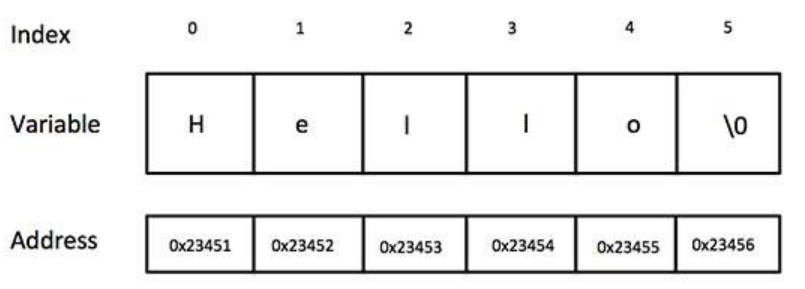

## 0. 重点注意

```C++
注意：
1. 函数中如何return？
  // ①return临时变量的值，不能return临时变量的地址
  int Add(int a, int b)
  {
      int c;
      c = a+b;
      return c; //可以return c，但是不能return &c，因为return c是值传递，return &c是地址传递， &c的内存离开函数就被释放掉了
  }
  // ②return类的实例对象、STL标准容器
  Student Addage(int age1, int age2)
  {
      Student s;
      return s;    // 可以在函数体内部实例化类的对象，然后直接return出去，属于值传递不会出现错误
  }
  // ③如果就像return指针类型，那么就在函数体内部new出来一个指针return
  std::shared_ptr<int> Add(int a , int b)
  {
      std::shared_ptr<int> c(new int());  //非得返回指针
      *c = a+b;
      return c;
  }

2，一个工程中只能有一个main()函数

3，头文件（.h）中不要使用using namespace ，因为如果使用了，当你在导入这个头文件的时候，就会导入头文件中使用的using namespace的命名空间，造成混乱。
  
4，在编译时，有main函数的文件会被编译成可执行文件，无main函数的文件会被编译成动态库。

5，nullptr和void指针辨析:nullptr需要指定指针类型(int float等)，指针为空指针，使用if判断时，nullptr为false;void为未指定类型的指针，可以先初始化，然后再指向任意类型数据的地址。
  例子:
  int *p=nullptr;  //初始化空指针
  void* pc;       //声明一个指针为void型
  int i = 123;
  pc = &i;
  p = &i;
  cout << pc << endl;         //输出指针地址006FF730
  cout << *(int*)pc << endl;  //输出值123
  char *c = "qwe";
  pc = &c;     //void型指针可以指向int型后再指向char型的
  cout << *(char*)pc << endl; //输出值qwe

6、向函数传递对象
  使用对象作为函数参数：对象可以作为参数传递给函数，其方法与传递其他类型的数据相同。在向函数传递对象时，是通过“传值调用”的方法传递给函数的。因此，函数中对对象的任何修改均不影响调用该函数的对象（实参本身）。
  使用对象指针作为函数参数：对象指针可以作为函数的参数，使用对象指针作为函数参数可以实现传值调用，即在函数调用时使实参对象和形参对象指针变量指向同一内存地址，在函数调用过程中，形参对象指针所指的对象值的改变也同样影响着实参对象的值。
  使用对象引用作为函数参数：在实际中，使用对象引用作为函数参数非常普遍，大部分程序员喜欢使用对象引用替代对象指针作为函数参数。因为使用对象引用作为函数参数不但具有用对象指针做函数参数的优点，而且用对象引用作函数参数将更简单、更直接。

7.虚基类:解决菱形继承问题;
虚函数:实现类的多态性(动态多态，也就是动态连编时运行时的多态)，为什么必须用虚函数，因为c++和python不一样，c++不能使用子类重写父类方法的方式加super来实现多态，而只能用虚函数这种方式实现多态。

8. 静态连编与动态连编:静态连编通过指针或者引用的类型来确定调用的函数，动态连编通过对象的类型确定调用函数。
```

```C++
//     注释
/**/   注释
# define a 10 定义宏常量，a的值为10，a的值不可修改。一般放在文件开头的位置
const int a = 10    定义常量a的值为10，a的值不可修改。一般用在程序内部

常用关键字（标识符）
sizeof 可以统计数据类型所占用内存大小，以字节为单位

typedef int feet;   # 为一个数据类型起一个别名
using feet = int;   # 为一个数据类型起一个别名

typeid(fe).name()   # 查看变量fe的数据类型

inline内联函数:类似于宏定义define，只是简单的代码替换

变量、函数、类声明的意义：在编译时有意义，可以通过编译。（链接时必须指定变量、函数、类的实际定义）
变量、函数、类可以被多次声明，但是只能被定义一次。

extern 关键字：声明一个变量或者一个函数为全局变量或者全局函数，一般来说他的定义在别的文件中，只要在编译时将定义他的文件一起编译即可（将变量、函数定义的文件编译为动态库，然后将主文件与动态库链接）

**左值（lvalue）：**指向内存位置的表达式被称为左值（lvalue）表达式。左值可以出现在赋值号的左边或右边。
**右值（rvalue）：**术语右值（rvalue）指的是存储在内存中某些地址的数值。右值是不能对其进行赋值的表达式，也就是说，右值可以出现在赋值号的右边，但不能出现在赋值号的左边。

#的作用：
1，导入头文件
2，定义宏（替换代码）（例如定义# define PI=3.14)
3，条件编译（选择性编译），也就是代码中有一部分代码不进行编译，一般会进行环境变量的判断。

g++、shell脚本、makefile、cmake编译区别：少量文件使用g++编译，文件数稍微多点可以使用shell脚本编译，文件量庞大可以使用makefile编译但是makefile规则复杂，文件量大建议使用cmake编译，使用比较简单。

动态库概念：一般以.so结尾，独立于主文件编写，如果要执行主文件，需要提供动态库链接
静态库概念：一般以.a结尾，待完善

不需要加分号的情况：
函数定义、类定义、for循环、宏定义

作用域标识符"::":用法一，通常情况下，如果有两个同名变量，一个是全局的，另一个是局部的，那么局部变量在其作用域内具有较高的优先权，它将屏蔽全局变量。如果希望在局部变量的作用域内使用同名的全局变量，可以在该变量前加上“::”，此时::value代表全局变量value，“::”称为作用域标识符。用法二，定义类中的已声明的成员函数。注意，此时定义只能在main函数体外定义。在main函数体内使用::只有一种情况，就是static静态成员变量或者静态成员函数。
用法一:类似于global
#include <iostream>
using namespace std;
int value;   //定义全局变量value
int main() 
{
    int value;  //定义局部变量value
    value = 100;
    ::value = 1000;
    cout << "local value : " << value << endl;
    cout << "global value : " << ::value << endl;
    return 0;
}
用法二:定义类中的成员函数
#include <iostream>
using namespace std;

class M {
public:
   void m();//声明成员函数
};
void M::m() {
    // 定义成员函数
}
int main() {
    // 主函数，注意不能在main函数中定义成员函数m
    return 0;
}
```

## 一、数据类型与变量

```C++
数据类型存在的意义：给变量分配合适的内存空间
整型：
1，short ：2字节  取值范围（-2^15,2^15-1)
2，int：4字节   取值范围（-2^31,2^31-1)
3，long：windows为4字节，Linux为4字节（32位），8字节（64位）
4，long long：8字节   取值范围（-2^63,2^63-1)

浮点型：
1，单精度float 4字节 输出小数会显示6为有效数字（不含小数点）
2，双精度double 8字节 15位有效数字

字符型：
char a = 'a';  1字节  字符型是将字母的ASCII编码放入存储单元

字符串型：
1，C语言风格的字符串： char a[] = "abandon"
2，C++风格的字符串：string a = "abandon"   在使用此风格的字符串的时候要在头文件中#include<string>
注意:使用char定义字符型必须是单引号，不能用指针定义，此时变量名就是字符值，可以用&取地址。使用char定义字符串型必须是双引号，且只能用指针定义或者数组定义，此时指针变量名就是字符串的值(不需要解引用)，且一般无法获取字符串的地址，如果要修改字符串的值，需要定义的时候使用数组定义字符串。使用string定义字符串的时候，必须用双引号，且只能用变量定义不能用指针定义，要获取地址使用&。

布尔类型：
bool a = True 1字节  

枚举类型：(变量的值只能在列举出来的值的范围内)
enum color { red, green, blue };
color c = blue;   # c为枚举类型color，并且赋值为blue，此时如果将c强转为int，那么c的值为2(因为c在第2个位置)

转义字符：
\n 换行
\t 水平制表符制表
\\ 反斜杠

& 取址符（用在一个数前面可以查看该数的地址）, 放在函数的形参中是代表引用传递
* 取值符。。。例如*&a的值其实就是a的值，*用在一个地址前面就可以得到地址内的值
```

**变量及作用域**

```C++
如果一个变量只声明但是未定义，变量的值会被初始化为NULL（所有字节的值都是0）

一般来说有三个地方可以声明变量：
在函数或一个代码块内部声明的变量，称为局部变量，一般局部变量声明后就要初始化，防止出问题。
在函数参数的定义中声明的变量，称为形式参数。
在所有函数外部声明的变量，称为全局变量。
局部变量和全局变量名字相同时，局部变量会覆盖全局变量。
```

**常量（define和const)**

```C++
#define WIDTH 5     // （只是简单地代码替换）注意不带分号，否则编译会错误。且WIDTH会自动分配存储空间为整型的4字节
const int  LENGTH = 10;  // （代表不可变的值）
```

**存储类（auto、register、static、extern、mutable）**

```C++
auto 关键字用于两种情况：声明变量时根据初始化表达式自动推断该变量的类型、声明函数时函数返回值的占位符。

register 存储类用于定义存储在寄存器中而不是 RAM 中的局部变量。这意味着变量的最大尺寸等于寄存器的大小（通常是一个词），且不能对它应用一元的 '&' 运算符（因为它没有内存位置）。
{ register int miles;}
寄存器只用于需要快速访问的变量，比如计数器。还应注意的是，定义 'register' 并不意味着变量将被存储在寄存器中，它意味着变量可能存储在寄存器中，这取决于硬件和实现的限制。

static 存储类指示编译器在程序的生命周期内保持局部变量的存在，而不需要在每次它进入和离开作用域时进行创建和销毁。因此，使用 static 修饰局部变量可以在函数调用之间保持局部变量的值。
static 修饰符也可以应用于全局变量。当 static 修饰全局变量时，会使变量的作用域限制在声明它的文件内。（这样即使其他文件中声明了extern，也无法使用当前文件声明的全局变量）

extern 用来在另一个文件中声明一个全局变量或函数。它用于告诉编译器该变量或函数的真正定义位于其他文件或当前文件的另一个部分。

mutable 说明符仅适用于类的对象.也就是说，mutable 成员可以通过 const 成员函数修改。
```

**字符串**

```C++
C风格的：
char greeting[] = "Hello";

C++风格的：
# include <iostream>
# include <string>
using namespace std;
int main() {
    string str1 = "Hello";
    string str2 = "orld";
    string str3 = str1 + str2;
    int size = str3.size();
    std::cout << str3 << std::endl;
    std::cout << size << std::endl;
    return 0;
}
```

**字符串函数:**

```C++
# include <cstring>
```

| 序号   | 函数 & 目的                                  |
| ---- | ---------------------------------------- |
| 1    | strcpy(s1, s2);复制字符串 s2 到字符串 s1。         |
| 2    | strcat(s1, s2);连接字符串 s2 到字符串 s1 的末尾。     |
| 3    | strlen(s1);    与sizeof区别，sizeof计算的是占用内存多少字节，而字符串在c++中存储的时候会在最后添加"\0"返回字符串 s1 的长度。 |
| 4    | strcmp(s1, s2);如果 s1 和 s2 是相同的，则返回 0；如果 s1s2 则返回大于 0。 |
| 5    | strchr(s1, ch);返回一个指针，指向字符串 s1 中字符 ch 的第一次出现的位置。 |
| 6    | strstr(s1, s2);返回一个指针，指向字符串 s1 中字符串 s2 的第一次出现的位置。 |



## 二、运算符

```C++
除法：
两个整数相除，结果还是整数

递增，递减： 
a = 2; b = a++  后置递增，先让变量进行表达式计算，再递增
a = 2; b = ++a  前置递增，先让变量进行递增，再进行表达式计算

逻辑与、或：
&&（同python中的and)  ||（同python中的or)  !逻辑非（同python中的not）

三目运算符
c = (a > b ? a : b) 如果a大于b则返回a，否则返回b(同numpy中的where)
```

逻辑运算符：

A = 0011 1100

B = 0000 1101

| 运算符  | 描述                                       | 实例                                       |
| ---- | ---------------------------------------- | ---------------------------------------- |
| &    | 如果同时存在于两个操作数中，二进制 AND 运算符复制一位到结果中。       | (A & B) 将得到 12，即为 0000 1100              |
| \|   | 如果存在于任一操作数中，二进制 OR 运算符复制一位到结果中。          | (A \| B) 将得到 61，即为 0011 1101             |
| ^    | 如果存在于其中一个操作数中但不同时存在于两个操作数中，二进制异或运算符复制一位到结果中。 | (A ^ B) 将得到 49，即为 0011 0001              |
| ~    | 二进制补码运算符是一元运算符，具有"翻转"位效果，即0变成1，1变成0。     | (~A ) 将得到 -61，即为 1100 0011，一个有符号二进制数的补码形式。 |
| <<   | 二进制左移运算符。左操作数的值向左移动右操作数指定的位数。            | A << 2 将得到 240，即为 1111 0000              |
| >>   | 二进制右移运算符。左操作数的值向右移动右操作数指定的位数。            | A >> 2 将得到 15，即为 0000 1111               |

## 三、if

```C++
if (条件1)
{
    if (子条件)
    {
        执行语句;  
    }

}
else if (条件2)
{
    执行语句;
}
else
{
    执行语句;
}
```

## 四、switch

```C++
switch比if执行效率高
switch(表达式)  

{

    case 结果1：//如果表达式的结果为结果1
            执行语句;
            break;

    case 结果2：//如果表达式的结果为结果2
            执行语句;
            break;

    ...

    default:  //如果表达式的结果都不在上面所有结果中
            执行语句;
            break;

}
```

## 五、while

```C++
while (num < 10)
{
    cout << "num = " << num << endl;
    num++;
}

do{ 循环语句 } while(循环条件); //和while的区别在于do while先执行一次循环语句再执行循环条件

循环语句有2中退出方式，一种是return另一种是break
```

## 六、for循环

```C++
for(起始表达式;条件表达式;末尾循环体) { 循环语句; }
int main() {

    for (int i = 0; i < 10; i++)
    {
        cout << i << endl;
    }
    
    system("pause");

    return 0;
}
```

## 七、goto

```C++
如果标记的名称存在，执行到goto语句时，会跳转到标记的位置
```

## 八、数组

```C++
C++ 支持数组数据结构，它可以存储一个固定大小的相同类型元素的顺序集合。数组是用来存储一系列数据，但它往往被认为是一系列相同类型的变量。

数组中的特定元素可以通过索引访问。所有的数组都是由连续的内存位置组成。最低的地址对应第一个元素，最高的地址对应最后一个元素。

数组在赋值的时候索引值不允许超过定义时的数组长度，但是在取值的时候索引值可以超过定义时的数组长度。

一维数组三种定义方式：
1、数据类型  数组名[ 数组长度 ];
2、数据类型  数组名[ 数组长度 ] = { 值1，值2 ...};
3、数据类型  数组名[ ] = { 值1，值2 ...};
注意数组名即为数组第一个元素的地址

二维数组定义方式：
数据类型  数组名[ 行数 ][ 列数 ] = { {数据1，数据2 } ，{数据3，数据4 } };
索引第一行：arr[0] 

数组索引：同python

例子：
#include <iostream>
using namespace std;
void arr_demo(int arr[]) {				// 也可以写成int* arr
    cout << "value of arr:" << *arr << endl;
    cout << "value of arr:" << arr[0] << endl;
}
int main() {
    int arr[] = {1,2,3};
    int * p = arr;
    arr_demo(p);
     // arr_demo(arr);
    return 0;
}
```

| 概念      | 描述                                  |
| ------- | ----------------------------------- |
| 多维数组    | C++ 支持多维数组。多维数组最简单的形式是二维数组。         |
| 指向数组的指针 | 您可以通过指定不带索引的数组名称来生成一个指向数组中第一个元素的指针。 |
| 传递数组给函数 | 您可以通过指定不带索引的数组名称来给函数传递一个指向数组的指针。    |
| 从函数返回数组 | C++ 允许从函数返回数组。                      |

## 九、函数以及函数声明

```C++
一、注意事项
没有返回值的时候用void修饰
语法：
返回值类型 函数名 （参数列表）
{

       函数体语句

       return表达式

}
函数调用时不能使用关键字传参，只能使用位置传参
调用函数时，在函数体内部会为与主函数同名的变量开辟新的内存空间，所以函数内与主函数同名的参数的值改变并不会改变主函数中同名参数的值

二、函数的分文件编写
函数分文件编写一般有5个步骤：
创建后缀名为.h的头文件
创建后缀名为.cpp的源文件
在头文件中写函数的声明（例如int wap(int a, int b);)
在源文件中写函数的定义
在需要调用函数的文件中使用#include导入头文件，即可调用函数
例子：
//swap.h文件
#include<iostream>
using namespace std;

//实现两个数字交换的函数声明
void swap(int a, int b);
//swap.cpp文件
#include "swap.h"

void swap(int a, int b)
{
    int temp = a;
    a = b;
    b = temp;

    cout << "a = " << a << endl;
    cout << "b = " << b << endl;
}
//main函数文件
#include "swap.h"
int main() {

    int a = 100;
    int b = 200;
    swap(a, b);

    system("pause");

    return 0;
}

三、函数的调用类型
1，传值调用
该方法把参数的实际值复制给函数的形式参数。在这种情况下，修改函数内的形式参数对实际参数没有影响。,
2，指针调用
该方法把参数的地址复制给形式参数。在函数内，该地址用于访问调用中要用到的实际参数。这意味着，修改形式参数会影响实际参数。
3，引用调用
该方法把参数的引用赋值给形式参数。在函数内，该引用用于访问调用中要用到的实际参数。这意味着，修改形式参数会影响实际参数。

 四、函数重载（一般会避免函数同名）
 在同一个作用域内，可以声明几个功能类似的同名函数，但是这些同名函数的形式参数（指参数的个数、类型或者顺序）  必须不同。您不能仅通过返回类型的不同来重载函数。
函数重载满足条件：
同一个作用域下
函数名称相同
函数参数类型不同或个数不同 或者 顺序不同
#include <iostream>
using namespace std;
class printData
{
public:
    void print(int i) {
        cout << "Printing int: " << i << endl;
    }

    void print(double  f) {
        cout << "Printing float: " << f << endl;
    }

    void print(char* c) {
        cout << "Printing character: " << c << endl;
    }};
int main(){
    printData pd;
    // Call print to print integer
    pd.print(5);
    // Call print to print float
    pd.print(500.263);
    // Call print to print character
    pd.print("Hello C++");
    return 0;}

五、构造函数和析构函数
1.构造函数语法：类名(){}
构造函数，没有返回值也不写void
函数名称与类名相同
构造函数可以有参数，因此可以发生重载
程序在调用对象时候会自动调用构造，无须手动调用,而且只会调用一次
2.析构函数语法： ~类名(){}
析构函数，没有返回值也不写void
函数名称与类名相同,在名称前加上符号  ~
析构函数不可以有参数，因此不可以发生重载
程序在对象销毁前会自动调用析构，无须手动调用,而且只会调用一次
3.拷贝构造函数
C++中拷贝构造函数调用时机通常有三种情况：
①使用一个已经创建完毕的对象来初始化一个新对象
②值传递的方式给函数参数传值
③以值方式返回局部对象
class Person {
public:
    //无参（默认）构造函数
    Person() {
        cout << "无参构造函数!" << endl;
    }
    //有参构造函数
    Person(int a) {
        age = a;
        cout << "有参构造函数!" << endl;
    }
    //拷贝构造函数
    Person(const Person& p) {
        age = p.age;
        cout << "拷贝构造函数!" << endl;
    }
    //析构函数
    ~Person() {
        cout << "析构函数!" << endl;
    }
public:
    int age;
};
```

## 十、lambda表达式

```C++
在Lambda表达式内可以访问当前作用域的变量，这是Lambda表达式的闭包（Closure）行为。 C++变量传递有传值和传引用的区别。可以通过前面的[]来指定：
[]          // 沒有定义任何变量。使用外部任何变量会引发错误。
[x,&y]   // x以传值方式传入（默认），y以引用方式传入。
[&]        // 任何被使用到的外部变量都隐式地以引用方式加以引用。
[=]        // 任何被使用到的外部变量都隐式地以传值方式加以引用。
[&,x]    // x显式地以传值方式加以引用。其余变量以引用方式加以引用。
[=,&z] // z显式地以引用方式加以引用。其余变量以传值方式加以引用。

例子：
#include <iostream>
using namespace std;
int main() {
    int y = 10;
    auto lambda_demo = [&] (int x) {
        y = x * 2;
        return y;
    };
    cout << "value of y:" << lambda_demo(1) << endl;
    return 0;
}
```

## 十一、C++中的内置函数和库

```C++
1，cmath（参数和返回值都是double类型）
#include <cmath>
cos sin tan log pow hypot(二范数) sqrt abs(整数绝对值) fabs(任意十进制绝对值) floor 

2，rand和srand
#include <cstdlib>
srand( 100 );  // 设置随机种子
int j= rand();  // 生成随机数

3，setw（输出时设置输出的空格数）
# include <iomanip>
类似于python中的字符串格式化：f"{:04d}"

4，cin cout cerr clog :良好的编码习惯：使用 cerr 流来显示错误消息，而其他的日志消息则使用 clog 流来输出。
#include <iostream>
```

## 十二、指针

```C++
所有指针的值的实际数据类型，不管是整型、浮点型、字符型，还是其他的数据类型，都是一样的，都是一个代表内存地址的长的十六进制数。不同数据类型的指针之间唯一的不同是，指针所指向的变量或常量的数据类型不同。

一、指针的定义
    int a = 10; //定义整型变量a
    
    //指针定义语法： 数据类型 * 变量名 ;
    int * p;

    //指针变量赋值
 	p = &a; //指针指向变量a的地址
    //2、指针的解引用
    //通过*操作指针变量指向的内存
 cout << "*p = " << *p << endl;
 
二、指针所占内存大小
无论指针是什么类型，在32位操作系统下下，指针占4字节；64位操作系统下占8字节。

三、空指针
    //指针变量p指向内存地址编号为0的空间，输出p值为0
    int * p = NULL;

    //空指针内存地址不允许被访问
    //内存编号0 ~255为系统占用内存，不允许用户访问
	cout << *p << endl;
 
四、void指针（通用指针）
void通常表示无值，但将void作为指针的类型时，它却表示不确定的类型。这种void型指针是一种通用型指针，也就是说任何类型的指针值都可以赋给void类型的指针变量。需要指出的是，这里说void型指针是通用指针，是指它可以接受任何类型的指针的赋值，但对已获值的void型指针，对它进行再处理，如输出或者传递指针值时，则必须再进行显式类型转换例如下面这段代码的*(int*)pc。
    void* pc;
    int i = 123;
    char c = 'a';
    pc = &i;
    cout << pc << endl;         //输出指针地址006FF730
    cout << *(int*)pc << endl;  //输出值123
    pc = &c;
    cout << *(char*)pc << endl; //输出值a

 
四、指针运算
++ -- + - ：每次移动？字节，？看存储什么数据类型
 
四、常量指针、指针常量、修饰指针、修饰常量
    int a = 10;
    int b = 10;

    //const修饰的是指针，指针指向可以改，指针指向的值不可以更改(常量指针)
    const int * p1 = &a; 
    p1 = &b; //正确
    //*p1 = 100;  报错
    

    //const修饰的是常量，指针指向不可以改，指针指向的值可以更改(指针常量)
    int * const p2 = &a;
    //p2 = &b; //错误
    *p2 = 100; //正确

 //const既修饰指针又修饰常量
    const int * const p3 = &a;
    //p3 = &b; //错误
    //*p3 = 100; //错误
 
 五、指针和数组
 int arr[] = { 1,2,3,4,5,6,7,8,9,10 };
 //因为数组的变量名就是数组第一个元素的地址，所以在定义指针变量的时候不需要再对数组取址了          
例1：
#include <iostream>
using namespace std;
int main() {
    // 见CSDN收藏 --> 机器学习
    int a[3][2] = {1,2,3,4,5,6};
    cout << a[0] << endl;    // 代表数组第1行第1列值的地址
    cout << *(a[0]) << endl;    // 代表数组第1行第1列的值
    cout << a[0] + 1 << endl;  // a[0] + 1代表数组第1行第2列元素的地址
    cout << *(a[0] + 1) << endl;  // *(a[0] + 1)代表数组第1行第2列元素的值
    cout << a + 1 << endl;    // 代表数组第2行第1列值的首地址
    cout << *(a + 1) << endl;  // 代表数组第2行第1列值的首地址
    cout << *(a + 2) + 1 << endl;  // 代表第3行元素第2列值的地址
    cout << *(*(a + 2) + 1) << endl;  // 代表第3行元素第2列的值
    int (*p)[2];    // a其实就是数组指针：p指向的是一个数组元素为int类型且数组元素个数为3的数组指针
//    int *q[3];      // 区别于指针数组：代表数组的每一个元素都是指针类型
    return 0;
}
例2：
    int * p = arr;  //指向数组的指针

    cout << "第一个元素： " << arr[0] << endl;
    cout << "指针访问第一个元素： " << *p << endl;

    for (int i = 0; i < 10; i++)
    {
        //利用指针遍历数组
        cout << *p << endl;
                //此时每次++使p的值移动4个字节                                        
        p++;
    }
 
 六、指针和函数
 //地址传递
void swap2(int * p1, int * p2)
{
    int temp = *p1;
    *p1 = *p2;
    *p2 = temp;
}
int main() {

    int a = 10;
    int b = 20;


    swap2(&a, &b); //地址传递会改变实参：a指向地址1，地址1中存储值1，b指向地址2，地址2中存储值2；交换后a指向地址2，存储值2，b指向地址1，存储值1。

    cout << "a = " << a << endl;

    cout << "b = " << b << endl;

    system("pause");

    return 0;
}
```

| 概念               | 描述                                  |
| ---------------- | ----------------------------------- |
| C++ Null 指针      | C++ 支持空指针。NULL 指针是一个定义在标准库中的值为零的常量。 |
| C++ 指针的算术运算      | 可以对指针进行四种算术运算：++、--、+、-             |
| C++ 指针 vs 数组     | 指针和数组之间有着密切的关系。                     |
| C++ 指针数组         | 可以定义用来存储指针的数组。                      |
| C++ 指向指针的指针      | C++ 允许指向指针的指针。                      |
| C++ 传递指针给函数      | 通过引用或地址传递参数，使传递的参数在调用函数中被改变。        |
| C++ 从函数返回指针(不建议) | C++ 允许函数返回指针到局部变量、静态变量和动态内存分配。      |

## 十三、结构体

```C++
一、结构体语法
语法：struct 结构体名 { 结构体成员列表 }；
通过结构体创建变量的方式有三种：
结构体名 变量名
结构体名 变量名 = { 成员1值 ， 成员2值...}


struct student
{
    //成员列表
    string name;  //姓名
    int age;      //年龄
    int score;    //分数
}stu3; //结构体变量创建方式3 


int main() {

    //结构体变量创建方式1
        student stu1; //struct 关键字可以省略

        stu1.name = "张三";
        stu1.age = 18;
        stu1.score = 100;
    
 cout << "姓名：" << stu1.name << " 年龄：" << stu1.age  << " 分数：" << stu1.score << endl;

    //结构体变量创建方式2
    student stu2 = { "李四",19,60 };

 cout << "姓名：" << stu2.name << " 年龄：" << stu2.age  << " 分数：" << stu2.score << endl;


 stu3.name = "王五";
 stu3.age = 18;
 stu3.score = 80;
    

 cout << "姓名：" << stu3.name << " 年龄：" << stu3.age  << " 分数：" << stu3.score << endl;

    system("pause");

    return 0;
}

二、结构体数组
//结构体定义
struct student
{
    //成员列表
    string name;  //姓名
    int age;      //年龄
    int score;    //分数
}

int main() {
    
    //结构体数组
    student arr[3]=
    {
        {"张三",18,80 },
        {"李四",19,60 },
        {"王五",20,70 }
    };

    for (int i = 0; i < 3; i++)
    {
        cout << "姓名：" << arr[i].name << " 年龄：" << arr[i].age << " 分数：" << arr[i].score << endl;
    }

    system("pause");

    return 0;
}

三、结构体指针
利用操作符 ->可以通过结构体指针访问结构体属性
//结构体定义
struct student
{
    //成员列表
    string name;  //姓名
    int age;      //年龄
    int score;    //分数
};


int main() {
    
    student stu = { "张三",18,100, };
    
    student * p = &stu;
    
 p->score = 80; //指针通过 -> 操作符可以访问成员

 cout << "姓名：" << p->name << " 年龄：" << p->age << " 分数：" << p->score << endl;
    
    system("pause");

    return 0;
}

四、结构体嵌套结构体
//学生结构体定义
struct student
{
    //成员列表
    string name;  //姓名
    int age;      //年龄
    int score;    //分数
};

//教师结构体定义
struct teacher
{
    //成员列表
    int id; //职工编号
    string name;  //教师姓名
    int age;   //教师年龄
    student stu; //子结构体 学生
};


int main() {

    teacher t1;
    t1.id = 10000;
    t1.name = "老王";
    t1.age = 40;

    t1.stu.name = "张三";
    t1.stu.age = 18;
    t1.stu.score = 100;

    cout << "教师 职工编号： " << t1.id << " 姓名： " << t1.name << " 年龄： " << t1.age << endl;
    
    cout << "辅导学员 姓名： " << t1.stu.name << " 年龄：" << t1.stu.age << " 考试分数： " << t1.stu.score << endl;

    system("pause");

    return 0;
}

五、结构体做函数参数
//学生结构体定义
struct student
{
    //成员列表
    string name;  //姓名
    int age;      //年龄
    int score;    //分数
};

//值传递
void printStudent(student stu )
{
    stu.age = 28;
    cout << "子函数中 姓名：" << stu.name << " 年龄： " << stu.age  << " 分数：" << stu.score << endl;
}

//地址传递
void printStudent2(student *stu)
{
    stu->age = 28;
    cout << "子函数中 姓名：" << stu->name << " 年龄： " << stu->age  << " 分数：" << stu->score << endl;
}

int main() {

    student stu = { "张三",18,100};
    //值传递
    printStudent(stu);
    cout << "主函数中 姓名：" << stu.name << " 年龄： " << stu.age << " 分数：" << stu.score << endl;

    cout << endl;

    //地址传递
    printStudent2(&stu);
    cout << "主函数中 姓名：" << stu.name << " 年龄： " << stu.age  << " 分数：" << stu.score << endl;

    system("pause");

    return 0;
}
```

## 十四、内存分区

```C++
栈区：在函数内部声明的所有变量都将占用栈内存, 栈区内存很小
堆区：这是程序中未使用的内存，在程序运行时可用于动态分配内存, 堆区内存较大
代码区：类的成员变量存放在栈区或者堆区（根据程序员定义的方式），类的函数存放在代码区，与类存放是分离的。
```

## 十五、new（开辟堆区内存），delete（释放堆区内存）

```C++
用运算符new分配的空间，使用结束后应该用也只能用delete显式地释放，否则这部分空间将不能回收而变成死空间。
在使用运算符new动态分配内存时，如果没有足够的内存满足分配要求，new将返回空指针（NULL）。
使用运算符new可以为数组动态分配内存空间，这时需要在类型后面加上数组大小。

#include<iostream>
using namespace std;
class M{};
int main(){
    int *i = new int;    //堆空间定义i
    float *j = new float(1.2);  //堆空间定义j并初始化为1.2
    double *k = new double[10];  //堆空间定义数组k，长度为10
    M *m = new M[2];
    delete i;  
    delete j;
    delete [] k;  //删除数组k
    delete [] m;  //删除对象m
}
```

## 十六、引用（引用的本质在c++内部是一个指针常量）

```C++
引用并不是一种独立的数据类型，它必须与某一种类型的变量相联系。在声明引用时，必须立即对它进行初始化，不能声明完成后再赋值。
为引用提供的初始值，可以是一个变量或者另一个引用。
指针是通过地址间接访问某个变量，而引用则是通过别名直接访问某个变量。
不允许建立void类型的引用
不能建立引用的数组
不能建立引用的引用。
不能建立指向引用的指针。
引用本身不是一种数据类型，所以没有引用的引用，也没有引用的指针。
可以将引用的地址赋值给一个指针，此时指针指向的是原来的变量。
可以用const对引用加以限定，不允许改变该引用的值，但是它不阻止引用所代表的变量的值。
int a = 0;
int &b = a;
int c = a;
b = 1; //b的值改变也会改变a的值，本质是给a变量起别名
c = 2;//c的值改变不会改变a的值
最终a的值为1，和b的值一样，c的值为2，不会改变a的值

// 引用函数，返回数组a中第i个元素的引用，可以通过该函数修改数组a中的元素
int a[] = {1, 3, 5, 7, 9};
int& index(int i){
    return a[i];
}
index(2) = 100;

//3. 引用传递（函数中使用引用传递参数）会改变值main函数中a和b的值
void mySwap03(int& a, int& b) {
    int temp = a;
    a = b;
    b = temp;
}
int main() {
    int a = 10;
    int b = 20;
    mySwap03(a, b);
    cout << "a:" << a << " b:" << b << endl;
    system("pause");
    return 0;
}

常量引用（防止main函数中a的值在showValue中被改变）
//引用使用的场景，通常用来修饰形参
void showValue(const int& v) {
    //v += 10; 不允许
    cout << v << endl;
}

int main() {

    //int& ref = 10;  引用本身需要一个合法的内存空间，因此这行错误
    //加入const就可以了，编译器优化代码，int temp = 10; const int& ref = temp;
    const int& ref = 10;

    //ref = 100;  //加入const后不可以修改变量
    cout << ref << endl;

    //函数中利用常量引用防止误操作修改实参
    int a = 10;
    showValue(a);

    system("pause");

    return 0;
}
```

## 十七、类和对象

```C++
一、类的定义和实例化
示例
class Circle
{
public:  //访问权限  公共的权限

    //属性
    int m_r;//半径

    //行为
    //获取到圆的周长
    double calculateZC()
    {
     //2 * pi  * r
     //获取圆的周长
     return  2 * PI * m_r;
    }
};
Circle c1; // 实例化

二、类内成员权限
//三种权限
//公共权限  public     类内可以访问  类外可以访问
//保护权限  protected  类内可以访问  类外不可以访问，但是派生类可以访问
//私有权限  private    类内可以访问  类外不可以访问，派生类也不可以访问
类的访问:实例化对象使用.访问成员函数和成员变量，指针使用->访问成员函数和成员变量
私有的成员和受保护的成员不能使用直接成员访问运算符 (.) 来直接访问
struct  默认权限为公共权限
class   默认权限为私有权限

三、类的构造函数
构造函数的名字必须与类名相同，否则编译程序将把它当做一般的成员函数来处理。
构造函数没有返回值，在定义构造函数时，是不能说明它的类型的。
与普通的成员函数一样，构造函数的函数体可以写在类体内，也可写在类体外。
构造函数一般声明为共有成员，但它不需要也不能像其他成员函数那样被显式地调用，它是在定义对象的同时被自动调用，而且只执行一次。
构造函数可以不带参数。

四、类的析构函数
析构函数调用的三种场景:
如果定义了一个全局对象，则在程序流程离开其作用域时，调用该全局对象的析构函数。
如果一个对象定义在一个函数体内，则当这个函数被调用结束时，该对象应该被释放，析构函数被自动调用。
若一个对象是使用new运算符创建的，在使用delete运算符释放它时，delete会自动调用析构函数。

五、拷贝构造函数
如果定义了一个全局对象，则在程序流程离开其作用域时，调用该全局对象的析构函数。
如果一个对象定义在一个函数体内，则当这个函数被调用结束时，该对象应该被释放，析构函数被自动调用。
若一个对象是使用new运算符创建的，在使用delete运算符释放它时，delete会自动调用析构函数。
当用类的一个对象去初始化该类的另一个对象时；
当函数的形参是类的对象，调用函数进行形参和实参结合时；
当函数的返回值是对象，函数执行完成返回调用者时。
类名::类名(const 类名 &对象名) 
{
    拷贝构造函数的函数体；
}

class Score{
public:
    Score(int m, int f);  //构造函数
    Score();
    Score(const Score &p);  //拷贝构造函数
    ~Score();               //析构函数
    void setScore(int m, int f);
    void showScore();
private:
    int mid_exam;
    int fin_exam;
};

Score::Score(int m, int f)
{
    mid_exam = m;
    fin_exam = f;
}

Score::Score(const Score &p)
{
    mid_exam = p.mid_exam;
    fin_exam = p.fin_exam;
}

调用拷贝构造函数的一般形式为：
    类名 对象2(对象1);
    类名 对象2 = 对象1;
Score sc1(98, 87);
Score sc2(sc1);    //调用拷贝构造函数
Score sc3 = sc2;   //调用拷贝构造函数

六、类的初始化
建议使用成员初始化列表对类的成员变量进行初始化:(成员初始化列表比赋值更高效)
class A{
private:
    int x;
    int& rx;
    const double pi;
public:
    A(int v) : x(v), rx(x), pi(3.14)    //成员初始化列表
    {    }
    void print()
    {
        cout << "x = " << x << " rx = " << rx << " pi = " << pi << endl;
    }
};

七、类的公有静态成员变量
类的公有静态成员变量意义在于，类及类的多个实例对象可以访问该变量修改该变量，注意该变量需在类的外部定义初始化。
class MyClass {
public:
    static int publicStaticMemberVar; // 声明
};
// 定义和初始化
int MyClass::publicStaticMemberVar = 0;
MyClass::publicStaticMemberVar = 10; 		// 修改

八、友元类
正常一个类中的成员变量是私有的，实例对象无法访问成员变量。现在在A类中实例化了B类，且想用B类中想通过A类实例化对象访问A的私有成员变量，理论上是不允许的，但是如果加上友元声明，则允许。

九、this指针
如果一个类的成员函数形参跟你的类变量重名，在函数内部，c++会仍然使用函数形参，而再也无法使用类变量了，除非使用this指针。
this关键字只能用于成员函数，不能用于被static修饰的函数（静态函数）。
```

| 概念             | 描述                                       |
| -------------- | ---------------------------------------- |
| 类成员函数          | 类的成员函数是指那些把定义和原型写在类定义内部的函数，就像类定义中的其他变量一样。 |
| 类访问修饰符         | 类成员可以被定义为 public、private 或 protected。默认情况下是定义为 private。 |
| 构造函数 & 析构函数    | 类的构造函数（相当于python中的__new__）是一种特殊的函数，在创建一个新的对象时调用。类的析构函数（相当于python中的__del__）也是一种特殊的函数，在删除所创建的对象时调用。 |
| C++ 拷贝构造函数     | 拷贝构造函数，是一种特殊的构造函数，它在创建对象时，是使用同一类中之前创建的对象来初始化新创建的对象（相当于python中使用copy.copy()复制一个类的实例对象给另一个变量）。 |
| C++ 友元函数       | 友元函数可以访问类的 private 和 protected 成员。       |
| C++ 内联函数       | 通过内联函数，编译器试图在调用函数的地方扩展函数体中的代码。           |
| C++ 中的 this 指针 | 每个对象都有一个特殊的指针this，它指向对象本身。（相当于python中的self） |
| C++ 中指向类的指针    | 指向类的指针方式如同指向结构的指针。实际上，类可以看成是一个带有函数的结构。   |
| C++ 类的静态成员     | 类的数据成员和函数成员都可以被声明为静态的。                   |

## 十八、static

```C++
在一个类中，若将一个数据成员说明为static，则这种成员被称为静态数据成员。
与一般的数据成员不同，无论建立多少个类的对象，都只有一个静态数据成员的拷贝。从而实现了同一个类的不同对象之间的数据共享。
定义静态数据成员的格式如下：
static 数据类型 数据成员名;
说明：
静态数据成员的定义与普通数据成员相似，但前面要加上static关键字。
静态数据成员的初始化与普通数据成员不同。静态数据成员初始化应在类外单独进行，而且应在定义对象之前进行。一般在main()函数之前、类声明之后的特殊地带为它提供定义和初始化。
静态数据成员属于类（准确地说，是属于类中对象的集合），而不像普通数据成员那样属于某一对象，因此，可以使用“类名::”访问静态的数据成员。格式如下：类名::静态数据成员名。
静态数据成员与静态变量一样，是在编译时创建并初始化。它在该类的任何对象被建立之前就存在。因此，共有的静态数据成员可以在对象定义之前被访问。对象定以后，共有的静态数据成员也可以通过对象进行访问。其访问格式如下
对象名.静态数据成员名;
对象指针->静态数据成员名;
#include<iostream>
using namespace std;
class M {
private:
  static int a;
};
int M::a = 10;  //初始化静态成员变量a
int main() {
}
```

## 十九、友元

```C++
这块比较复杂，详细见csdn收藏
类的主要特点之一是数据隐藏和封装，即类的私有成员（或保护成员）只能在类定义的范围内使用，也就是说私有成员只能通过它的成员函数来访问。但是，有时为了访问类的私有成员而需要在程序中多次调用成员函数，这样会因为频繁调用带来较大的时间和空间开销，从而降低程序的运行效率。为此，C++提供了友元来对私有或保护成员进行访问。友元包括友元函数和友元类。
友元函数:
友元函数既可以是不属于任何类的非成员函数，也可以是另一个类的成员函数。友元函数不是当前类的成员函数，但它可以访问该类的所有成员，包括私有成员、保护成员和公有成员。
在类中声明友元函数时，需要在其函数名前加上关键字friend。此声明可以放在公有部分，也可以放在保护部分和私有部分。友元函数可以定义在类内部，也可以定义在类外部。
```

## 二十、继承

```C++
单继承语法：class 派生类名: public 基类名{}
多继承语法：class 派生类名: public 基类名1, public 基类名2{}
派生类可以访问基类中所有的非私有成员（public、protected)

一个派生类继承了所有的基类方法，但下列情况除外：
1，基类的构造函数、析构函数和拷贝构造函数。
2，基类的重载运算符。
3，基类的友元函数。

什么事菱形继承，如何解决菱形继承带来的问题？
/*      A
 *    /   \
 *    B   C
 *    \   /
 *      D       */
#include <iostream>
class A {
public:
    void func() {
        std::cout << "using class A.func..." << std::endl;
    }
};
class B : public A {
};
class C : public A {
};
class D : public B, public C {
};
int main() {
    D d;
    // d.func(); // 报错，因为不知道是从B去找A的func还是从C去找A的func
    d.B::func();  // 第一种解决方式（不推荐）：指定从B去找A的func
}

// 第二种解决方式，使用virtual虚继承
/*      A
 *    /   \
 *    B   C
 *    \   /
 *      D       */
#include <iostream>
class A {
public:
    void func() {
        std::cout << "using class A.func..." << std::endl;
    }
};
class B : virtual public A {
};
class C : virtual public A {
};
class D : public B, public C {
};
int main() {
    D d;
    d.func();  // 指定从B去找A的func
}
```

## 二十一.overload、overwrite、override

```C++
overload（函数重载）：相同作用域下，两个同名函数，函数参数数量不同或者参数类型不同，实例会根据参数的不同自动调用相应函数；（派生类重写继承的成员函数）
overwrite（子类覆盖基类同名函数）：派生类中有函数名与基类中函数名相同，那么派生类的函数就会覆盖基类函数，基类函数失效；（派生类重写基类的成员函数，此时基类的成员函数失效）
override（子类重写基类同名纯虚函数）：派生类继承基类，派生类和基类都有同一个名字的成员函数，实例化一个派生类对象，然后使用基类类型的指针指向派生类实例对象，当使用基类类型的指针访问成员函数时，只能访问基类的成员函数，不能访问派生类的成员函数。为了解决这个问题，需要给基类的函数加virtual关键字使其成为基类的虚函数，这样使用基类类型的指针指向派生类实例对象来访问派生类的成员函数就可以访问了（重要用途RAII接口，实现头文件中干干净净）
```

## 二十二、多态与虚函数

```C++
多态：当类之间存在层次结构，并且类之间是通过继承关联时，就会用到多态。C++ 多态意味着调用成员函数时，会根据调用函数的对象的类型来执行不同的函数。
虚函数：是在基类中使用关键字 virtual 声明的函数。在派生类中重新定义基类中定义的虚函数时，会告诉编译器不要静态链接到该函数。我们想要的是在程序中任意点可以根据所调用的对象类型来选择调用的函数，这种操作被称为动态链接，或后期绑定。
抽象类：带有纯虚函数的类叫做抽象类。面向对象的系统可能会使用一个抽象基类为所有的外部应用程序提供一个适当的、通用的、标准化的接口。然后，派生类通过继承抽象基类，就把所有类似的操作都继承下来。外部应用程序提供的功能（即公有函数）在抽象基类中是以纯虚函数的形式存在的。这些纯虚函数在相应的派生类中被实现。（相当于基类定义了标准，派生类负责执行）
#include <iostream>
using namespace std;
class Shape {
protected:
    int width, height;
public:
    Shape( int a=0, int b=0)
    {
        width = a;
        height = b;
    }
    virtual int area()      //必须使用虚函数virtual，否则在编译时派生类的实例对象只能调用到基类的area方法
    {
        cout << "Parent class area :" << width * height << endl;
        return 0;
    }};
class Rectangle: public Shape{
public:
    Rectangle( int a=0, int b=0):Shape(a, b) { }    //相当于python中super的用法
    int area ()
    {
        cout << "Rectangle class area :" <<width * height << endl;
        return 0;
    }};
int main( ){
    Rectangle rec(10,7);
    rec.area();
    return 0;
}
```

## 二十三、文件的读写和流

```C++
// 一个可用的读取本地文件的函数
vector<unsigned char> load_file(const string& file){
    ifstream in(file, ios::in | ios::binary);
    if (!in.is_open())
        return {};

    in.seekg(0, ios::end);
    size_t length = in.tellg();

    std::vector<uint8_t> data;
    if (length > 0){
        in.seekg(0, ios::beg);
        data.resize(length);

        in.read((char*)&data[0], length);
    }
    in.close();
    return data;
};
```

## 二十四、命名空间

```C++
语法：
定义命名空间：namespace namespace_name {代码声明}
使用命名空间：using namespace namespace_name

例子：
#include <iostream>
using namespace std;
// 第一个命名空间
namespace first_space{
    void func(){
    cout << "Inside first_space" << endl;
}}
// 第二个命名空间
namespace second_space{
    void func(){
    cout << "Inside second_space" << endl;
}}
int main (){
    // 调用第一个命名空间中的函数
    first_space::func();
    // 调用第二个命名空间中的函数
    second_space::func();
    return 0;}
```

## 二十五、预处理器

```C++
1，宏    
#define 只是代码替换
宏的意义：如果一个变量、函数在很多文件中都会被频繁的用到，那么就可以在一个头文件中使用宏定义，后期修改方便
2，条件编译
#ifdef DEBUG   cerr <<"Variable x = " << x << endl;#endif
#if 0   不进行编译的代码#endif
3，# 运算符会把令牌转换为用引号引起来的字符串。类似于python中的str
例子
#include <iostream>
using namespace std;
#define MKSTR( x ) # x   // 这里会将x转换为字符串
int main (){
    cout << MKSTR(HELLO C++) << endl;
    return 0;
}
4，## 运算符用于连接两个令牌。
#include <iostream>
using namespace std;
#define concat(a, b) a ## b
int main(){
    int xy = 100;
    cout << concat(x, y);       
    return 0;
}
5，预定义宏
见表格
例子：
#include <iostream>
using namespace std;
int main (){
    cout << "Value of __LINE__ : " << __LINE__ << endl;
    cout << "Value of __FILE__ : " << __FILE__ << endl;
    cout << "Value of __DATE__ : " << __DATE__ << endl;
    cout << "Value of __TIME__ : " << __TIME__ << endl;

    return 0;}
```

| 宏    | 描述                                       |
| ---- | ---------------------------------------- |
| LINE | 这会在程序编译时包含当前行号。（想想python报错为什么知道行号）       |
| FILE | 这会在程序编译时包含当前文件名。（相当于python中的\__file__）   |
| DATE | 这会包含一个形式为 month/day/year 的字符串，它表示把源文件转换为目标代码的日期。 |
| TIME | 这会包含一个形式为 hour:minute:second 的字符串，它表示程序被编译的时间。 |

## 二十六、智能指针

```C++
问题由来：
子函数中使用了new而不delete，通常是不会释放的空间的。内存被new出来以后，有一个指针指向这个空间。不管是在子函数中，或是在主函数中，都必须有一次delete来释放这个空间，如果没有做delete，即使退出程序，也无法回收这段内存了，内存就被泄露了。。
我们知道除了静态内存和栈内存外，每个程序还有一个内存池，这部分内存被称为自由空间或者堆。程序用堆来存储动态分配的对象即那些在程序运行时分配的对象，当动态对象不再使用时，我们的代码必须显式的销毁它们。
动态内存管理经常会出现两种问题：一种是忘记释放内存，会造成内存泄漏；一种是尚有指针引用内存的情况下就释放了它，就会产生引用非法内存的指针。
为了更加容易（更加安全）的使用动态内存，引入了智能指针的概念。智能指针的行为类似常规指针，重要的区别是它负责自动释放所指向的对象。标准库提供的两种智能指针的区别在于管理底层指针的方法不同，shared_ptr允许多个指针指向同一个对象，unique_ptr则只允许一个智能指针指向对象（允许普通指针指向unique_ptr指向的对象，但是强烈建议不要这样）。标准库还定义了一种名为weak_ptr的伴随类，它是一种弱引用，指向shared_ptr所管理的对象，weak_ptr不负责内存的创建与销毁，这三种智能指针都定义在memory头文件中。

推荐写法：
auto p1 = std:: make_shared<int>(10);  // 推荐这种写法，安全。创建一个share类型的智能指针a，指针指向的值类型为int，值为10
shared_prt<int> p2(new int(10));    // 另一种创建方式不推荐
shared_ptr<unsigned char> intell_data(new unsigned char[1024], default_delete<unsigned char[]>()); //创建一个智能指针并分配一定大小的内存
p2.use_count();    // 返回p指针的引用计数
p2.reset();   // 重置所维护的裸指针
p2 = p1;      //  可以直接赋值，此时p1和p2的引用计数都为2
p2.get()     // 返回p2指针的裸指针
p2.unique()  // 返回布尔值，查看是否独自拥有
p2.swap(p1)  // 将两个指针互换
p2.release()  // 返回裸指针，同时取消p2智能指针的控制权
```

## 二十七、STL容器


```C++
 注意：vector容器删除元素容易出现的问题！
 vector<int> vArray;
    for (int i = 0; i < 100; i++)
    {
      vArray.push_back(i);
    }   //向容器中添加值
 vector<int>::iterator it;  //声明一个迭代器
 for (int i = 0; i < vArray.size(); i++)
    {
     if (vArray[i] == 5)    //如果等于5，则删除之
     {
          it = vArray.begin() + i;  //把迭代器定位到5那个位置
          vArray.erase(it);    // 执行删除操作：注意vArray.erase只能接受迭代器参数，但是erase后迭代器也被删除了，所以只能用for (int i = 0; i < vArray.size(); i++)这种方式遍历，不要用for(it=vArray.begin();it!=vArray.end();it++)这种方式遍历，如果用后者遍历，那么vArray.erase(it)后，迭代器也没了
      }
    }
```

