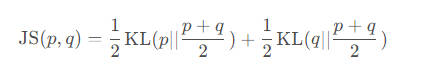

# 一. 曼哈顿距离


```python
# 代码实现
import numpy as np

def ManhattanDistance(x, y):
    x = np.array(x)
    y = np.array(y)
    return np.sum(np.abs(x-y))

# API
from scipy.spatial.distance import cdist
manhattan_distances = cdist(points1, points2, metric='cityblock')
```

# 二. 欧氏距离


```python
# 代码实现
import numpy as np

def EuclideanDistance(x, y):
    x = np.array(x)
    y = np.array(y)
    return np.sqrt(np.sum(np.square(x-y)))

# API
from scipy.spatial.distance import cdist
euclidean_distances = cdist(points1, points2, metric='euclidean')
```

# 三. 余弦距离

衡量两个N维向量之间的相似度一般用这个

余弦相似度:


余弦距离 = 1 - 余弦相似度

```python
# 代码实现
import numpy as np
import torch
import torch.nn.functional as F

# numpy版
def compute_cosine_distance(x, y):
    x = np.array(x)
    y = np.array(y)
    # np.linalg.norm(x) : np.sqrt(np.sum(np.square(x)))
    sim = np.dot(x, y) / (np.linalg.norm(x) * np.linalg.norm(y))
    return 1 - sim

# torch版
def compute_cosine_distance(x, y):
    """Computes cosine distance.
    Args:
        x (torch.Tensor): 2-D feature matrix.[N, E]
        y (torch.Tensor): 2-D feature matrix. [M, E]
    Returns:
        torch.Tensor: distance matrix. [N, M]
    """
    x = F.normalize(x, p=2, dim=1)
    y = F.normalize(y, p=2, dim=1)
    dist_m = 1 - torch.mm(x, y.t())
    return dist_m.cpu().numpy()

# API
from scipy.spatial.distance import cdist
cosine_distances = cdist(points1, points2, metric='cosine')
```

# 四. KL散度

两个概率分布间差异的**非对称性度量**


```python
# 代码实现
import numpy as np

def RelativeEntropy(p, q):
    p = np.array(p)
    q = np.array(q)
    return np.sum(p * np.log(p/q))

# API 
from scipy.stats import entropy
kl_divergence = entropy(p, q)

```

# 五. JS散度

KL散度的变体，JS散度解决了KL散度非对称的问题



```python
# 代码实现
import numpy as np

def JensenShannonDivergence(p, q):
    p = np.array(p)
    q = np.array(q)
    M = (p + q) / 2
    return 0.5 * np.sum(p * np.log(p / M)) + 0.5 * np.sum(q * np.log(q / M))

# API
from scipy.stats import entropy

def js_divergence(p, q):
    # Calculate the average distribution M
    m = 0.5 * (p + q)
    
    # Calculate KL Divergences
    kl_pm = entropy(p, m)
    kl_qm = entropy(q, m)
    
    # Calculate JS Divergence
    js_divergence = 0.5 * (kl_pm + kl_qm)
    
    return js_divergence
```


