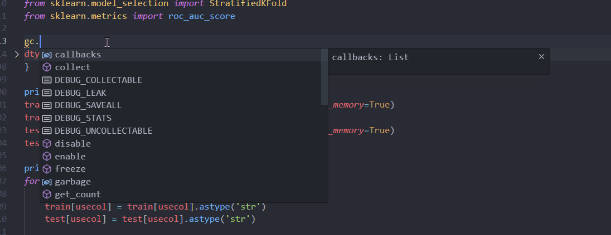
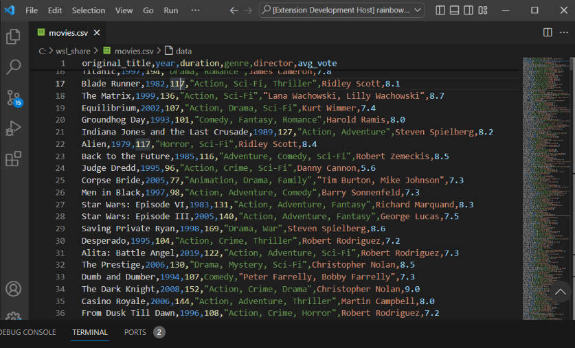

## 1, C/C++ ; C/C++ Extension Pack

## 2, Python; Pylance; 

## Python Environment Manager; 

## Python Extension Pack

Pylance: python中自动提示输入函数

## 3, autoDocstring

python中输入"""自动添加函数格式化文档

## 4, Rainbow CSV

在vscode中可以使用csv

## 5, View Image for Python Debugging

在linux下也可以在debug过程中可视化图片

