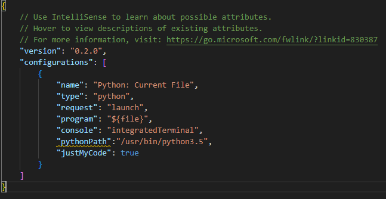

 **由于vscode已不支持python3.7以下的代码debug, 所以需要手动安装旧扩展插件**

更换vscode的python插件(否则不能debug python3.5)

更换方法教程: https://blog.csdn.net/Judikator/article/details/125781089

老版本vscode-python插件下载地址:https://marketplace.visualstudio.com/_apis/public/gallery/publishers/ms-python/vsextensions/python/2021.5.829140558/vspackage

如果安装不上, 需要找到盒子上.vscode-server文件夹的位置, 将该文件夹删除然后再重新安装

launch.json的配置, 需要指定pythonPath:

