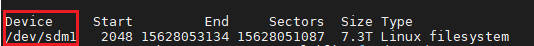

## 1. 格式化并挂载硬盘

```bash
# 查看可使用硬盘
fdisk -l		   # 比如硬盘名字为 /dev/sdb1
# 分区
fdisk /dev/sdb1     # 分区过程中可使用m查看都有哪些命令
# 查看分区是否成功
lsblk			   # 如果出现/dev/sdb1出现在/dev/sdb下，证明分区成功
# 查看Filesystem文件系统的完整性
sudo e2fsck -f /dev/sdb1
# 如果不完整，格式化硬盘
sudo mkfs.ext4 /dev/sdb1
# 挂载
sudo mount /dev/sdb1 /mnt
```

## 2. 挂载硬盘

挂载的时候更好的方式是不直接挂载“/dev/sdb1”这样的名字，这样的名字会变化，要挂载一个不会变化的名字

```bash
# 首先确定“/dev/sdb1”这样的名字
fdisk-l
```



```bash
# 然后确定“/dev/sdb1”这样的名字对应的唯一的名字
-l  /dev/disk/by-id/
```


```bash
# 然后挂载唯一的名字到需要挂载的目录下
mount  /dev/disk/by-id/ata-HGST_HUS728T8TALE6L4_VYJURA6M-part1 your/dst/dir
```

