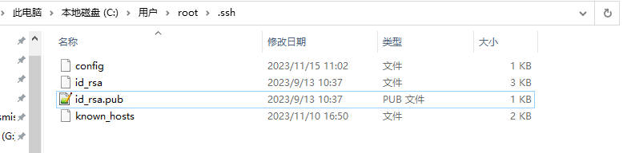
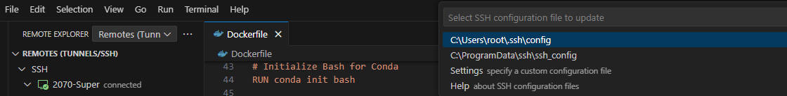

```bash
# 本地terminal
ssh-keygen
# 一路回车,就会在自己用户.ssh文件夹下生成一对密钥
```




```bash
# 修改本地的配置文件，添加下面这行属性到配置文件里
IdentityFile "C:\Users\root\.ssh\id_rsa"
```




```bash
# 创建路径
mkdir -p ~/.ssh
# 把本地生成的公钥（id_rsa.pub）里面的内容追加到服务器上的~/.ssh/authorized_keys文件中
```

