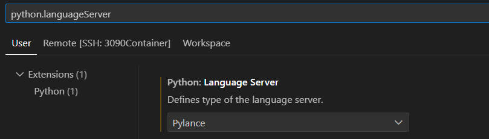

**激活函数参数提示：**

点击进入python扩展插件 ----> Ctrl+,进入python扩展设置 ----> 在搜索栏中输入'python.languageServer' ----> 确保 language server 设置成Pylance ---->  在搜索栏中输入'editor.parameterHints.enabled'，确保打上勾

**更改函数提示快捷键：**

Ctrl+K Ctrl+S调出快捷键更改对话框 ----> 搜索栏输入'triggerParameterHints' ----> 更改为 'Ctrl + P'

