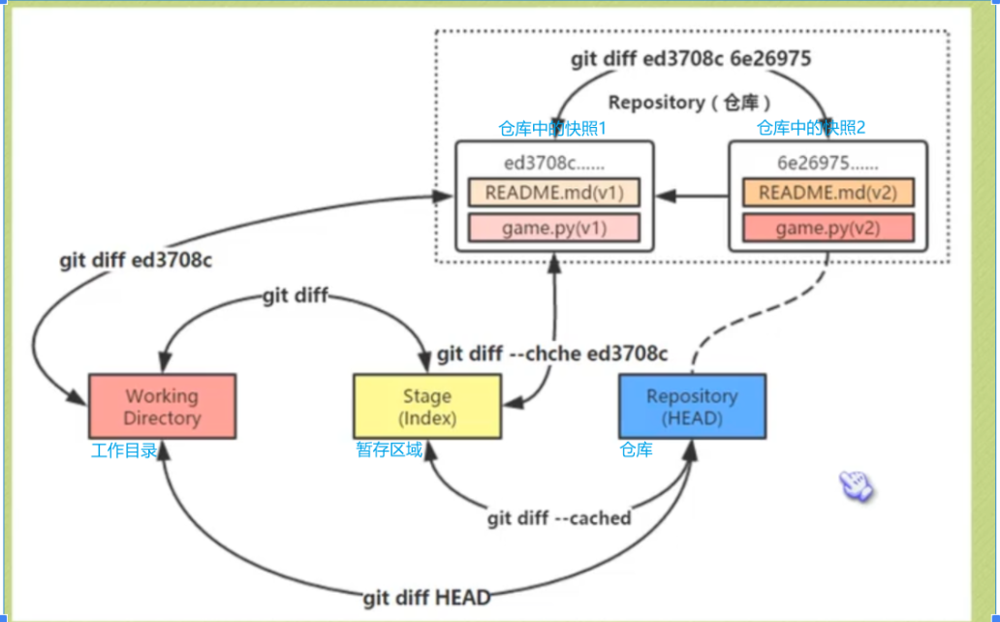
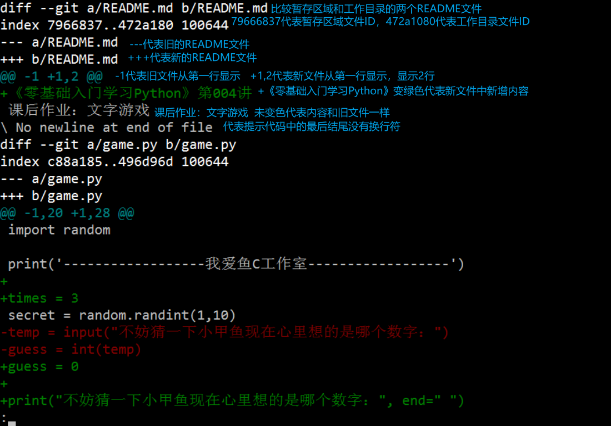

# 一. 一套完整的git流程

```python
一套完整的提交代码流程：
# （使用git bash命令或者linux命令）
# 如果git clone速度慢，请使用本文件夹下的FastGithub
git clone  									# 远程仓库代码拉取到本地（第一次拉取）
git checkout -b mybranch   					# 新建一个分支叫mybranch，一般只能在自己新建的分支上开发
# git checkout -b mybranch2 origin/mybranch1   从远程仓库中拉取mybranch1分支到本地并新建分支mybranch2（只开发mybranch1分支，不开发main分支）
# git checkout mybranch 切换到mybranch分支上（在切换分支之前，要将代码全部commit，防止原分支开发的代码在切换后的分支中显示出来）
=====================write my code======================
git add .   								# 将工作区代码提交到暂存区
git commit -m "This is a test" 				# 将暂存区代码提交到本地仓库
git checkout main   						# 回主分支（为什么要回到main，就是要为下一步pull做准备，否则直接push到远程大概率是会冲突，因为远程仓库中的main分支代码很有可能已发生改变）
git pull   									# 将远程仓库的代码拉取到本地main分支上（防止本地代码的版本和远程仓库代码版本有冲突）
git checkout mybranch  						# 切换回要提交的分支
git merge main    							# 将本地main分支的代码拉到mybranch中（此步骤是为了在本地处理可能会存在的代码冲突，main分支中的代码和mybranch中的代码可能有冲突）
# 如果是第一次使用git的设备，push之前需要设置个人私钥：参考：https://blog.csdn.net/liuzehn/article/details/128037853?spm=1001.2014.3001.550
git push --set-upstream origin mybranch 	# 推送已commit到本地仓库的代码到远程仓库中的mybranch分支（--set-upstream意思是：有可能本地分支有3个分支，而远程仓库只有2个分支，所以要现在远程仓库新建一个和本地仓库一样的分支后再push代码）
```

# 二. 其他git常用命令

```python
git branch  查看自己所在本地分支
git branch -r   查看远程分支
git branch -a   列出本地分支和远程分支
git branch -d mybranch   删除本地mybranch分支
git push origin --delete mybranch  删除远程分支

git reset --hard e2a3919    将head移动到哈希值为e2a3919的位置，删除e2a3919和原HEAD之间commit的文件（回退操作）
git reset --soft e2a3919    将head移动到哈希值为e2a3919的位置，保留e2a3919和原HEAD之间commit的文件，将文件从本地仓库回到暂存区
git reset --mixed e2a3919    将head移动到哈希值为e2a3919的位置，保留e2a3919和原HEAD之间commit的文件，将文件从本地仓库回到工作区

git status  查看状态
git log     查看日志
git diff    查看工作区代码与之前commit的代码的不同

远程仓库中的一些解释：
pull requests(pr)：一般会将代码推送到远程仓库的分支（pr)中，然后会有相关人员进行review审核，review通过会才会合并到主分支上。
```

# 三. 添加公钥

**windows系统中：**

```python
在anaconda中执行命令ssh-keygen -t rsa --> 全部回车 --> 在执行过程中会有一行Your public key has been saved in C:\Users\root/.ssh/id_rsa.pub --> 进入该目录，打开该文件（id_rsa.pub），复制全部内容 -->
登陆github账号 --> 找到settings --> 找到SSH and GPG keys点击 --> 添加公钥
```

**Linux系统中：**

```python
1. 安装git： sudo apt-get install –y git
2. 配置git1：git config –global user.name usrname
3. git config –global user.email youremail
4. git config –list #查看配置
5. 配置ssh： ssh-keygen –t ras –C “youremail.163.com”#生成ssh密钥
6. cat ~/.ssh/id_rsa.pub
7. github 上配置ssh
8. https://github.com/ -> settings -> SSH ang GPS keys -> New SSH key
9. copy id_rsa.pub to New SSH key -> key -> Title (write by your self)
10. 点击 Add SSH key
11. 测试： git clone ***.git
```

# 四. pycharm导入正在开发的项目

```python
step1: 在github上：
    右上角有个+号，点下拉箭头，点击Import Repository，导入成功，复制仓库地址
step2: 在本地：
    打开要存放代码的文件夹，然后右键选git bash here，然后git clone + 仓库地址（上一步已导入到自己仓库的地址）
    使用git clone比使用download zip的好处是在pycharm上可以知道自己改动了代码的哪一部分（改动的会变蓝，增加的会变绿）
step3: 在pycharm上
    进入pycharm，打开项目文件夹，在pycharm右下角点击master，选择Remote Branches中的Original/master，选择checkout
    点击pycharm中右下角的master，选择Checkout Tag or Revision，选择最新的7.0版本
    点击左下角的git，切换到log界面中，可以看到开发过程中代码的git树状图，点击右下角，选择New Branch新建一个本地分支取好名字，然后点击右下角，点击取好名字的那个分支，点击push，将本地新建的分支push到远程仓库，选择使用token的方式验证比较快。此时在git bash软件中，输入回车可以看到自己在取好名字的分支上。
step4: 如果本地修改或新增了代码，如何push到远程仓库
    在pycharm左侧有commit，选中修改的文件，添加说明，commit就可以了，也可以点commit and push直接推到远程仓库中，此时在远程仓库中刷新就可以看到修改的文件了。
    另外，在pycharm中左侧的commit，双击修改的文件，可以看到对比，左侧为远程仓库的文件，右侧为本地修改的文件，可以对比变化。而且，在右侧本地文件可以选择行号，然后commit and push，也就是不push整个文件，而是push文件中的部分代码。
```

# 五. git diff



**执行git diff命令后各行注释**



