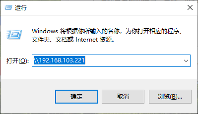

### 一. linux上挂载windows目录

```bash
步骤一：
现在windows端，右键要共享的文件夹-->属性-->共享-->高级共享-->勾选“共享此文件夹”-->点击“共享名”下方的“添加”按钮-->给该文件夹取一个共享名，比如下面的例子中叫"videos"-->确定

步骤二：
                windows被挂载目录            linux挂载目录                   windows用户名+密码
mount -t cifs //192.168.103.228/videos /root/work/real-esrgan/mount -o username=root,password=windowscode
```

### 二. windows上挂载linux目录

```bash
sudo apt-get update   
apt-get install samba  
cp /etc/samba/smb.conf /etc/samba/smb.conf.bak
vi /etc/samba/smb.conf		
# 删掉下面这三段
```


```bash
# 在末尾增加这一段
[ubuntu]     			# 共享目录的名字                                                                                                                                               
    path = /root/work    # 共享目录的路径                                                                                                                                             
    writable = yes       # 可写                                                                                                                                             
    create mask = 0664   # 不用改                                                                                                                                             
    directory mask = 0775   # 不用改
    
```

```bash
pdbedit -a -u root        # 设置账号密码
sudo service smbd start  
```

在windows端win+R



键入，然后即可共享完成