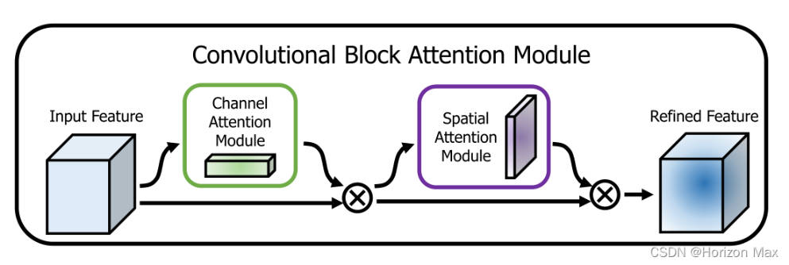
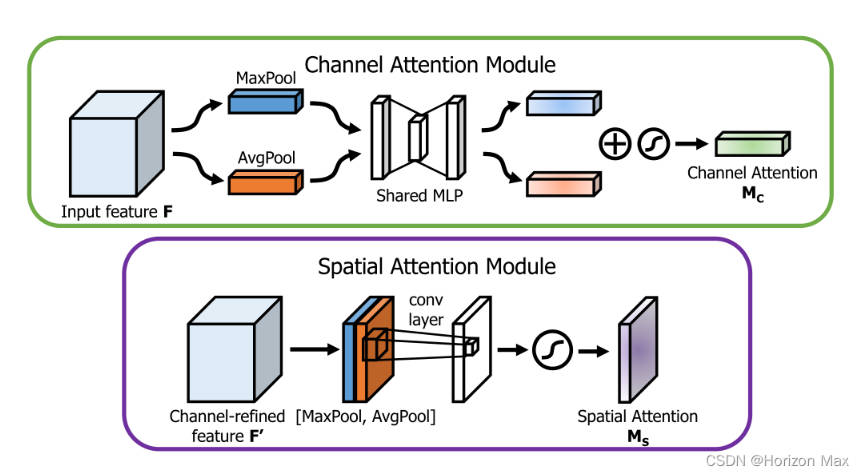

CBAM:** 通道注意力与空间注意力融合**的注意力机制 ；

对前馈卷积神经网络 是一个 简单而有效的 注意力模块 ；

因为它的 **轻量级和通用性** ，可以 无缝集成到任何CNN网络 当中 ；

[参考链接](https://blog.csdn.net/weixin_45084253/article/details/124270271?ops_request_misc=%257B%2522request%255Fid%2522%253A%2522170865166616800185882120%2522%252C%2522scm%2522%253A%252220140713.130102334..%2522%257D&request_id=170865166616800185882120&biz_id=0&utm_medium=distribute.pc_search_result.none-task-blog-2~all~top_positive~default-1-124270271-null-null.142^v99^pc_search_result_base6&utm_term=CBAM&spm=1018.2226.3001.4187)

