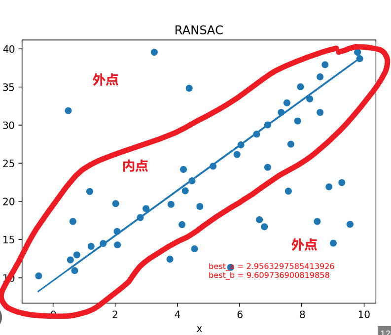

## 一. RANSAC算法作用

RANSAC(RANdom SAmple Consensus,随机采样一致)算法是从一组含有“外点”(outliers)的数据中正确估计数学模型参数的迭代算法。

对于RANSAC算法来说一个基本的假设就是数据是由“内点”和“外点”组成的。“内点”就是组成模型参数的数据，“外点”就是不适合模型的数据。同时RANSAC假设：在给定一组含有少部分“内点”的数据，存在一个程序可以估计出符合“内点”的模型。

**RANSAC优点: 只要噪声是杂乱无章的，哪怕噪声占比比较大，也能够很好地去噪**

**RANSAC缺点: 如果噪声是有序的, 那么很可能使用RANSAC拟合时模型会趋向于拟合噪声**

**与最小二乘法区别:最小二乘法是用所有的观测值去拟合模型, 仅适用于噪声占比比较小的情况**

## 二. RANSAC算法流程

1.随机取一组点num_points, 求解出模型方程, num_points为求取模型的最小点数;

2.计算满足该模型方程的点数占总点数的比例(即内点占比) ;

3.若内点占比满足一定阈值(说明已找到最优模型方程)，或者当前迭代次数大于最大值(说明已无法找到最优模型方程)，则停止迭代:

4.若当前内点占比大于当前统计得到的最大内点占比，则根据内点占比**更新最大迭代次数**

5.继续选代

## 三. 最大迭代次数更新方法

* 为什么要更新最大迭代次数?

  如果循环所有的点对, 那么迭代次数过多, 计算量过大, 效率太慢, 所以要限制循环次数。如何限制, 就是根据内点占比计算

* 那么最大迭代次数是如何更新的?

  首先，RANSAC的目的是找出内点占比最大的模型;

  假设迭代到了第i次, 当前统计的最大内点占比是ep, 也就是对应的外点占比是1-ep, 对应的模型是 model_S。

  我们并不确定当前的模型是否是实际内点占比最大的模型，

  假设实际内点占比最大的模型是mode_Max, 我们假设Model_S和Model_Max不是同一个模型。

  我们需要计算当已经求取出模型model_S的时候，我们离求取出mode_Max还需要多少次迭代。

  而我们不知道最优模型对应的最大内点占比到底是多少, 但是我们知道当前求取的模型model_S对应的内点占比是多少。

  而最优模型对应的内点占比一定比当前模型对应的内点占比大, 所以如果都是从第0次开始迭代分别求取两个模型的话, 求取到最优模型一定比求取到当前模型所需的迭代次数少

  所以我们只需要将当前最大迭代次数设置为最少能求取到一次当前模型的最大迭代次数即可(因为这个迭代次数一定比最少能求取到一次最优模型的最大迭代次数要大)

* 目标是①: 求迭代iter次后, 至少一次能求取到当前模型Model_S的概率, 这个概率大于一定的置信度p即可

  那么如何求得"迭代iter次后, 至少一次能求取到当前模型Model_S的概率"?

  先求相反的概率②: "迭代iter次后, 一次都没求取到当前模型Model_S的概率是多少"?

  等价于②: "迭代iter次后, 每次都取到非Model_S模型的概率是多少"?

  先求取③"迭代1次取到非Model_S模型的概率是多少"?

  那么为了求取"迭代1次取到非Model_S模型的概率是多少", 

  可以先求④"迭代1次取到Model_S模型的概率是多少"?

​	因此公式如下:

​		④迭代1次取到Model_S模型的概率: $\mathopen{}\mathrm{ep} \mathclose{}^{\mathrm{num\_points}}$

​		③迭代1次取到非Model_S模型的概率: $1 - \mathopen{}\mathrm{ep} \mathclose{}^{\mathrm{num\_points}}$

​		②迭代iter次后, 每次都取到非Model_S模型的概率: $\mathopen{}\left( 1 - \mathopen{}\mathrm{ep} \mathclose{}^{\mathrm{num\_points}} \mathclose{}\right)^{\mathrm{iter}}$

​		①迭代iter次后, 至少一次能求取到当前模型Model_S的概率: $1 - \mathopen{}\left( 1 - \mathopen{}\mathrm{ep} \mathclose{}^{\mathrm{num\_points}} \mathclose{}\right)^{\mathrm{iter}}$

​	令: $1 - \mathopen{}\left( 1 - \mathopen{}\mathrm{ep} \mathclose{}^{\mathrm{num\_points}} \mathclose{}\right)^{\mathrm{iter}}$ > p

​	可得: $\mathrm{iter} >= \frac{\log \mathopen{}\left( 1 - p \mathclose{}\right)}{\log \mathopen{}\left( 1 - \mathopen{}\mathrm{ep} \mathclose{}^{\mathrm{num\_points}} \mathclose{}\right)}$

​	其中iter最大迭代次数, p是置信度概率, ep是内点占比, model_points是求取模型所需的最小的点对数

