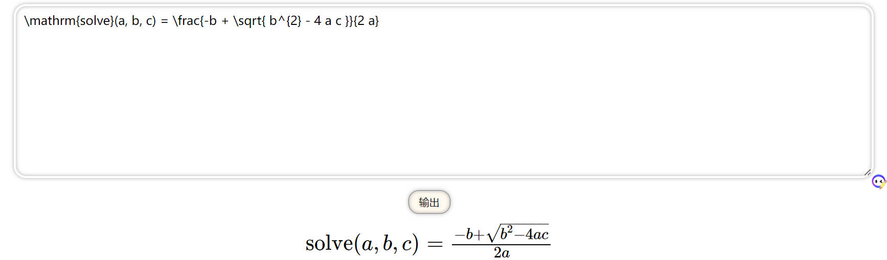

## Markdown插入Latex公式:

公式前后各一个$符号


## 生成Latex方法:

使用latexify-py库:

```bash
pip install latexify-py
```

使用方法:

```python
import math  # 可选
import numpy as np # 可选
import latexify

@latexify.function
def solve(a, b, c):
  return (-b + math.sqrt(b**2 - 4*a*c)) / (2*a)

print(solve) 
```

打印结果:

```bash
\mathrm{solve}(a, b, c) = \frac{-b + \sqrt{ b^{2} - 4 a c }}{2 a}
```

放入[网址](https://zh.numberempire.com/latexequationeditor.php)显示:



[latexify-py更多用法](https://mp.weixin.qq.com/s/c-LPHhBY7yvzfen142Mhcw)

