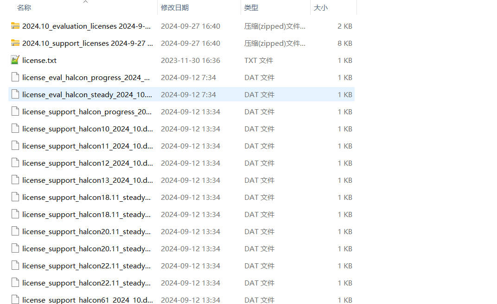
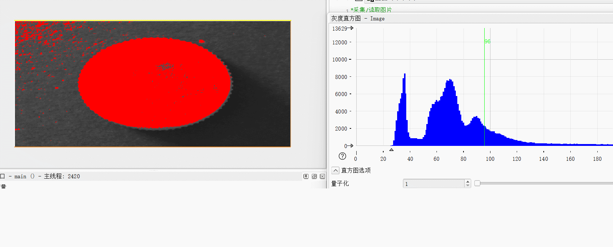
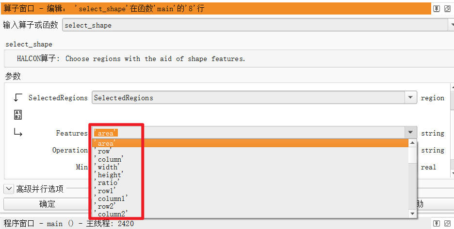
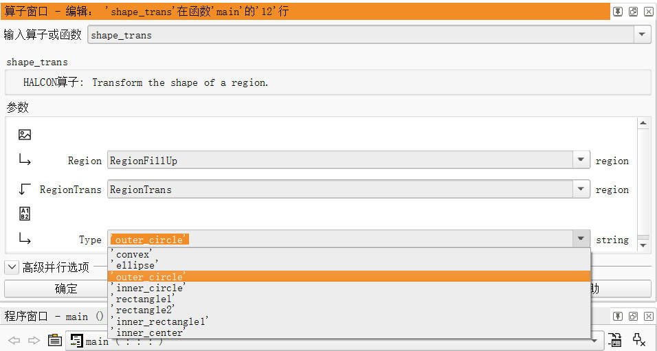
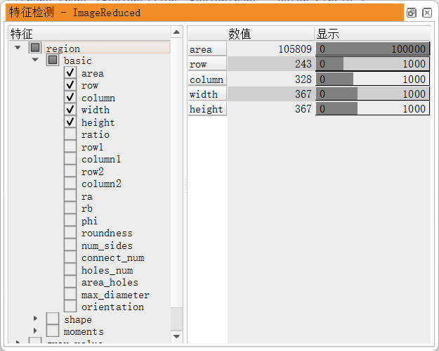
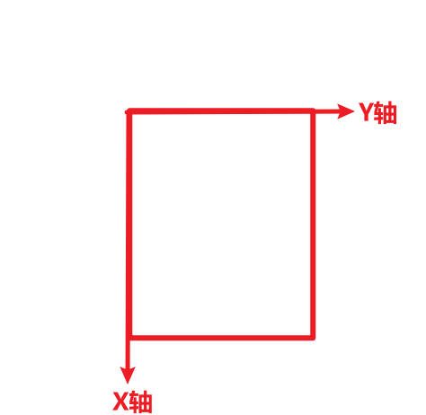
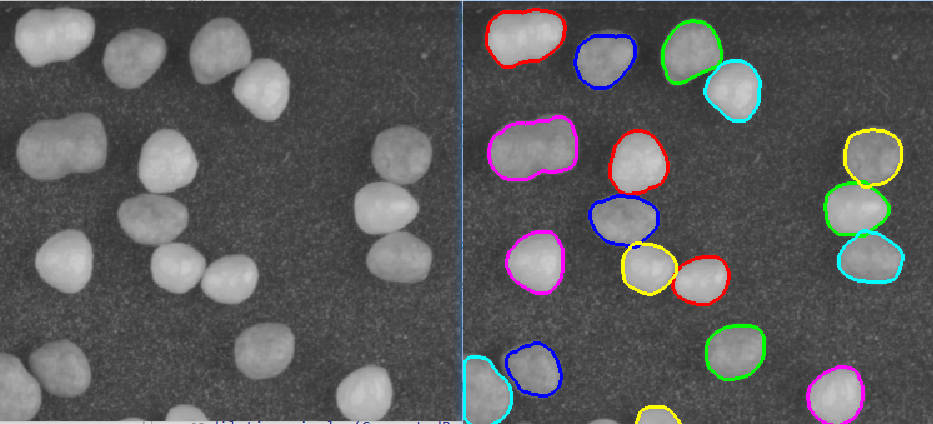

# 一. 安装

到[halcon官网](https://www.mvtec.com/products/halcon)下载, 到[该链接](https://blog.csdn.net/qq_18620653/article/details/120033443)中将最新的分享文件下载后解压放入halcon安装目录中的license文件夹下



# 二. 软件部分使用

## 1.可视化的二值化



# 三. 代码部分使用

# 1. API接口

* 显示相关

  ```halcon
  * 关闭窗口更新, 防止图像被不断地重绘
  dev_update_window ('off')
  * 关闭窗口
  dev_close_window ()
  * 打开窗口: [row, col, width, height, background, windowhandle]
  dev_open_window (0, 0, 728, 512, 'black', WindowID)
  * 展示图像
  dev_display (Bond)
  * 设置字体: [windowhandle, font_size, font_type, 是否加粗, 是否斜体]
  set_display_font (WindowID, 14, 'mono', 'true', 'false')

  * 设置接下来绘制轮廓区域等的线条颜色
  dev_set_color ('green')
  * 设置接下来绘制轮廓区域等的线条粗细
  dev_set_line_width (3)
  * 设置接下来绘制轮廓区域等的是只绘制轮廓区域线条还是使用颜色填充整个轮廓区域
  * margin代表只绘制线条, 而fill代表使用颜色填充
  dev_set_draw ('margin')

  * 画圆
  disp_circle (WindowID, Row, Column, Radius)
  ```

* 二值化

  ```halcon
  *值在82-200之间的会被设置为255, 值在该范围之外的会被设置为0
  threshold (Image, Regions, 82, 200)
  ```

* 连通域

  ```halcon
  *计算连通域, 将上一步中二值化后的区域按照是否相连划分出多个区域
  connection (Regions, ConnectedRegions)
  ```

* 按条件过滤区域

  ```halcon
  *选择面积在大于50000且小于200000的区域(and代表与, 也就是既要满足大于50000, 又要满足小于200000)
  select_shape (ConnectedRegions, SelectedRegions, 'area', 'and', 50000, 200000)
  * 根据形状选择更接近圆的: circularity=(4*pi*area)/(perimter^2), 介于0.85-1.0之间的会被保留
  select_shape (SingleBalls, IntermediateBalls, 'circularity', 'and', 0.85, 1.0)
  ```

  除了面积这个条件还可以选择如下其他各种条件进行过滤

  

* 填充孔洞

  ```halcon
  *填充某一区域的孔洞
  fill_up (SelectedRegions, RegionFillUp)
  * 根据面积填充孔洞: fill_up_shape (Region, RegionFilled, Feature, Min, Max)
  fill_up_shape (Wires, WiresFilled, 'area', 1, 100)
  ```

* 形状转换

  ```halcon
  *获得某一区域的最小外接圆('outer_circle')的区域
  shape_trans (RegionFillUp, RegionTrans, 'outer_circle')
  ```

  除了最小外接圆这个条件还可以选择如下其他各种条件进行转换: 凸包、椭圆、最小外接圆、最小内接圆、最小外接矩形、水平外接矩形、最小内接矩形等

  

* 面积计算

  ```halcon
  *计算区域的面积、行号、列号
  area_center (RegionTrans, Area, Row, Column)
  ```

  可以使用'特征检测'进行查看

  

* 限制计算区域

  ```halcon
  * 限制接下来的处理区域, reduce_domain (Image, Region, ReducedImage)
  reduce_domain (Bond, Die, DieGrey)
  ```

* 开运算

  ```halcon
  * 开运算, 去除噪点
  opening_circle (WiresFilled, Balls, 15.5)
  ```

* 对区域排序

  ```halcon
  * 把区域排序, sort_region (InputRegion, OutputRegion, SortCriterion, SortOrder, SortMethod)
  * first_point代表选取每个区域的左上角, true代表降序, column代表会按照列来排序
  sort_region (IntermediateBalls, FinalBalls, 'first_point', 'true', 'column')
  ```

* 计算最小外接圆

  ```halcon 
  * 计算最小外接圆
  smallest_circle (FinalBalls, Row, Column, Radius)
  ```

  ​

​

## 1. 控制变量、字符串、数组、基本运算

```halcon
i1 := 123$'#o'  //8进制，0为前缀 
i2 := 123$'#x'  //16进制，0x为前缀，7b为赋值 
i3 := 123$'#X'  //16进制，0x为前缀，7B为赋值，7b与7B是一样的 
i4 := 123$'#f'  //double型，默认保留小数点后六位，$'#.3f'为小数点后三位
i5 := 1123$'#g'  //使数字始终保持六位，不足补零，超过用e 
i6 := 123$'#G'  //使数字始终保持六位，不足补零，超过用e
i7 := 123$'#e'  //转换成科学计数 
i8 := 123$'#E'  //转换成科学计数 
*****************整数*****************
d1 := 123$'6'   //小于六位时，文本右对齐，大于不影响
d2 := 123$'-6'  //小于六位时，文本左对齐，大于不影响
d3 := 123$'.6'  //小于六位时，在左边补零，大于不影响 
d4 := 123$'10.5'  //小于10位时，文本右对齐；小于5位则在左边补零，大于不影响 
*****************小数***************** 
g1 := 123.456$'.1'  //保留1位，四舍五入
g2 := 123.456$'.2'  //保留2位，四舍五入 
g3 := 123.456$'.3'  //保留3位，四舍五入 
g4 := 123.456$'.4'  //保留4位，四舍五入
g5 := 123.456$'.5'  //保留5位，四舍五入
g6 := 123.456$'.15'  //保留15位，四舍五入，少于不会补零
g7 := 123.456$'2.2'  //不管是$'2.2'还是$'1.2'、$'7.2'都只和.2有关，保留两位数 
e1 := 123.456$'.1e'  //保留小数点后1位 
e2 := 123.456$'.2e'  //保留小数点后2位 
e4 := 123.456$'.10e'   //保留小数点后10位，不足补零

*****************数组操作***************** 
Tuple := []  //定义空数组
Tuple := [0,1,2,3,4,5]  //数组赋值
Tuple1 := [6,7,8,'Halcon']  
Tuple[0] := 100  //根据数组下标修改数组的值
Tuple3 := Tuple  //数组赋值
Tuple1[3] := 'gkgj'
Tuple4 := Tuple1
Numble := |Tuple1|  //求数组的个数
Union := [Tuple3,Tuple4]  //数组的合并
T := Tuple1[3]  //根据数组下标选择指定的数据
T1 := Tuple[1:4]  //截取一定范围的数组
T2 := find(Tuple,100)//寻找数组的下标
tuple_find ('A', 'A', Indices1)  //字符串比较，一样的为0，不一样的为-1

TT := [0,1,2,3,4,5,6,5,4,3,2,1,0,111]
T3 := sort(TT)  //数组升序排序
T4 := sort_index(TT)  //数组索引值升序排序
T5 := inverse(TT)  //反转数组
T6 := number(['AA','','44'])  //字符串转数字 
T7 := rand(93)  //生成3个随机数

*****************算术运算***************** 
a1 := 1 + 2  //加法
a2 := 2 - 3  //减法
a3 := 10 * 3  //乘法
a4 := 10 / 3  //除法
a5 := 10 / 3.0  //想提高精度
a6 := 10 % 2  //取模 
a7 := round(10.5)  //四舍五入
a8 := int(10.9)  //向下取整
a9 := gen_tuple_const(5,'A')  //生成5个0
a10 := sgn(88)  //符号函数
a11 := floor(10.8888)  //自动取整，保留一位小数
a12 := real(100)  //转实数
a13 := subset([1,82,3,4,5,66],1)//根据索引寻找值
a14 := [1,2,3,4] * 5 + 2  //数组乘法
a15 := [1,2,3] * [4,5,6]  //数组乘法
a16 := min([1,2,0,3,4,5])  //数组的最小值
a17 := max([1,2,0,3,4,5])  //数组的最大值
a18 := mean([1,2,0,3,4,5])  //求平均值
a19 := abs(-111)  //求绝对值
a20 := sqrt(4)  //开平方
T12 := 10 == 20  //等于
T13 := 10 > 20  //大于
T14 := 10 < 20  //小于
T15 := 10 >= 20  
T16 := 10 <= 20  
T17 := 10 # 20 and 1 == 1  //并且
T17 := 10 # 20 or 1 == 2  //或者
T18 := 10 # 20  //不等于
phi1 := deg(3.1415926)  //弧度转角度
phi2 := rad(180)  //角度转弧度

*****************位运算***************** 
b1 := lsh(8,2)   //左移  1000  100000
b2 := rsh(8,2)   //右移  1000  10
b3 := 3 band 2   //与运算(同为1时才为1)  11  10 
b4 := 2 bor 4    //与运算(同为0时才为0)  10  100 
b5 := 3 bxor 4   //位异或运算（互斥为1） 11  100
b6 := bnot 100  //取反（求整数的二进制反码）  

*****************字符串***************** 
C := 'AA' + 'BB'  //合并字符串
Sum := sum('AA' + 'BB')  //合并字符串
C1 := 1 + '2'  
C3 := 'CC' + 3.1 * 2
C4 := 1.1 + (2 + 3 + 'CC')
C5 := 'ABCDEF'
C7 := 'GHCDD'
C6 := C5{1:3}  //截取字符串
CN := strlen(C5)  //获取字符串的长度
C8 := strchr(C5,C7)  //相同字符串的位置
New_str := split(C5,'B')  //分割字符串
str := 11$'0.2f'  //转字符串，并且保留两位小数
str1 := 255 $ 'x'  //转换16进制
ASC := ord('A')  //字符对应的ASCII
str := chr(65)  //ASCII对应的字符
Con := gen_tuple_const(10,'')  //生成10个''
strA:= 'abcdefg'
AA := strA{5}  //寻找字符串
s1 := 'Hugo'$'20'      //文本右对齐
s2 := 'Hugo'$'-10'     //文本左对齐
```

## 2. 图像变量

注意在halcon中图像的x轴和y轴如下:

S

## 3. BLOB分析

将一个物体从背景中分割出来:



```halcon
* This programs demonstrates the use of basic morphology
* operators.
* The aim of the program is to detect each single pellet
* (bright particle on a darker background).
* 
dev_update_off ()
read_image (Image, 'pellets')
dev_close_window ()
get_image_size (Image, Width, Height)
dev_open_window (0, 0, Width, Height, 'black', WindowID)
dev_set_part (0, 0, Height - 1, Width - 1)
set_display_font (WindowID, 16, 'mono', 'true', 'false')
dev_set_colored (6)
dev_set_draw ('margin')
dev_set_line_width (3)
dev_display (Image)
disp_message (WindowID, 'Detect each single pellet', 'window', 12, 12, 'black', 'true')
disp_continue_message (WindowID, 'black', 'true')
stop ()
* 
* Segment the regions of the pellets from the background
* 二值化, 'light'为选择值全部为255的区域
binary_threshold (Image, LightRegion, 'max_separability', 'light', UsedThreshold)
* 开运算
opening_circle (LightRegion, Region, 3.5)
dev_display (Region)
disp_message (WindowID, 'First, segment the pellets', 'window', 12, 12, 'black', 'true')
disp_continue_message (WindowID, 'black', 'true')
stop ()
* 
* Compute the connected pellet regions
* Note, that this approach fails, because some of
* the pellets are still connected.
* 计算连通域
connection (Region, ConnectedRegionsWrong)
dev_display (Image)
dev_display (ConnectedRegionsWrong)
disp_message (WindowID, 'Simple connection fails', 'window', 12, 12, 'black', 'true')
disp_continue_message (WindowID, 'black', 'true')
stop ()
* 
* Separate each pellet from the others by erosion
* 腐蚀
erosion_circle (Region, RegionErosion, 7.5)
dev_display (Image)
dev_display (RegionErosion)
disp_message (WindowID, 'Erosion of the pellet regions', 'window', 12, 12, 'black', 'true')
disp_continue_message (WindowID, 'black', 'true')
stop ()
* 
* Now, compute the connected pellet regions
* 计算连通域
connection (RegionErosion, ConnectedRegions)
dev_display (Image)
dev_display (ConnectedRegions)
disp_message (WindowID, 'Perform connection now', 'window', 12, 12, 'black', 'true')
disp_continue_message (WindowID, 'black', 'true')
stop ()
* 
* Turn back to the original pellet size by applying a dilation
* 膨胀
dilation_circle (ConnectedRegions, RegionDilation, 7.5)
* 计数
count_obj (RegionDilation, Number)
dev_display (Image)
dev_display (RegionDilation)
disp_message (WindowID, Number + ' pellets detected', 'window', 12, 12, 'black', 'true')
```


