原始视频: bilibili西湖大学赵世钰<<强化学习>>

# 一. 基本概念

## 1. grid-world example

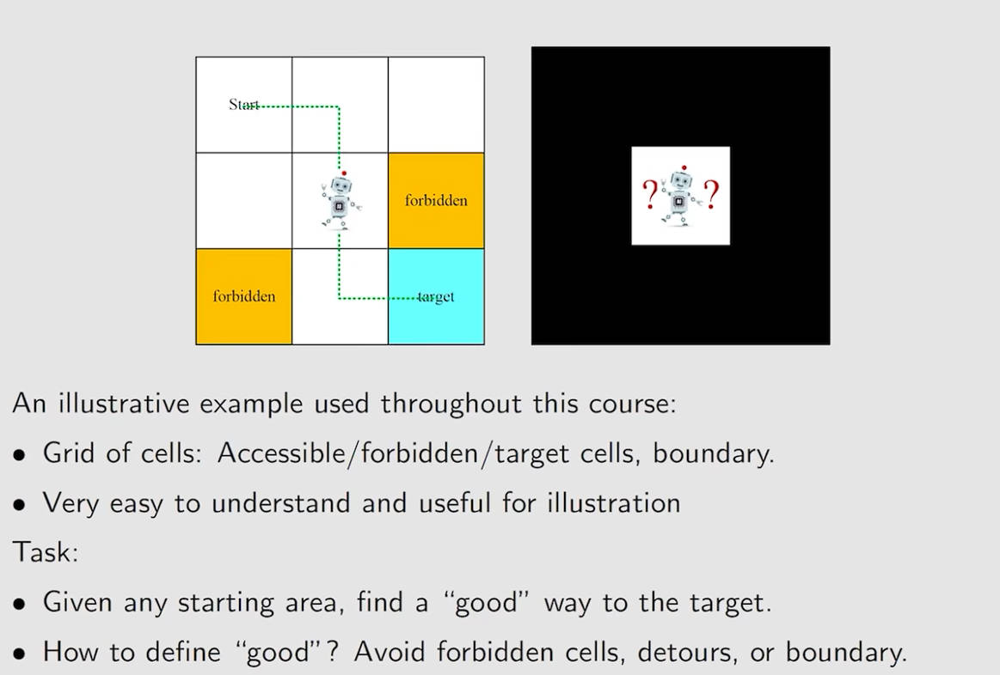

网格分为: 可达、禁止、目标单元格，边界

## 2. State和State space

## 3. Action

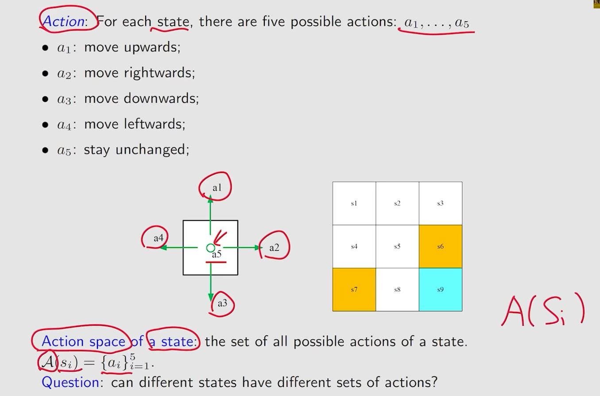

Action space是和state有关的， 不同的state会有不同的Action space， 写作 $A(S_i)$

## 4. State transition

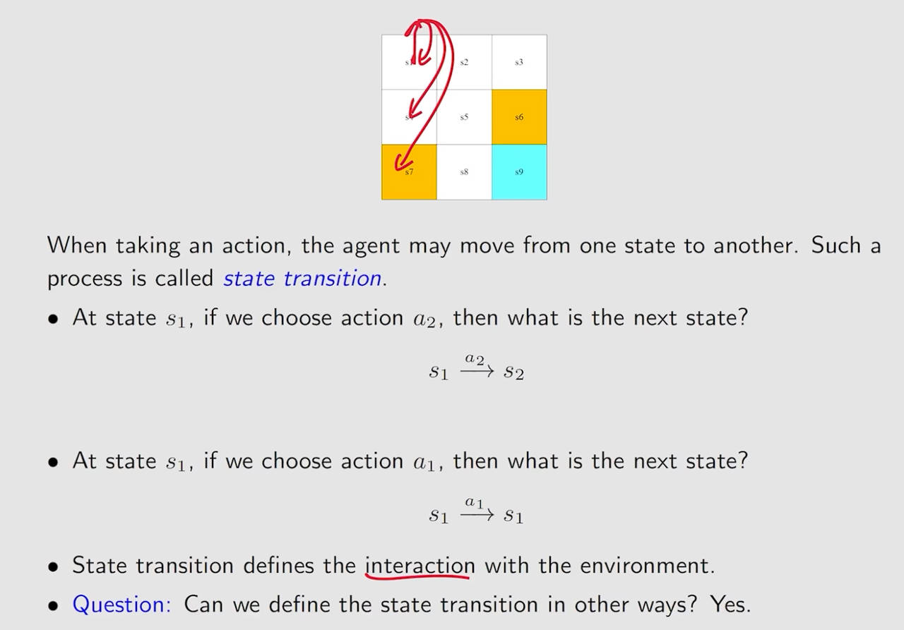

## 5. Forbidden area

## 6. Tabular respresentation

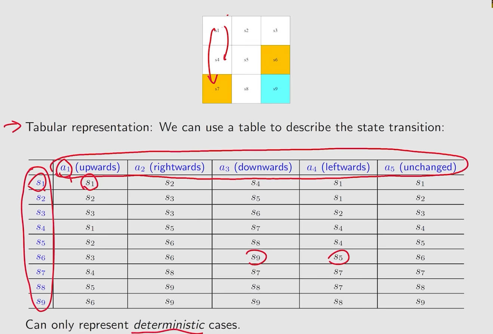

这种表示方式只能表示确定性（deterministic）的例子，一般不用

## 7. State transition probability

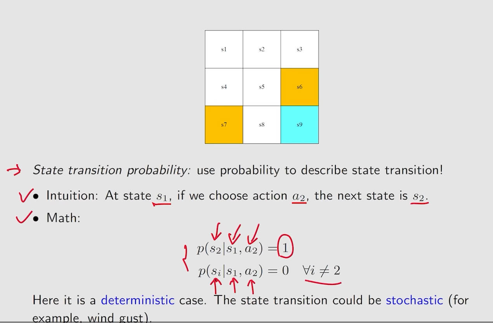

使用条件概率来表示状态转移： 

当前在s1状态，采取a2动作，下一步在s2状态的概率为1；

当前在s1状态，采取a2动作，下一步在si(i不等于2)状态的概率为0；

## 8. Policy

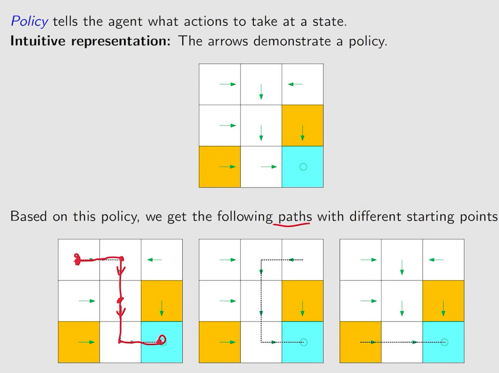

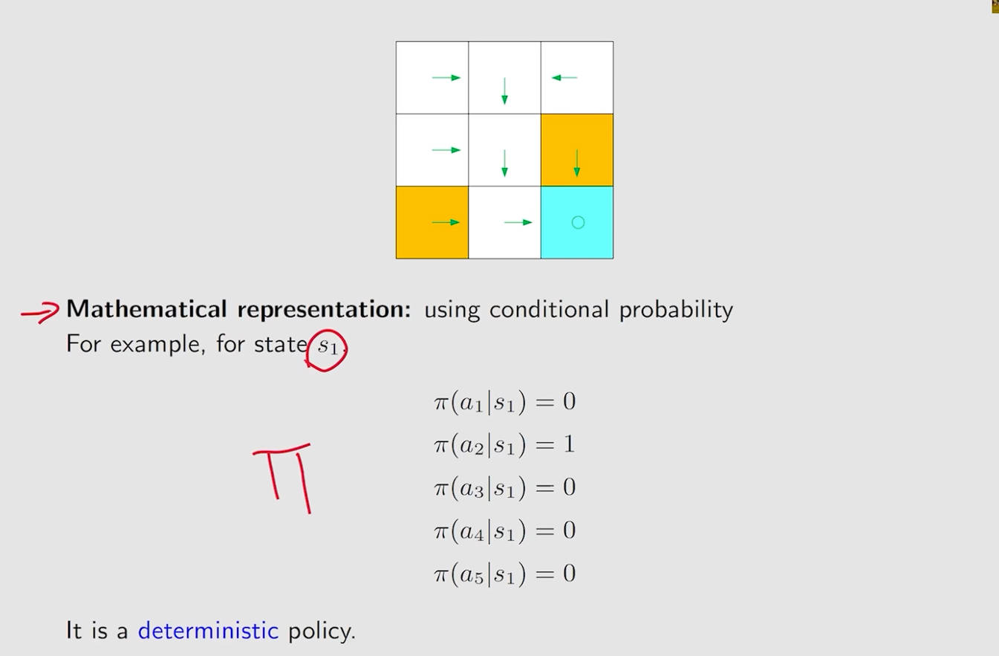

在强化学习中，我们使用 $\pi$ 来表示策略。在从一个状态转移到另一个状态的时候，采取不同的动作的概率之和应为1。

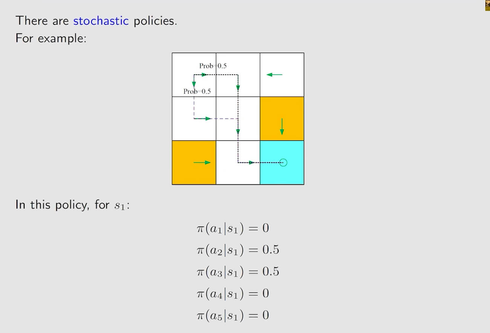

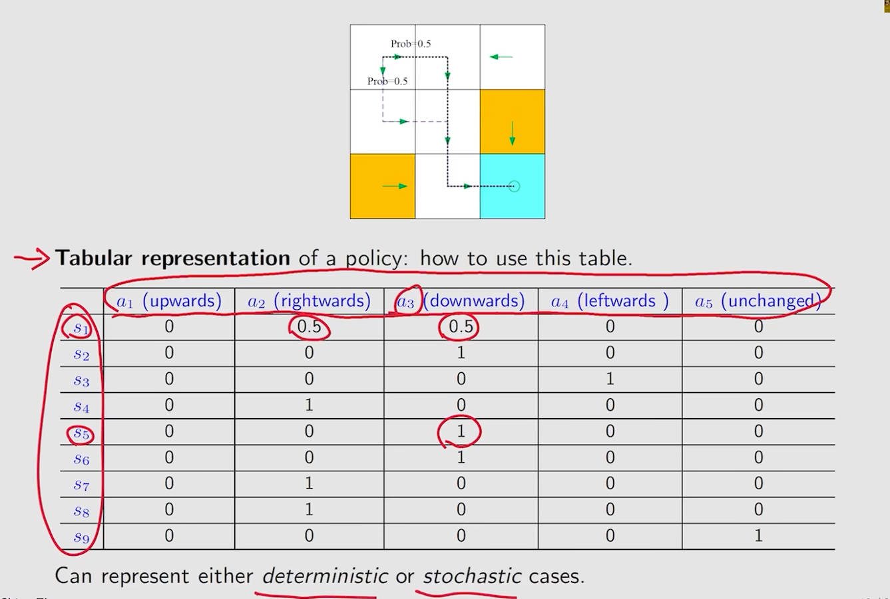

## 9. Reward

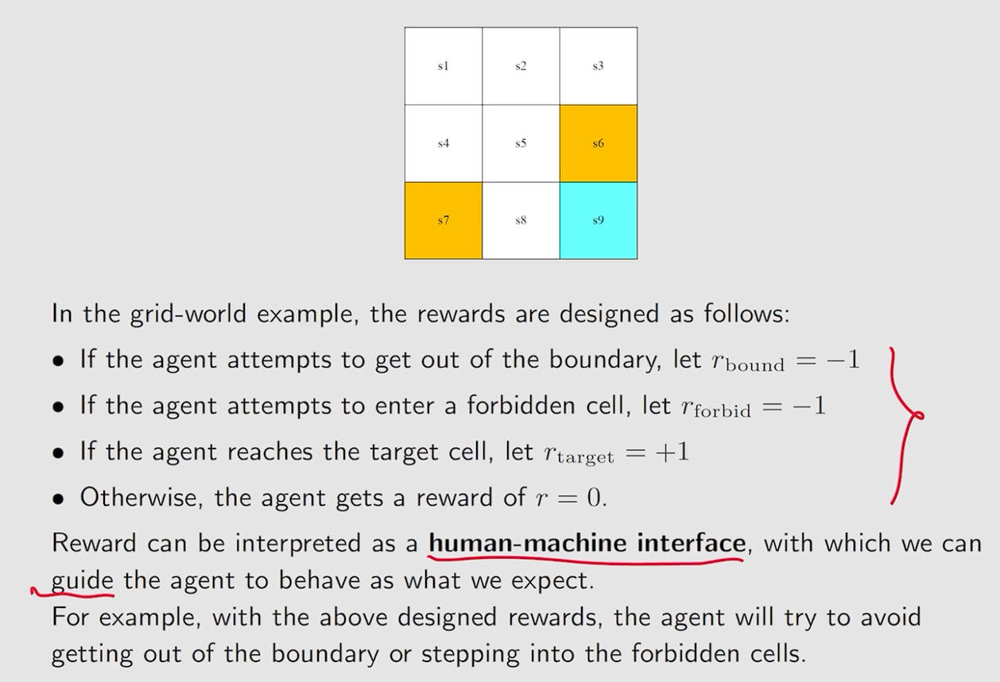

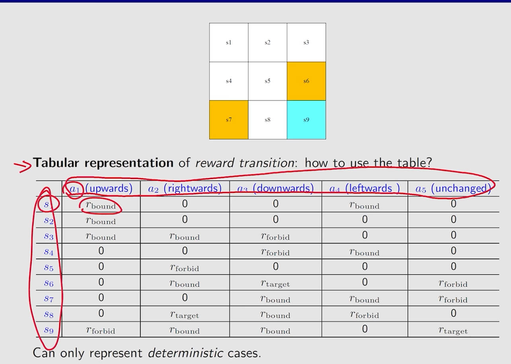

reward只依赖于当前状态和采取的动作，不取决于它下一刻处于什么状态

## 10. Trajectory and return

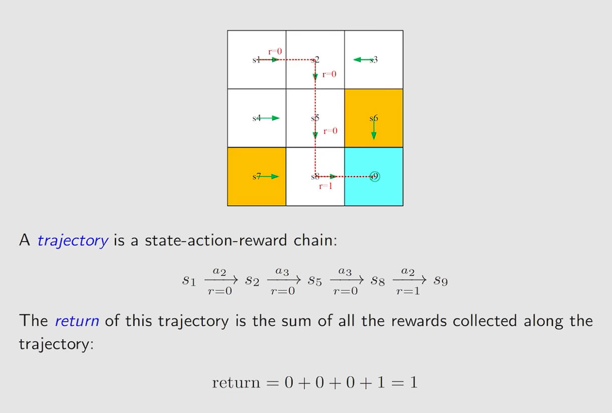

## 11. Discounted return

## 12. Episode

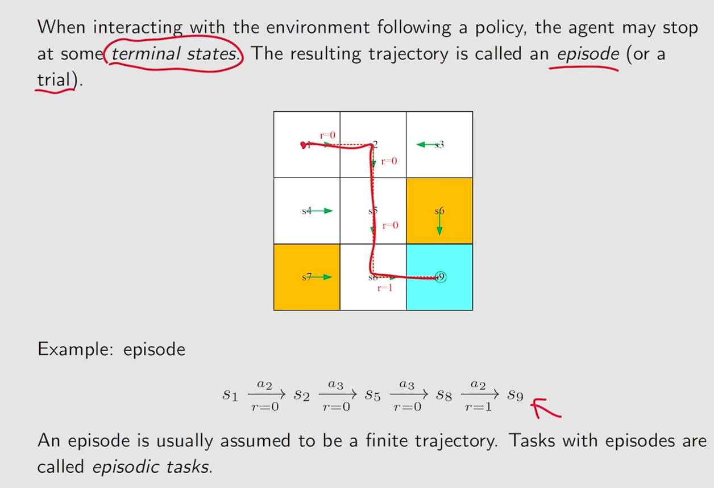

# 二. Markov decision process(MDP)

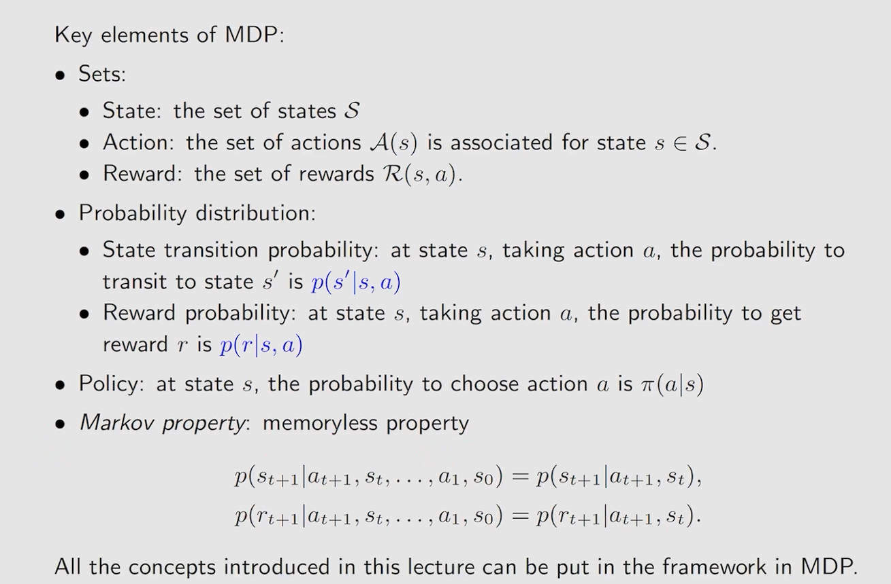

# 三. 贝尔曼公式

## 1. 引出

在上面的公式中， r已知、$\gamma$ 已知、P已知，则v可求

