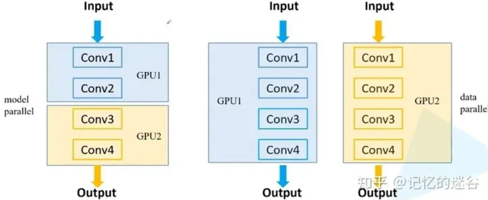
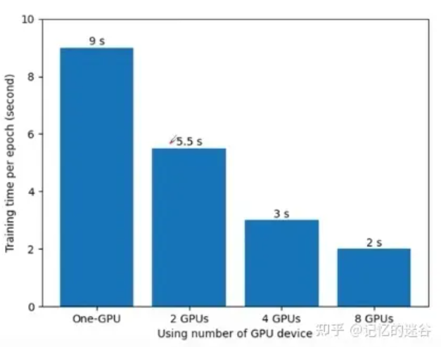
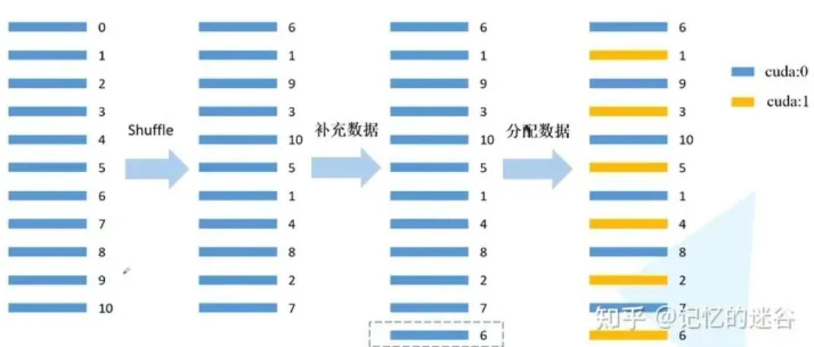
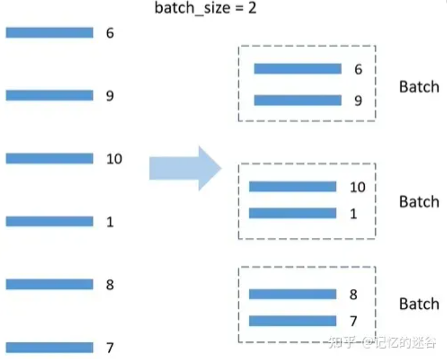

# 一. 参考资料

视频：b站UP主**霹雳吧啦Wz**                                 [pytorch多GPU并行训练教程](https://www.bilibili.com/video/BV1yt4y1e7sZ/?spm_id_from=333.999.0.0&vd_source=2fa3840975cc19817a9a15ddf8a1a81b)

代码：github**WZMIAOMIAO**                         [train_multi_GPU](https://github.com/WZMIAOMIAO/deep-learning-for-image-processing/tree/master/pytorch_classification/train_multi_GPU)

知乎博客：**极视平台**  					         [实操教程 | GPU多卡并行训练总结（以pytorch为例）](https://zhuanlan.zhihu.com/p/403339155)

CSDN博客：[钱彬 ](https://qianbin.blog.csdn.net/)                                                  [多卡分布式训练代码如何debug](https://blog.csdn.net/qianbin3200896/article/details/108182504)

**本文件夹下的代码主要注释了入口为train_multi_gpu_using_launch.py的多卡分布式训练代码。**

# 二. torch.distributed.launch多卡分布式训练原理

多卡分布式训练实质上是多进程，一个进程负责一张卡，所以每个进程都会执行一遍训练代码，进程使用rank环境变量进行区分（主进程需要多做很多事情，比如，记录tensorboard等等）。

分布式训练主要需要同步：模型权重以及损失，保证多卡上的模型在反向传播后权重必须保持一样。

# 二.多卡分布式训练代码如何debug

正常执行多卡分布式训练的命令：

```bash
$ export CUDA_VISIBLE_DEVICES=0,1
$ python -m torch.distributed.launch --nproc_per_node=2 tools/train.py --model bisenetv2
```

上述第一条命令用来设置当前环境变量中GPU数量。第二条命令为正式的启动脚本，该启动脚本与一般的使用类似python demo.py这种形式不同，整个python -m torch.distributed.launch为启动命令，实际的启动文件为：/home/dl/anaconda3/lib/python3.7/site-packages/torch/distributed/launch.py。也就是说该命令会自动的去调用torch包中的分布式启动文件launch.py来执行。后面的--nproc_per_node=2 tools/train.py --model bisenetv2全部为执行参数。

在VS Code中想要调试Python脚本很简单，只需要创建一个launch.json文件即可。

下面是最关键的地方，用于为debug设置配置参数，具体如下：

    {
        // Use IntelliSense to learn about possible attributes.
        // Hover to view descriptions of existing attributes.
        // For more information, visit: https://go.microsoft.com/fwlink/?linkid=830387
        "version": "0.2.0",
        "configurations": [ 
            {
                "name": "Python: 当前文件",
                "type": "python",
                "request": "launch",
                "program": "/home/dl/anaconda3/lib/python3.7/site-packages/torch/distributed/launch.py",//可执行文件路径
                "console": "integratedTerminal",
                "args": [
                    "--nproc_per_node=1",
                    "tools/train.py",
                    "--model",
                    "bisenetv1",
                ],
                "env": {"CUDA_VISIBLE_DEVICES":"0"},
            }
        ]
    }
其中，program参数用于设置使用torch分布式包中的launch.py文件来作为启动脚本，具体路径请参照具体的torch安装路径来修改。args用于设置每个参数。env用于设置环境变量。具体debug时，建议只用1个GPU来进行调试，所以nproc_per_node设置为1，CUDA_VISIBLE_DEVICES设置为0。

# 三. **为什么要使用多GPU并行训练**

简单来说，有两种原因：第一种是模型在一块GPU上放不下，两块或多块GPU上就能运行完整的模型（如早期的AlexNet）。第二种是多块GPU并行计算可以达到加速训练的效果。想要成为“炼丹大师“，多GPU并行训练是不可或缺的技能。

# 四. **常见的多GPU训练方法：**

1.**模型并行方式**：如果模型特别大，GPU显存不够，无法将一个显存放在GPU上，需要把网络的不同模块放在不同GPU上，这样可以训练比较大的网络。（下图左半部分）

2.**数据并行方式**：将整个模型放在一块GPU里，再复制到每一块GPU上，同时进行正向传播和反向误差传播。相当于加大了batch_size。（下图右半部分）



在pytorch1.7 + cuda10 + TeslaV100的环境下，使用ResNet34，batch_size=16, SGD对花草数据集训练的情况如下：使用一块GPU需要9s一个epoch，使用两块GPU是5.5s， 8块是2s。这里有一个问题，为什么运行时间不是9/8≈1.1s ? 因为使用GPU数量越多，设备之间的通讯会越来越复杂，所以随着GPU数量的增加，训练速度的提升也是递减的。



# 五.**误差梯度如何在不同设备之间通信？**

在每个GPU训练step结束后，将每块GPU的损失梯度求平均，而不是每块GPU各计算各的。

# 六.**BN如何在不同设备之间同步？**

假设batch_size=2，每个GPU计算的均值和方差都针对这两个样本而言的。而BN的特性是：batch_size越大，均值和方差越接近与整个数据集的均值和方差，效果越好。使用多块GPU时，会计算每个BN层在所有设备上输入的均值和方差。如果GPU1和GPU2都分别得到两个特征层，那么两块GPU一共计算4个特征层的均值和方差，可以认为batch_size=4。注意：如果不用同步BN，而是每个设备计算自己的批次数据的均值方差，效果与单GPU一致，仅仅能提升训练速度；如果使用同步BN，效果会有一定提升，但是会损失一部分并行速度。


下图为单GPU、以及是否使用同步BN训练的三种情况，可以看到使用同步BN（橙线）比不使用同步BN（蓝线）总体效果要好一些，不过训练时间也会更长。使用单GPU（黑线）和不使用同步BN的效果是差不多的。

# 七. **两种GPU训练方法：DataParallel 和 DistributedDataParallel：**

- DataParallel是单进程多线程的，仅仅能工作在单机中。而DistributedDataParallel是多进程的，可以工作在单机或多机器中。
- DataParallel通常会慢于DistributedDataParallel。所以目前主流的方法是DistributedDataParallel。

# 八.  **pytorch中常见的GPU启动方式：**


注：distributed.launch方法如果开始训练后，手动终止程序，最好先看下显存占用情况，有小概率进程没kill的情况，会占用一部分GPU显存资源。

# 九. train_multi_gpu_using_launch.py代码中DistributedSampler的解释

DistributedSampler原理如图所示：假设当前数据集有0~10共11个样本，使用2块GPU计算。首先打乱数据顺序，然后用 11/2 =6（向上取整），然后6乘以GPU个数2 = 12，因为只有11个数据，所以再把第一个数据（索引为6的数据）补到末尾，现在就有12个数据可以均匀分到每块GPU。然后分配数据：间隔将数据分配到不同的GPU中。



BatchSampler原理: DistributedSmpler将数据分配到两个GPU上，以第一个GPU为例，分到的数据是6，9，10，1，8，7，假设batch_size=2，就按顺序把数据两两一组，在训练时，每次获取一个batch的数据，就从组织好的一个个batch中取到。注意：只对训练集处理，验证集不使用BatchSampler。



