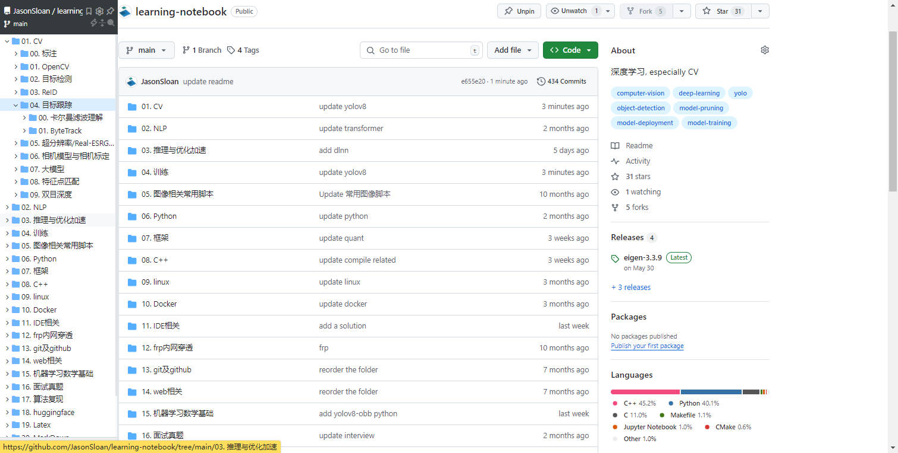
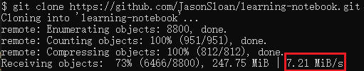

**由于文件夹嵌套较多, 建议使用google插件[Octotree插件](https://chromewebstore.google.com/detail/octotree-github-code-tree/bkhaagjahfmjljalopjnoealnfndnagc?hl=zh-CN&utm_source=ext_sidebar), 效果如下:**

**本仓库较大, clone前建议先参考本仓库中的"Git与Github"中的"FastGithub软件"配置好后克隆下载, 使用FastGithub软件克隆时的下载速度:**

**觉得本仓库好的, 给个Star吧!**