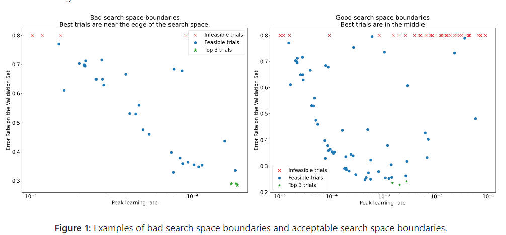
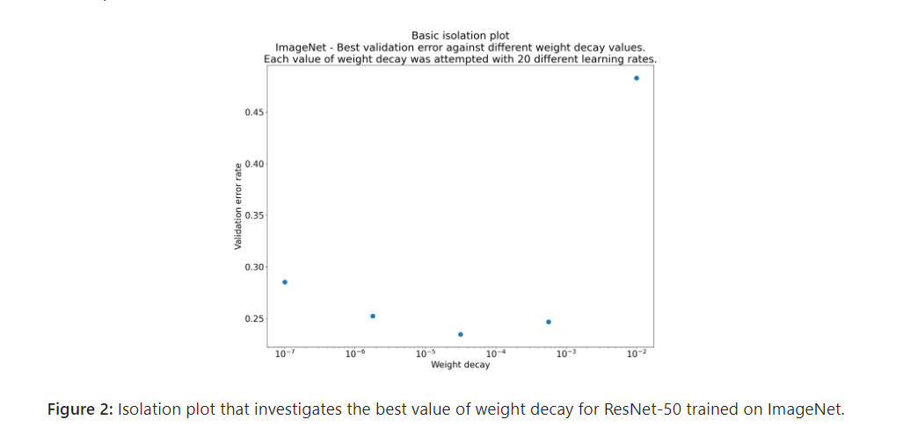
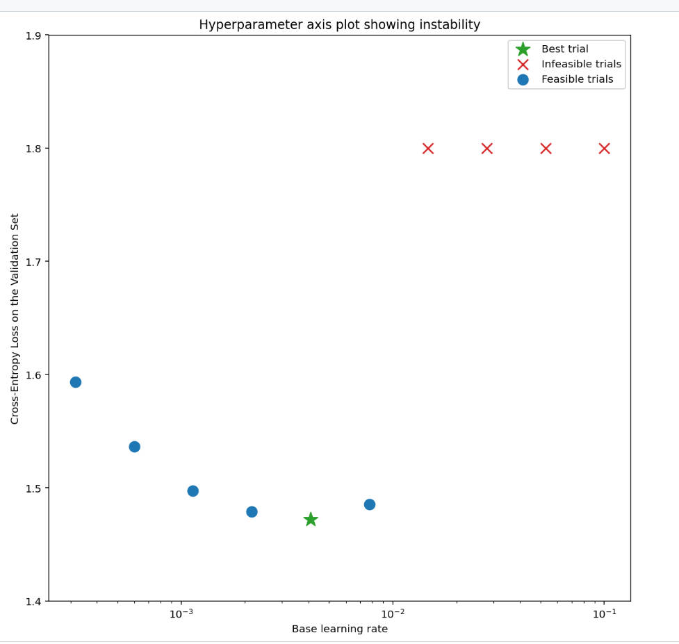
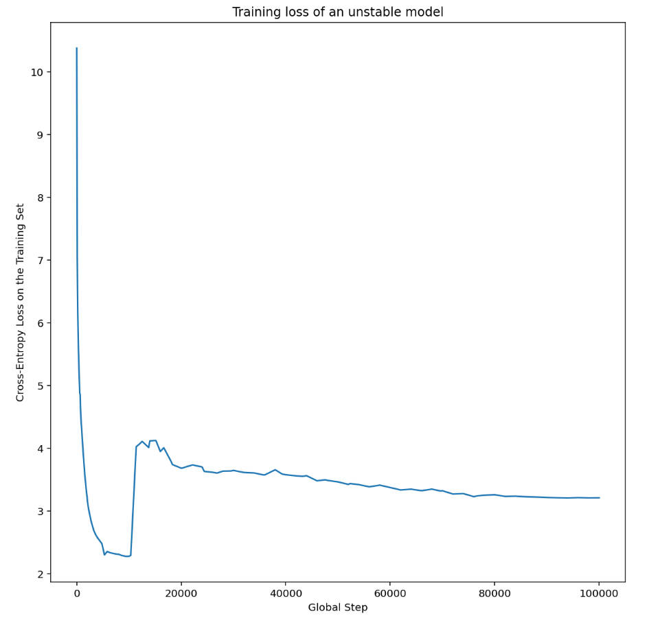
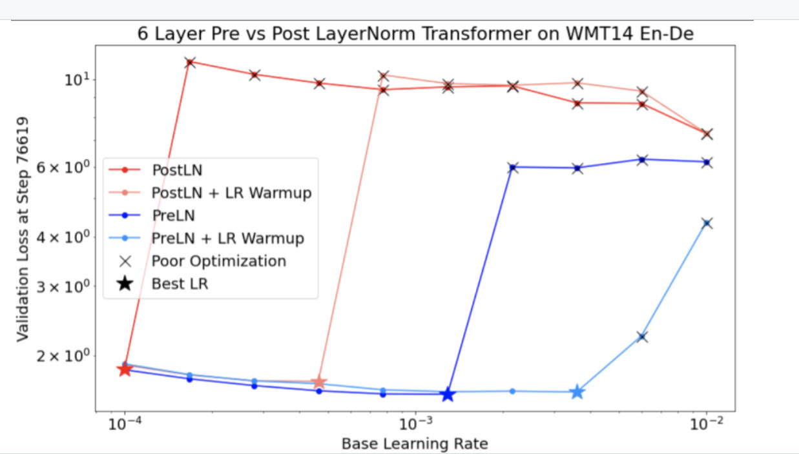
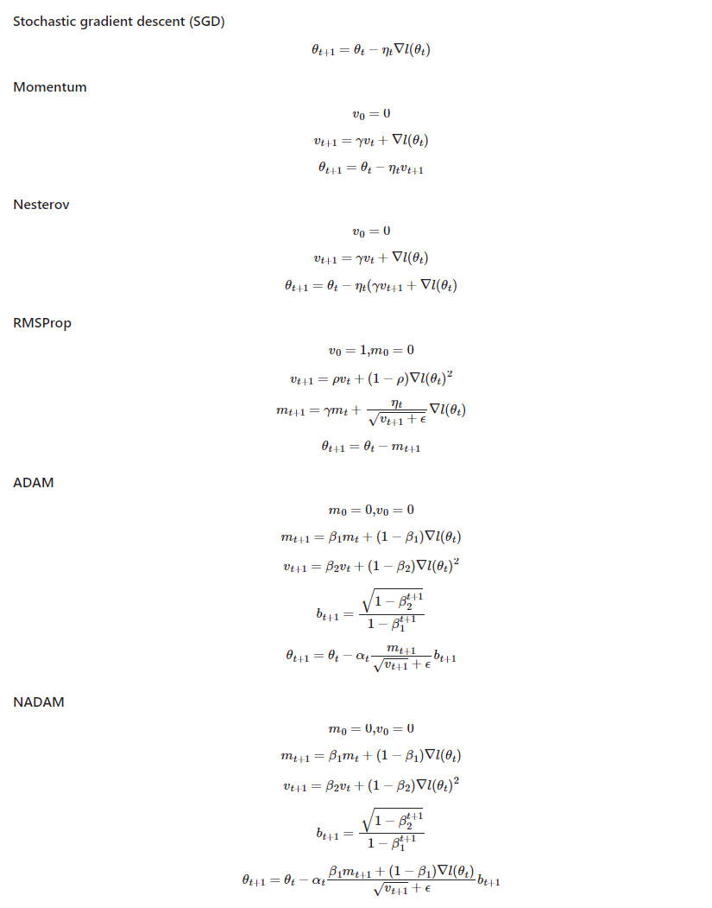

​			谷歌研究院训练调参指南：https://github.com/google-research/tuning_playbook

​								此文档为以上官方文档的中文翻译版

# 一. 开始一个新工程的指导

许多我们在调优过程中做出的决策可以在项目开始时一次性做出，并且只在情况发生变化时偶尔重新审视。

我们以下的指导假设如下：

* 已经完成了问题构建、数据清洗等重要工作的足够部分，因此花时间在模型架构和训练配置上是有意义的。
* 已经设置了一个可以进行训练和评估的流程，并且可以轻松执行对感兴趣的各种模型的训练和预测任务。
* 已经选择并实施了合适的度量标准。这些度量标准应尽可能代表在部署环境中将要测量的内容。

## 1. 选择模型架构

**总结：当启动一个新项目时，尽可能复用一个已经work的模型。**

* 选择一个成熟、常用的模型架构首先使其正常工作。然后构建一个自定义模型。
* 模型架构通常具有各种超参数，这些超参数决定了模型的规模和其他细节（例如，层数、层宽度、激活函数类型等）。
  * 因此，选择架构实际上意味着选择一系列不同的模型（每个模型都对应不同的模型超参数设置）。
  * 我们将在选择初始配置和改进模型性能的科学方法中考虑选择模型超参数的问题。
* 在可能的情况下，尽量找到一篇处理与手头问题尽可能接近的内容的论文，并以该模型作为起点进行复现。

## 2. 选择优化器optimizer

**总结：针对手头问题类型，首先选择最受欢迎的优化器开始。**

* 没有一种优化器在所有类型的机器学习问题和模型架构上都是“最好”的。甚至[仅仅比较优化器的性能都是一项困难的任务](https://arxiv.org/abs/1910.05446)。🤖
* 我们建议在开始新项目时坚持使用成熟、流行的优化器，尤其是选择与问题类型相符的最受欢迎的优化器。
  * 理想情况下，选择用于相同类型问题的最受欢迎的优化器。
* 要准备关注所选优化器的所有超参数。
  * 拥有更多超参数的优化器可能需要更多的调优工作，以找到最佳配置。
  * 这在项目的初期阶段特别相关，当我们试图找到各种其他超参数的最佳值时（例如，架构超参数），而将优化器超参数视为干扰参数。
  * 在项目的初期阶段，最好从更简单的优化器开始（例如，带有固定动量的SGD或带有固定学习率、β1和β2的Adam），然后在以后切换到更通用的优化器。
* 我们喜欢的成熟优化器包括（但不限于）：
  * 带动量的SGD（我们喜欢Nesterov变体）
  * Adam和NAdam，比带动量的SGD更通用。请注意，Adam有4个可调超参数，[它们都可能很重要](https://arxiv.org/abs/1910.05446)！
    * 参见《如何调整Adam的超参数（下方内容）》。

## 3. 选择批量大小batch size

**总结：批量大小决定了训练速度，不应该直接用于调整验证集的性能。通常情况下，理想的批量大小将是硬件支持的最大批量大小。**

* 批量大小是决定训练时间和计算资源消耗的关键因素。
* 增加批量大小通常会减少训练时间。这可能非常有益，因为它，例如：
  * 允许在固定时间间隔内更彻底地调整超参数，可能导致更好的最终模型。
  * 减少了开发周期的延迟，允许更频繁地测试新想法。
* 增加批量大小可能会减少、增加或不改变资源消耗。
* 批量大小不应被视为调整验证集性能的可调超参数。
  * 只要所有超参数都经过良好调整（尤其是学习率和正则化超参数），并且训练步数足够，使用任何批量大小应该能够达到相同的最终性能（参见[Shallue等人的2018年研究](https://arxiv.org/abs/1811.03600)）。
  * 请参阅《为什么不应该直接调整批量大小以改善验证集性能？（下方内容）》。

### （1）确定可行的批量大小和估计训练吞吐量

* 对于给定的模型和优化器，通常会有一系列由可用硬件支持的批量大小。限制因素通常是加速器内存。

* 不幸的是，很难在不运行或至少编译完整的训练程序的情况下计算哪些批量大小将适应内存。

* 通常，最简单的解决方案是在不同批量大小下运行训练任务（例如，逐渐增加2的幂次），直到其中一个任务超出了可用内存。

* 对于每个批量大小，我们应该训练足够长的时间，以获得训练吞吐量的可靠估计

  ​					训练吞吐量 =（每秒处理的示例数）

  ​						或者等效地，每步所需时间。

  ​				每步所需时间 =（批量大小）/（训练吞吐量）

* 当加速器尚未饱和时，如果批量大小翻倍，训练吞吐量也应该翻倍（或至少接近翻倍）。等效地，随着批量大小的增加，每步所需时间应该保持不变（或至少接近不变）。

* 如果不是这种情况，那么训练流程存在诸如I/O或计算节点之间的同步等瓶颈。在继续之前，可能值得诊断和纠正这些问题。

* 如果训练吞吐量仅增加到某个最大批量大小，那么我们应该只考虑最大批量大小，即使硬件支持更大的批量大小。

  * 使用更大批量大小的所有好处都取决于训练吞吐量的增加。如果没有增加，请修复瓶颈或使用较小的批量大小。
  * 梯度累积模拟了硬件无法支持的更大批量大小，因此不提供任何吞吐量方面的好处。在应用工作中，通常应避免使用。

* 这些步骤可能需要在每次更改模型或优化器时重复（例如，不同的模型架构可能允许更大的批量大小适应内存）。

### （2）选择批量大小从而最小化训练时间

​						训练时间 =（每步所需时间）x（总步数）

* 通常情况下，我们可以认为每步所需时间对于所有可行的批量大小都是近似恒定的。这是在没有并行计算的额外开销，且已经诊断和纠正了所有训练瓶颈的情况下成立的（有关如何识别训练瓶颈的信息，请参阅前一节）。实际上，通常至少会有一些来自增加批量大小的额外开销。
* 随着批量大小的增加，通常需要达到固定性能目标的总步数会减少（前提是在更改批量大小时重新调整了所有相关超参数；Shallue等人的研究中有相关信息）。
  * 例如，将批量大小翻倍可能会使所需的总步数减半。这称为完美的比例尺。
  * 完美的比例尺适用于所有批量大小，直到关键批量大小为止，在此之后将获得递减的回报。
  * 最终，增加批量大小不再减少训练步数（但绝不会增加它）。
* 因此，最小化训练时间的批量大小通常是仍然提供减少所需训练步数的最大批量大小。
  * 这个批量大小取决于数据集、模型和优化器，如何计算它是一个开放的问题，除非为每个新问题进行实验找到它。🤖
  * 在比较批量大小时，要注意在budget/[epoch](https://developers.google.com/machine-learning/glossary#epoch) budget（在固定训练示例数量的情况下运行所有实验）和step budget（在固定训练步数的情况下运行所有实验）之间的区别。
    * 使用[epoch](https://developers.google.com/machine-learning/glossary#epoch) budget比较批量大小只探讨完美的比例尺范围，甚至增大批量大小从而减少所需的训练步数也是提供了有意义的加速。
  * 通常情况下，可用硬件支持的最大批量大小会小于关键批量大小。因此，一个很好的经验法则（无需运行任何实验）是使用尽可能大的批量大小。
* 如果使用更大的批量大小最终会增加训练时间，那么使用更大的批量大小就没有意义。

### （3）选择批量大小从而最小化资源消耗

* 增加批量大小会导致两种资源成本的开支：

  * 前期成本，例如购买新的硬件或重写训练流程以实现多GPU / 多TPU训练。
  * 使用成本，例如根据团队的资源预算进行计费，来自云提供商的计费，电力/维护成本。

* 如果增加批量大小需要较大的前期成本，可能最好延迟增加批量大小，直到项目成熟并且更容易评估成本效益权衡。实施多主机并行训练程序可能会引入错误和微妙的问题，因此最好从一个更简单的流程开始。（另一方面，在需要进行大量调整实验的早期阶段，训练时间大幅缩短可能非常有益）。

* 我们将总的使用成本（可能包括多种不同类型的成本）称为“资源消耗”。我们可以将资源消耗分解为以下组成部分：

  ​						资源消耗 =（每步的资源消耗）x（总步数）

* 通常情况下，增加批量大小通常允许我们减少总步数。资源消耗是否增加或减少将取决于每步的消耗如何变化。

  * 增加批量大小可能会减少资源消耗。例如，如果每一步使用较大批量大小与较小批量大小在相同的硬件上运行（每步时间仅略有增加），那么每步的资源消耗的任何增加都可能被减少的步数所抵消。
  * 增加批量大小可能不会改变资源消耗。例如，如果将批量大小翻倍会将所需步数减半并且使用的GPU数量翻倍，那么总消耗（以GPU小时计）将不会改变。
  * 增加批量大小可能会增加资源消耗。例如，如果增加批量大小需要升级硬件，那么每步的消耗增加可能会超过总步数的减少。

### （4）改变批量大小需要重调大多数的超参数

* 大多数超参数的最佳值对批量大小非常敏感。因此，通常情况下更改批量大小需要重新开始调整过程。
* 与批量大小最强烈互动，因此最重要为每个批量大小分别调整的超参数是优化器超参数（例如，学习率、动量）和正则化超参数。
* 在项目开始时选择批量大小时，请记住这一点。如果后来需要切换到不同的批量大小，可能会难以、耗时和昂贵地重新调整所有超参数以适应新的批量大小。

### （5）批归一化（BN）与批次大小是怎么相互作用的

* 批归一化（Batch Normalization）是复杂的，在一般情况下，应该使用与梯度计算不同的批量大小来计算统计信息。有关详细讨论，请参阅批归一化（内部链接）部分。

## 4. 选择初始化配置

* 在开始超参数调整之前，我们必须确定起始点。这包括指定以下内容：（1）模型配置（例如，层数），（2）优化器超参数（例如，学习率），以及（3）训练步数。
* 确定这个初始配置将需要一些手动配置的训练和试错。
* 我们的指导原则是找到一个简单、相对快速、相对低资源消耗的配置，以获得一个“合理”的结果。
  * “简单”意味着在可能的情况下避免炫耀和花哨的功能；这些功能可以随后添加。即使后来这些功能被证明是有帮助的，但在初始配置中添加它们可能会浪费时间调整不必要的特性和/或引入不必要的复杂性。
    * 例如，在添加复杂的衰减计划之前，从一个恒定的学习率开始。
  * 选择一个初始配置，它快速且资源消耗较低，将使超参数调整更加高效。
    * 例如，从一个较小的模型开始。
  * “合理”的性能取决于问题，但最低要求是训练的模型在验证集上远远优于随机（尽管可能不足以值得部署）。
* 选择训练步数涉及到平衡以下紧张关系：
  * 一方面，训练更多步可以提高性能，并且使超参数调整更容易进行（参见Shallue等人的研究）。
  * 另一方面，更少的训练步数意味着每次训练运行更快，使用的资源更少，通过减少循环之间的时间并允许并行运行更多实验来提高调整效率。此外，如果最初选择了不必要的多步数，可能很难在后续更改它，例如，学习率已经针对该步数调整。

# 二. 一个科学的方法去提高模型性能

在本文档的目的中，机器学习开发的最终目标是最大化部署模型的效用。尽管开发过程在不同应用之间有许多不同之处（例如，时间长度，可用的计算资源，模型类型），但通常我们可以在任何问题上使用相同的基本步骤和原则。

以下是我们的指导所做的假设：

* 已经存在一个完全运行的训练流程，以及一个能够获得合理结果的配置。
* 有足够的计算资源可以进行有意义的调整实验，并且可以并行运行至少几个训练作业。

## 1. 增量调优策略

**总结：从一个简单的配置开始，逐步进行改进，同时逐渐深入了解问题。确保任何改进都基于有力的证据，以避免增加不必要的复杂性。**

* 我们的最终目标是找到一个配置，最大化模型的性能。
  * 在某些情况下，我们的目标将是在固定的截止日期内最大化改进模型的程度（例如，提交到比赛中）。
  * 在其他情况下，我们希望无限期地继续改进模型（例如，不断改进用于生产的模型）。
* 原则上，我们可以通过使用算法自动搜索可能配置的整个空间来最大化性能，但这不是一个可行的选择。
  * 可能配置的空间非常大，目前尚没有足够复杂的算法可以在没有人类指导的情况下有效地搜索这个空间。
* 大多数自动搜索算法依赖于手动设计的搜索空间，定义了要搜索的配置集合，而这些搜索空间可能非常重要。
* 最有效的方式是从一个简单的配置开始，逐步添加功能并进行改进，同时逐渐深入了解问题。
  * 我们在每一轮调整中使用自动搜索算法，并随着我们的理解不断更新我们的搜索空间。
* 随着我们的探索，我们自然会找到越来越好的配置，因此我们的“最佳”模型将不断改进。
  * 当我们更新我们的最佳配置时（可能与实际的生产模型相对应，也可能不相对应），我们称之为“发布”。
  * 对于每次发布，我们必须确保更改基于有力的证据----而不仅仅是基于幸运的配置----以避免向训练流程中添加不必要的复杂性。
* 在高层次上，我们的增量调优策略包括重复以下四个步骤：
  * 确定下一轮实验的合适范围。
  * 设计并运行一组实验，以向这个目标迈进。
  * 从结果中学到我们能学到的东西。
  * 考虑是否发布新的最佳配置。

本节的其余部分将更详细地考虑这个策略。

## 2. 探索与利用

**总结：大多数情况下，我们的主要目标是深入了解问题。**

* 尽管人们可能认为我们会花大部分时间尝试在验证集上最大化性能，但实际上，我们花大部分时间尝试深入了解问题，相对较少的时间贪婪地关注验证错误。
  * 换句话说，我们花费大部分时间在“探索”上，只有少量时间用于“利用”。
* 从长远来看，如果我们想要最大化最终的性能，了解问题是至关重要的。将洞察力置于短期收益之上可以帮助我们：
  * 避免仅仅因为历史原因恰巧出现良好运行状态而进行的不必要的更改。
  * 确定验证集错误对哪些超参数最为敏感，哪些超参数相互作用最多，因此需要一起重新调整，以及哪些超参数对其他更改相对不敏感，因此可以在未来的实验中进行固定。
  * 提出尝试的潜在新特性，例如如果过拟合是一个问题，可以尝试新的正则化方法。
  * 识别不起作用的特性，因此可以删除，减少未来实验的复杂性。
  * 认识到来自超参数调整的改进可能已经饱和。
  * 缩小围绕最佳值的搜索空间，以提高调整效率。
* 当我们最终准备贪婪时，即使实验对于调整问题的结构不是最有信息的，我们也可以纯粹关注验证集错误。

## 3. 选择下一轮试验的目标

**总结：每一轮的实验应该有明确的目标，并且在范围上足够狭窄，以便实验实际上可以朝着目标取得进展。**

* 每一轮的实验应该有明确的目标，并且在范围上足够狭窄，以便实验实际上可以朝着目标取得进展：如果我们试图同时添加多个特征或回答多个问题，我们可能无法将结果上的各种效应区分开来。
* 示例目标包括：
  * 尝试改进流程的潜在方法（例如，新的正则化器、预处理选择等）。
  * 了解特定模型超参数的影响（例如，激活函数）。
  * 贪婪地最小化验证集误差。

## 4. 设计下一轮的试验

**总结：识别实验目标中的科学超参数、干扰超参数和固定超参数。创建一系列研究来比较科学超参数的不同值，同时优化干扰超参数。选择干扰超参数的搜索空间以在资源成本和科学价值之间取得平衡。**

**这一节表明了一个意思，就是当只调整一个超参数而固定其他所有超参数时，比较的结果可能是不公平的，例如，如果想确定隐层数量时，如果只调整隐层数量而不调整学习率，那么比较出来的结果是不公平的，因为最佳学习率通常取决于模型架构。**

**这一节的另一个意思，如果在调整超参数的值的搜索空间时，选择到的最优超参数的值在搜索空间的边界处，那么大概率是这个超参数的最优值选的不到位，应该扩大搜索空间（见图1）。**

### （1）识别科学超参数、干扰超参数和固定超参数

* 给定一个目标，所有超参数都将是科学超参数、干扰超参数或固定超参数。
  * 科学超参数是我们试图衡量其对模型性能的影响的超参数。
  * 干扰超参数是需要进行优化以公平比较科学超参数不同值的超参数。这类似于统计学中的干扰参数概念。
  * 固定超参数在当前一轮实验中将具有固定的值。这些超参数，其值在比较科学超参数的不同值时不需要（或我们不希望它们）发生变化。
    * 通过为一组实验固定某些超参数，我们必须接受从实验中得出的结论可能对其他固定超参数的设置无效。换句话说，固定超参数为我们从实验中得出的任何结论创建了注意事项。
* 例如，如果我们的目标是“确定具有更多隐藏层的模型是否会减小验证误差”，那么隐藏层数是一个科学超参数。
  * 学习率是一个干扰超参数，因为只有在为每种隐藏层数量单独调整学习率时，我们才能公平比较具有不同隐藏层数的模型（最佳学习率通常取决于模型架构）。
  * 如果我们在之前的实验中确定最佳激活函数的选择不受模型深度的影响，或者如果我们愿意将有关隐藏层数的结论限制为仅涵盖这种特定激活函数的选择，那么激活函数可能是一个固定超参数。或者，如果我们准备为每种隐藏层数量单独调整它，那么它可能是一个干扰参数。
* 特定超参数是科学超参数、干扰超参数还是固定超参数并不是超参数的固有属性，而取决于实验目标。
  * 例如，激活函数的选择可以是科学超参数（对于我们的问题，ReLU或tanh哪个更好？），干扰超参数（如果我们允许几种不同的激活函数，最佳的5层模型是否比最佳的6层模型好？）或固定超参数（对于ReLU网络，在特定位置添加批量归一化是否有帮助？）。
* 在设计新一轮实验时，我们首先确定与我们的实验目标相对应的科学超参数。
  * 在这个阶段，我们将所有其他超参数视为干扰超参数。
* 接下来，我们将一些干扰超参数转换为固定超参数。
  * 在资源充足的情况下，我们会将所有非科学超参数保留为干扰超参数，以便从实验中得出的结论不受固定超参数值的限制。
  * 然而，我们尝试调整的干扰超参数越多，我们就越有可能无法为每个科学超参数的设置充分调整它们，从而可能会从实验中得出错误的结论。
  * 如下所述，我们可以通过增加计算预算来对抗这种风险，但通常我们的最大资源预算不足以对所有非科学超参数进行调整。
  * 当我们认为通过固定某个干扰超参数引入的干扰比将其作为干扰超参数包含在内的成本更小时，我们选择将干扰超参数转换为固定超参数。
    * 给定的干扰超参数与科学超参数的相互作用越多，将其值固定对实验结果的影响就越大。例如，权重衰减强度的最佳值通常取决于模型大小，因此假设权重衰减的单个特定值来比较不同模型大小可能不太有意义。
* 尽管我们为每个超参数分配的类型取决于实验目标，但对于某些超参数类别，我们有以下经验法则：
  * 各种优化器超参数（例如学习率、动量、学习率调度参数、Adam beta等）中至少有一些将是干扰超参数，因为它们往往与其他变化发生最多的相互作用。
    * 它们很少是科学超参数，因为像“当前流水线的最佳学习率是多少？”这样的目标并不会提供太多见解 - 最佳设置可能会随着下一次pipeline更改而轻松变化。
    * 尽管由于资源限制或我们有特别充分的证据表明它们不会与科学参数互相影响，我们偶尔可能会将其中一些固定，但通常我们应该假设优化器超参数必须分别调整，以便在不同科学超参数设置之间进行公平比较，因此不应该固定。
      * 此外，我们没有先验理由更喜欢优化器超参数的一个值而不是另一个值（例如，它们通常不会以任何方式影响前向传播或梯度的计算成本）。
  * 相比之下，优化器的选择通常是科学超参数或固定超参数。
    * 如果我们的实验目标涉及在两个或更多不同优化器之间进行公平比较（例如，“确定在给定步数内哪个优化器产生最低的验证误差”），那么它是一个科学超参数。
    * 或者，出于各种原因，我们可能会将其作为固定超参数，包括（1）以前的实验使我们相信最适合我们问题的优化器不会对当前的科学超参数敏感；和/或（2）我们更喜欢使用这个优化器来比较科学超参数的值，因为它的训练曲线更容易理解；和/或（3）我们更愿意使用这个优化器，因为它比其他选择使用的内存更少。
  * 由正则化技术引入的超参数通常是干扰超参数，但我们是否完全包括正则化技术是科学超参数或固定超参数。
    * 例如，dropout会增加代码复杂性，因此在决定是否包含它时，我们会将“无dropout”与“有dropout”作为科学超参数，并将dropout率作为干扰超参数。
      * 如果我们决定根据这个实验将dropout添加到我们的流程中，那么在未来的实验中，dropout率将成为干扰超参数。
  * 模型架构超参数通常是科学超参数或固定超参数，因为模型架构更改可能会影响服务和训练成本、延迟和内存需求。
    * 例如，层数通常是科学或固定超参数，因为它往往对训练速度和内存使用率产生重大影响。
* 在某些情况下，干扰和固定超参数的集合将取决于科学超参数的值。
  * 例如，假设我们试图确定Nesterov动量和Adam中哪个优化器导致最低的验证误差。科学超参数是优化器，可以取值{"Nesterov_momentum", "Adam"}。值optimizer="Nesterov_momentum"引入了干扰/固定超参数{learning_rate, momentum}，但值optimizer="Adam"引入了干扰/固定超参数{learning_rate，beta1，beta2，epsilon}。
  * 只在科学超参数的某些值存在的超参数称为条件超参数。
  * 我们不应假设只因为它们具有相同的名称的两个条件超参数相同！在上面的示例中，名为learning_rate的条件超参数对于optimizer="Nesterov_momentum"与optimizer="Adam"是不同的超参数。它在这两种算法中的作用是相似的（尽管不完全相同），但在这两种优化器中表现良好的值范围通常相差几个数量级。

### （2）创建一组study

* 一旦我们确定了科学超参数和干扰超参数，我们就设计一个"study"或一系列study，以取得实验目标的进展。
  * 一个study指定一组要用于后续分析的超参数配置。每个配置被称为一个"试验"。
  * 创建一个study通常涉及选择在试验中会变化的超参数，选择那些超参数可以取哪些值（"搜索空间"），选择试验数量，以及选择一个自动搜索算法从搜索空间中抽样。或者，我们可以通过手动指定一组超参数配置来创建一个study。
* study的目的是在不同的科学超参数值下运行pipeline，同时"优化"（或"优化过"）干扰超参数，以便不同科学超参数值之间的比较尽可能公平。
* 在最简单的情况下，我们可以为每个科学参数配置创建一个单独的study，每个study都会对干扰超参数进行调整。
  * 例如，如果我们的目标是从Nesterov动量和Adam中选择最佳优化器，我们可以创建一个study，其中optimizer="Nesterov_momentum"，干扰超参数是{learning_rate, momentum}，另一个study中optimizer="Adam"，干扰超参数是{learning_rate，beta1，beta2，epsilon}。我们将通过选择每个study中表现最佳的试验来比较这两个优化器。
  * 我们可以使用任何无梯度优化算法，包括贝叶斯优化或进化算法等方法，来优化干扰超参数，尽管在探索调整阶段，我们更喜欢使用近似随机搜索，因为它在这种情况下有许多优势。探索结束后，如果有最先进的贝叶斯优化软件可用，那将是我们首选的选择。
* 在更复杂的情况下，如果我们想比较大量不同科学超参数值，并且创建那么多独立study不切实际，我们可以将科学参数包括在干扰超参数的相同搜索空间中，并使用搜索算法在单个study中对科学超参数和干扰超参数的值进行抽样。
  * 采用这种方法时，条件超参数可能会引发问题，因为除非所有科学超参数的值的干扰超参数集合都相同，否则很难指定搜索空间。
  * 在这种情况下，我们更倾向于使用近似随机搜索而不是更高级的黑盒优化工具，因为它可以确保我们获得相对均匀的科学超参数值抽样。无论使用哪种搜索算法，我们都需要确保以某种方式均匀地搜索科学参数。

### （3）在寻求信息丰富和经济实惠的实验之间取得平衡

在设计一个study或一系列study时，我们需要分配有限的预算，以充分实现以下三个期望目标：

1. 比较足够多不同的科学超参数值。
2. 在足够大的搜索空间中调整干扰超参数。
3. 密集地抽样干扰超参数的搜索空间。

* 我们能够多好地实现这三个期望目标，就能从我们的实验中提取多好的见解。
  * 比较尽可能多的科学超参数值扩大了我们从实验中获得的见解的范围。
  * 包括尽可能多的干扰超参数，并允许每个干扰超参数在尽可能广泛的范围内变化，增加了我们对于在搜索空间中的每个科学超参数配置中存在一个"好"的干扰超参数值的信心。
    * 否则，我们可能会因为未搜索到干扰参数空间的可能区域而对科学超参数值进行不公平的比较，在某些科学参数值上可能存在更好的干扰参数值。
  * 尽可能密集地抽样干扰超参数的搜索空间增加了我们对于搜索过程中存在的任何好的干扰超参数设置会被找到的信心。
    * 否则，我们可能会因为一些值在干扰超参数抽样中更幸运而导致对科学超参数值之间的比较不公平。
* 不幸的是，提高这三个维度中的任何一个的改进都要求增加试验的数量，因此增加了资源成本，或者在其他维度中找到一种节省资源的方法。
  * 每个问题都有其特殊性和计算约束，因此如何在这三个期望目标之间分配资源需要一定领域知识水平。
  * 在运行study后，我们总是试图了解study是否充分调整了干扰超参数（即在足够大的空间内进行了充分的搜索），以便公平比较科学超参数（如下文更详细地描述）。

### （4）从实验结果中提取见解

**总结：除了尝试实现每组实验的原始科学目标之外，还要经过一系列额外的问题检查，如果发现问题，需要修订实验并重新运行它们。**

* 最终，每组实验都有一个具体的目标，我们希望评估实验提供的证据对于实现该目标的贡献。

  * 然而，如果我们提出正确的问题，通常会发现需要在一组实验可以朝其原始目标取得更多进展之前进行纠正的问题。
    * 如果我们不提出这些问题，我们可能会得出不正确的结论。
  * 由于运行实验可能成本高昂，我们还希望利用每组实验提取其他有用的见解，即使这些见解不立即与当前目标相关。

* 在分析一组给定的实验以取得原始目标的进展之前，我们应该向自己提出以下额外的问题：

  * 搜索空间足够大吗？

    如果一项研究的最佳点在一个或多个维度上接近搜索空间的边界，那么搜索可能不够广泛。在这种情况下，我们应该运行另一项研究，扩展搜索空间。

  * 我们从搜索空间中抽样了足够多的点吗？

    如果没有，可以运行更多的点或者在调整目标时采取更谨慎的方法。

  * 每项研究中有多少试验是不可行的（即试验发散、损失值非常差，或因违反某些隐含约束而无法运行）？

    当一项研究中有很大比例的点是不可行的时，我们应该尝试调整搜索空间，以避免抽样这些点，有时需要重新参数化搜索空间。

    在某些情况下，大量不可行的点可能表明训练代码中存在错误。

  * 模型是否存在优化问题？

  * 我们可以从最佳试验的训练曲线中学到什么？

    例如，最佳试验的训练曲线是否与过拟合一致？

* 如果必要，根据上述问题的答案，调整最近的研究（或一组研究）以改善搜索空间和/或抽样更多的试验，或采取其他纠正措施。

* 一旦回答了上述问题，我们可以继续评估实验对于我们原始目标提供的证据（例如，评估一个变化是否有用）。

### （5）识别不良搜索空间边界

* 如果从一个搜索空间中抽样的最佳点靠近其边界，那么该搜索空间就值得怀疑。如果我们在该方向上扩大了搜索范围，可能会找到更好的点。

* 为了检查搜索空间的边界，我们喜欢在所谓的基本超参数轴图上绘制已完成的试验，其中我们绘制验证目标值与一个超参数（例如学习率）的关系。图中的每个点对应一个单独的试验。

  * 每个试验的验证集目标值通常应该是其在训练过程中取得的最佳值。

    

* 图1中的图表显示了错误率（较低的值表示更好）与初始学习率之间的关系。

* 如果最佳点聚集在搜索空间的边缘（在某个维度上），那么搜索空间的边界可能需要扩展，直到观察到的最佳点不再靠近边界。

* 通常，一项研究将包括"不可行"的试验，这些试验会发散或产生非常差的结果（在上述图表中以红色X标记）。

  * 如果在某个阈值以上的学习率下，所有试验都是不可行的，并且性能最好的试验具有位于该区域边缘的学习率，那么模型可能会因稳定性问题而防止使用更大的学习率。

### （6）在搜索空间未取样足够多的点

* 一般来说，很难确定是否已经对搜索空间进行了足够密集的抽样。 🤖
* 当然，运行更多的试验是更好的选择，但显然会带来成本。
* 由于很难确定何时已经进行了足够的抽样，我们通常会抽样我们能够承受的范围，并尝试通过反复查看各种超参数轴图，并试图了解搜索空间的"好"区域中有多少点来校准我们的直觉信心。

### （7）检查训练曲线

**总结：检查训练曲线是识别常见失败模式的一种简单方式，可以帮助我们确定下一步采取哪些行动。**

* 尽管在许多情况下，我们实验的主要目标只需要考虑每个试验的验证集错误，但在将每个试验简化为一个单一数字时，我们必须小心，因为这可能隐藏了有关正在发生的重要细节。
* 对于每项研究，我们总是查看至少最佳几个试验的训练曲线（训练错误和验证错误与训练步骤随着训练的持续时间而绘制）。
* 即使这对于解决主要的实验目标并不是必要的，检查训练曲线是识别常见失败模式的一种简单方式，可以帮助我们确定下一步采取哪些行动。
* 在检查训练曲线时，我们关注以下问题。
* 是否有任何试验表现出过拟合？
  * 过拟合是指验证错误在训练过程中的某个时刻开始增加。
  * 在通过选择科学超参数的每个设置的“最佳”试验来优化掉麻烦的超参数的实验设置中，我们应该至少检查与我们正在比较的科学超参数设置相对应的最佳试验中是否存在过拟合。
    * 如果任何最佳试验表现出过拟合，通常我们希望在比较科学超参数的值之前，重新运行实验并/或更好地调整现有的正则化参数。
      * 如果科学超参数包括正则化参数，这可能不适用，因为在这种情况下，如果这些正则化参数的低强度设置导致过拟合，那将不足为奇。
    * 使用常见的正则化技术通常可以轻松减少过拟合，这些技术增加的代码复杂性或额外计算量很小（例如，dropout、标签平滑、权重衰减），因此通常可以毫不费力地将其中一个或多个添加到下一轮实验中。
    * 例如，如果科学超参数是“隐藏层的数量”，并且使用最大数量的隐藏层的最佳试验出现了过拟合，那么通常我们会更愿意再试一次，并使用额外的正则化，而不是立即选择较少的隐藏层。
    * 即使没有任何“最佳”试验表现出过拟合，如果任何试验中出现这种情况，仍可能存在问题。
      * 选择最佳试验会抑制表现出问题的配置，并偏向那些没有问题的配置。换句话说，它会偏向具有更多正则化的配置。
      * 然而，任何使训练变得更差的因素都可以作为正则化器，即使这并不是本意。例如，选择较小的学习率可以通过阻碍优化过程来正则化训练，但通常我们不希望以这种方式选择学习率。
      * 因此，我们必须意识到，为每个科学超参数设置选择的“最佳”试验可能会倾向于科学或干扰超参数的“坏”值。
* 训练或验证错误在训练后期是否存在步骤间大差异？
  * 如果是这样，这可能会影响我们比较不同科学超参数值的能力（因为每个试验最终都在“幸运”或“不幸”的步骤上随机结束），以及我们在生产中重现最佳试验结果的能力（因为生产模型可能不会在研究中的同一“幸运”步骤上结束）。
  * 步骤间差异最可能的原因是批次差异（每个批次从训练集中随机抽样示例），小的验证集，以及在训练后期使用的学习率太高。
  * 可能的解决方法包括增加批次大小，获取更多的验证数据，使用学习率衰减，或使用Polyak平均法。
* 在训练结束时，试验是否仍在提高？
  * 如果是这样，这表明我们处于“计算受限”状态，我们可能会从增加训练步数或更改学习率中受益。
* 性能是否在最终训练步骤之前就在训练和验证集上饱和了？
  * 如果是这样，这表明我们处于“非计算受限”状态，我们可能可以减少训练步骤的数量。
* 尽管我们不能列举出所有的情况，但从检查训练曲线中可以看出许多其他附加行为（例如，训练期间训练损失的增加通常表明训练流程中存在错误）。

### （8）使用单独绘图检测改变是否有用



* 通常，一组实验的目标是比较科学超参数的不同值。
  * 例如，我们可能希望确定导致最佳验证集错误的权重衰减值是多少。
* 隔离图是基本超参数轴图的特殊情况。隔离图上的每个点对应于在一些（或全部）干扰性超参数上的最佳试验性能。
  * 换句话说，我们绘制了在“优化掉”干扰性超参数后的模型性能。
* 隔离图使得在不同科学超参数值之间进行一一对应的比较变得更容易。
* 例如，图2显示了在ImageNet上训练的特定ResNet-50配置的最佳验证集性能对应的权重衰减值。
  * 如果我们的目标是确定是否包括权重衰减，那么我们将比较此图中的最佳点与不使用权重衰减的baseline。为了公平比较，baseline的学习率也应进行良好调整。
* 当我们有（准）随机搜索生成的数据，并考虑用于隔离图的连续超参数时，我们可以通过将基本超参数轴图的x轴值进行分桶，并在每个由分桶定义的垂直切片中选择最佳试验来近似隔离图。

### （9）自动化生成通用有用的图表

* 生成图表的工作越费力，我们就越不太可能会像应该的那样经常查看它们，因此我们有必要设置基础架构，以自动产生尽可能多的图表。
* 至少，我们会自动为在实验中变化的所有超参数生成基本超参数轴图。
* 此外，我们会自动为所有试验生成训练曲线，并尽量简化查找每个研究的最佳几个试验并检查它们的训练曲线。
* 还有许多其他潜在的图表和可视化工具，我们可以添加，这些可以很有用。虽然上面描述的这些是一个很好的起点，但引用 Geoffrey Hinton 的话来说，“每当你绘制新的东西，你都会学到新的东西。”

## 5. 确定是否改变训练pipeline或超参数配置

**摘要：在决定是否对我们的模型或训练流程进行更改或采用新的超参数配置时，我们需要知道我们结果中的变化是怎么来的。**

* 当我们试图改进我们的模型时，我们可能会观察到特定的变化最初在验证集错误方面表现的比我们现有的配置要好，但在重复实验后发现没有连续的优势。非正式地说，我们可以将可能导致这种不一致结果的最重要的变化来源分为以下广泛的类别：
  * 训练过程方差、重新训练方差或试验方差：我们在使用相同超参数但使用了不同随机种子。
    * 例如，不同的随机初始化、训练数据打乱、dropout掩码、数据增强操作模式以及并行算术操作的顺序都是可能导致试验方差的潜在来源。
  * 超参数搜索方差或study方差：由于选择超参数的程序而引起的结果变化。
    * 例如，我们可以使用特定搜索空间运行相同的实验，但对近似随机搜索使用两个不同的种子，最终选择不同的超参数值。
  * 数据收集和抽样方差：由于随机划分成训练、验证和测试数据，或者来自训练数据生成过程的变化。
* 通过使用细致的统计测试来比较在有限验证集上估计的验证错误率是很好的，但通常仅仅试验方差就足以在使用相同超参数设置的两个不同训练模型之间产生统计上显著的差异。
* 在尝试得出超越超参数空间中的个别点的结论时，我们最关注研究方差。
  * study方差取决于试验数量和搜索空间，我们已经看到一些情况下它比试验方差大，也有一些情况下它小得多。
* 因此，在采用候选更改之前，考虑运行最佳试验N次以描述试验方差的运行差异。
  * 通常情况下，我们可以在对pipeline进行重大更改后仅重新描述试验方差，但在某些应用中，我们可能需要更新的估计。
  * 在其他应用中，描述试验方差的成本可能太高，不值得。
* 总的来说，尽管我们只想采用产生真正改进的更改（包括新的超参数配置），但要求完全确定某些东西是否有帮助也不是正确的答案。
* 因此，如果新的超参数点（或其他更改）比baseline得到更好的结果（考虑到新点和baseline的重新训练方差，尽力而为），那么我们可能应该将其作为未来比较的新baseline。
  * 然而，我们只应采纳那些产生超过它们增加的复杂性的改进的更改。

## 6. 在探索结束之后

**总结：贝叶斯优化工具是一种令人信服的选择，一旦我们完成了对良好搜索空间的探索，并已决定哪些超参数应该进行调整。**

* 在某一时刻，我们的重点将从更多地了解调参问题转向生成一个最佳配置，以便启动或以其他方式使用。
* 此时，应该有一个经过精细调整的搜索空间，其中包含最佳观察试验周围的局部区域，并已充分采样。
* 我们的探索工作应该已经揭示了最重要的需要调整的超参数（以及它们的合理范围），我们可以使用这些超参数构建一个用于进行最终自动调整研究的搜索空间，以尽可能大的调整预算。
* 由于我们不再关心最大化对调整问题的洞察力，因此近似随机搜索的许多优点不再适用，应该使用贝叶斯优化工具来自动查找最佳的超参数配置。
  * 开源 Vizier 实现了多种用于调整 ML 模型的高级算法，包括贝叶斯优化算法。
  * 如果搜索空间包含大量发散点（即获得 NaN 训练损失或甚至训练损失远远超过均值的点），则使用能够正确处理发散试验的黑盒优化工具则显得很重要（请参阅"[带未知约束的贝叶斯优化](https://arxiv.org/abs/1403.5607)"，以了解处理此问题的出色方法）。[开源 Vizier](https://github.com/google/vizier) 支持将试验标记为不可行的发散点，尽管具体使用的方法可能会根据配置的方式而有所不同，不一定采用我们首选的 [Gelbart](https://arxiv.org/abs/1403.5607) 等人的方法。
* 此时，我们还应考虑检查测试集上的性能。
  * 原则上，我们甚至可以将验证集合并到训练集中，并使用贝叶斯优化找到的最佳配置进行重新训练。然而，只有在不会有未来的具体工作负载（例如一次性的 Kaggle 竞赛）时，才适用此方法。

# 三. 决定每一轮训练的步数

* 有两种类型的工作负载：计算受限和非计算受限。
* 当训练受计算限制时，训练的限制是由我们愿意等待的时间而不是我们拥有的训练数据量或其他因素所限制。
  * 在这种情况下，如果我们可以以某种方式延长训练时间或更加高效地进行训练，我们应该能够看到更低的训练损失，并且通过适当的调整，可以改善验证损失。
  * 换句话说，加速训练等同于改进训练，而“最佳”训练时间始终是“只要我们负担得起”的时间。
  * 尽管如此，仅因为工作负载受计算限制并不意味着延长/加快训练是改善结果的唯一途径。
* 当训练不受计算限制时，我们可以根据自己的意愿进行长时间的训练，但在某一时刻，延长训练时间可能不会有太大帮助（甚至可能导致问题性的过拟合）。
  * 在这种情况下，我们应该期望能够将训练损失降低到非常低的水平，以至于延长训练时间可能会略微降低训练损失，但不会对验证损失产生实质性影响。
  * 特别是当训练不受计算限制时，更慷慨的训练时间预算可以使调整变得更加容易，特别是在调整学习率衰减计划时，因为它们与训练预算有着特别强的相互作用。
    * 换句话说，非常吝啬的训练时间预算可能需要将学习率衰减计划调整得非常完美才能达到良好的错误率。
* 无论给定的工作负载是否受计算限制，增加梯度（跨批次）的方差的方法通常会导致训练进展较慢，从而可能增加达到特定验证损失所需的训练步骤数量。高梯度方差可能是由以下原因引起的：
  * 使用较小的批次大小
  * 添加数据增强
  * 添加某些类型的正则化（例如 dropout）

## 1. 当训练不受计算限制时，决定训练多长时间

* 我们的主要目标是确保我们进行足够长时间的训练，以使模型达到可能的最佳结果，同时避免在训练步数方面过于浪费。
* 当存在疑虑时，应该倾向于延长训练时间。在选择（最佳）断点的时候并且断点足够多的情况下，性能不应该在延长训练时间时下降。
* 永远不要在study中调整max_train_steps数。选择一个值，并在所有试验中使用相同的值。从这些试验中，绘制断点选择找到的训练步骤，以精确选择max_train_steps。
  * 例如，如果最佳步骤总是在训练的前10%期间，那么最大步数可能过高。
  * 或者，如果最佳步骤在训练的最后25%期间一直保持稳定，我们可能会从延长训练时间并重新调整衰减计划中收益。
* 理想的训练步数可能会在架构或数据发生变化时发生变化（例如，添加数据增强）。
* 以下是如何基于使用恒定学习率进行训练的步数来选择max_train_steps的初始候选值的描述。
  * 请注意，我们并没有以精确或数学上明确定义的方式使用短语“完全拟合训练集”。这只是一个非正式的描述词，用来表示非常低的训练损失。
    * 例如，当使用对数损失进行训练时，除去正则化项外，我们可能会看到训练损失持续缓慢改善，直到网络权重无限增长，模型对训练集的预测变得越来越自信。在这种情况下，我们可能会说模型在训练集上的误分类错误达到零时，模型“完全拟合”了训练集。
  * 如果训练过程中的梯度噪声量增加，我们可能需要增加max_train_steps的起始值。
    * 例如，如果引入了数据增强或像dropout这样的正则化器到模型中。
  * 如果训练过程以某种方式改善，可能可以减少max_train_steps。
    * 例如，使用已调整好的优化器或已调整好的学习率。

### （1）使用学习率扫描选择max_train_steps的初始候选值的算法

* 这个过程假设不仅可以“完全”拟合训练集，还可以使用恒定的学习率来做到这一点。
* 如果可能完全拟合整个训练集，那么一定存在一种配置（具有某个max_train_steps的值）可以完全拟合训练集；找到任何这样的配置，并使用其max_train_steps值作为起始点N。
* 运行一个不使用数据增强和正则化的恒定的学习率扫描（例如网格搜索学习率），其中每个试验都会训练N步。
* 在扫描中，达到完美的训练性能所需的步数最少的试验的步数是我们对max_train_steps的初始猜测。
* 注意：糟糕的搜索空间可能导致自我欺骗成为可能。
  * 例如，如果study中的所有学习率都太小，我们可能会错误地得出需要非常大的max_train_steps值的结论。
  * 至少，我们应该检查study中的最佳学习率是否位于搜索空间的边界之外。


## 2. 当训练受计算限制时，决定训练多长时间

* 在某些情况下，训练损失无限地持续改善，而我们的耐心和计算资源成为限制因素。
* 如果训练损失（甚至验证损失）持续改善，我们是否应该尽量训练？未必。
  * 通过运行更多次较短的实验并将最长的“生产长度”runs保留给我们希望启动的模型，我们可能能够更有效地进行调整。
  * 随着试验的训练时间接近我们的耐心限制，调整实验变得对我们潜在的启动候选模型更为相关，但我们可以完成更少的实验。
  * 在只进行了生产长度的约10%的训练时限内，我们可能可以回答许多问题，但在这个时间限制内得出的结论可能不适用于进行了生产长度的20%甚至100%的实验，总是存在风险。
* 以增加每个试验训练步长限制的方式进行多轮调整是明智的方法。
  * 我们可以进行任意多轮调整，但通常最实际的是1-3轮。
  * 基本上，尽量在非常快的周转时间内获取尽可能多的问题理解，同时权衡调整的彻底性与最终、最长运行的相关性。
  * 一旦给定的每个试验时间限制生成了有用的见解，我们可以增加训练时间并继续调整，根据需要再次核实较短运行的结论。
* 作为起点，我们建议进行两轮调整：
  * 第1轮：较短的运行以找到良好的模型和优化器超参数。
  * 第2轮：在良好的超参数点上进行很少的长时间运行以获得最终模型。
* 从第i轮到第i+1轮的最大问题是如何调整学习率衰减计划。
  * 在调整学习率衰减计划时的一个常见陷阱是在两轮之间使用所有额外的训练步骤，但学习率太小。

### （1）第1轮

* 不幸的是，在短时间、不完整的训练中找到的良好的超参数，在当训练时间显著增加时，仍然是一个良好的选择，这是没有保证的。但对于某些类型的超参数来说，它们通常足够相关，使第一轮调整是有用的。
* 哪些在较短的运行中找到的超参数值我们希望能够转移到较长的训练运行中？关于所有这些，我们需要进行更多研究。但根据我们目前所知，以下是作者们怀疑的排名，按概率递减顺序排列：
  * 很有可能转移
    * 早期训练不稳定性可以在第一轮调整中通过较少的训练步骤来解决。也许这些超参数是我们可以确保转移的最接近的选择。
      * Warmup length（预热长度）
      * Initialization（初始化）
  * 可能性大的转移
    * 模型架构 - 模型架构的显著优势通常会转移，但可能存在许多反例。
  * 可能转移
    * 优化算法/optimizer（优化器）超参数 - 我们认为这会“松散”转移。它明显弱于以上的事项。
    * Data augmentation（数据增强）
    * Regularization（正则化）
      * 如果无法完全拟合训练集，模型可能处于正则化不太可能帮助的情况。
  * 不太可能转移
    * Learning rate schedule（学习率计划）：不太可能完全转移。
      * [这篇论文](https://arxiv.org/abs/2203.15556)建议即使衰减计划也会转移，但我们不相信这在一般情况下是正确的。例如：在少量训练步骤上调整 sqrt 衰减，然后扩展到大量步骤将导致大多数训练发生在过小的步骤上。
        * 在极端训练预算的极限情况下，大多数schedules 可能都能达到“足够好”，但如果进行调整，很可能会看到明显的性能改进。
      * [了解随机元优化中短视倾向](https://arxiv.org/abs/1803.02021)的论文描述了试图短视地选择学习率的危险。

### （2）第2轮

* 运行来自第一轮的最佳超参数配置。
* （推测）🤖 使用额外的步骤来延长高学习率的训练期。
  * 例如，如果使用线性衰减计划，那么从第一轮中保持衰减长度不变，然后延长开始时的恒定学习率期间。
  * 对于余弦衰减计划，只需保持第一轮的基本学习率，然后按照[《Chinchilla》](https://arxiv.org/abs/2203.15556)论文中的方法扩展 max_train_steps。
* 对于具有非常成熟的建模和调整流程以及非常长时间和昂贵的生产训练运行的团队，更多轮次可能是有道理的，但它们通常会过于冗长。
  * 我们已经描述了如何从步骤1转移到步骤2。如果我们不关心分析时间，如果有效地使用计算资源是首要考虑因素，那么理想情况下是在许多不同的调整轮次中指数级增加训练运行的长度（从而使完成一项研究的端到端时间增加）。
    * 在每一轮中，我们系统地确保我们的选择仍然有效。
    * 新的想法通过渐进增加的实验流程，从步骤 i 到步骤 i+1，逐渐降低风险。

# 四. 训练流程中额外的指导

## 1. 优化输入流程

**总结：输入受限的流程高度依赖于任务；应当使用性能分析工具，注意常见问题。**

* 使用合适的性能分析工具来诊断输入受限的pipeline。例如，对于JAX，可以使用Perfetto，对于TensorFlow，可以使用TensorFlow性能分析工具。
* 最终，具体的原因和干预措施将高度依赖于任务。更广泛的工程考虑（例如，最小化磁盘占用）可能会导致更差的输入pipeline性能。
* 常见原因：
  * 数据与训练过程不共位，导致I/O延迟（这可能发生在通过网络读取训练数据时）。
  * 昂贵的在线数据预处理（考虑离线进行一次处理并保存结果）。
  * 无意中的同步障碍干扰了数据pipeline的prefetch。例如，在CommonLoopUtils（[链接](https://github.com/google/CommonLoopUtils/blob/fea2518ada8814a78e1492023fd9f00edb0b0568/clu/metrics.py#L291)）中，在device和host之间同步指标时可能出现这种情况。
* 常见提示：
  * 在输入pipeline中添加预取数据的工具，例如 tf.data.Dataset.prefetch。
  * 尽早在pipeline中去除每个数据中未使用的特征/元数据。
  * 增加生成输入流水线示例的作业数量的复制。例如，使用 tf.data 服务。

## 2. 评估模型性能

**总结：在比训练更大的批处理大小下运行评估。在常规步骤间隔而不是常规时间间隔下运行评估。**

### （1）评估设置

* 有几种设置可以用来评估我们模型的性能。
  * 在线评估 - 在模型在生产环境中提供预测时收集指标。
  * 离线评估 - 在模型在代表生产环境的离线训练/验证/测试集上运行时收集指标。
  * 定期评估 - 在模型训练期间收集指标，这可能是离线评估的代理，和/或在离线评估中使用的数据子集上收集指标。
* 在线评估是黄金标准，但在模型开发阶段通常不切实际。
* 根据问题的不同，离线评估可能相当复杂且计算成本高昂。
* 定期评估是最实际和经济的选择，但可能不能完全代表生产环境。
  * 我们在定期评估期间的目标是使用离线评估的一个快速代理，而不损害我们在训练期间获取的信号的可靠性。

### （2）设置定期评估

* 我们在训练过程中进行定期评估，以实时监控训练进度，方便[回顾性地选择模型检查点](https://github.com/google-research/tuning_playbook#saving-checkpoints-and-retrospectively-selecting-the-best-checkpoint)，并且这样我们可以[在训练结束时检查训练曲线](https://github.com/google-research/tuning_playbook#examining-the-training-curves)。
* 最简单的配置是在同一计算实例内执行训练和定期评估，周期性地在训练和评估之间切换。
  * 在这种情况下，用于执行评估的批量大小应至少与用于训练的批量大小一样大，因为在评估期间不需要维护模型激活，从而降低了每个示例的计算要求。
* 定期评估应在常规步数间隔内进行，而不是时间间隔。
  * 基于时间间隔进行评估可能会使训练曲线的解释变得更加困难，尤其是当训练可能受到训练作业被抢占、网络延迟等问题的影响时。
* 周期性的验证/测试指标可以指示实施错误（在使用已打乱的划分的训练/验证/测试集时），例如测试数据与训练数据有重叠，或者训练数据没有正确shuffle。按照常规步数间隔进行评估可以更容易发现这些问题。
* 在评估集不可被批处理大小整除时，可能会出现部分批次。确保正确加权填充的示例，以防止损失函数受其影响。通常，这些填充的示例可以被赋予零权重。
* 保存足够的信息以支持离线分析。理想情况下，我们将保存对一些单个示例的预测，因为它们对于调试非常有价值。
  * 生成[SavedModels](https://www.tensorflow.org/guide/saved_model)等工件可以让我们在评估作业完成后轻松进行特定的模型检查。

### （3）选择一个定期评估的例子

* 定期评估作业可能不足够快以在合理的时间内计算完整的离线评估集上的指标。这通常需要对定期评估进行数据抽样。
* 在构建抽样数据集时，我们考虑以下因素：
  * 样本大小
    * 检查定期作业使用的抽样数据集上计算的性能是否与完整的离线评估集上的性能匹配，即抽样集和完整数据集之间没有偏差。
    * 用于定期评估的数据集应足够小，以便可以轻松生成模型对其的预测，但也应足够大，以便可以准确测量模型的改进（即不会被标签噪声淹没）。
    * 它应足够大，可以容纳多个连续试验中的多次评估，并仍然能够产生准确的估算。也就是说，为了避免随时间自适应地“拟合”到验证集，以一种不适用于保留测试集的方式。然而，这种考虑很少是一个实际的问题。
* 不平衡数据集
  * 对于不平衡的数据集，罕见类别示例的性能通常会产生噪音。
  * 对于类别标签中示例数量较少的数据集，可以记录预测正确的示例数，以获取有关准确性改进的更多见解（例如，0.05的敏感性提升听起来令人兴奋，但是否只是多一个正确的示例而已？）。

### （4）保存检查点然后回顾性的选择最优的检查点

**总结：进行固定步数的训练，并事后选择运行中的最佳检查点。**

* 大多数深度学习框架都支持模型检查点。也就是说，模型的当前状态会定期保存在磁盘上。这允许训练作业对计算实例的中断具有鲁棒性。
* 通常，最佳检查点不是最后一个检查点，特别是当验证集的性能不会随时间持续提高，而是在某个特定值附近波动时。
* 设置pipeline以在训练过程中跟踪到目前为止看到的N个最佳检查点。在训练结束时，模型选择就是选择在训练期间看到的最佳检查点。我们称之为事后最佳检查点选择。
* 通常情况下，不需要支持前瞻性的early stop，因为我们会预先指定一个试验预算，并保留到目前为止看到的N个最佳检查点。

### （5）设置试验跟踪

**总结：在跟踪不同的实验时，确保记下一些基本信息，如study中检查点的最佳性能和study的简短描述。**

* 我们发现，将实验结果记录在电子表格中对我们所处理的建模问题非常有帮助。通常包括以下列信息：
  * study名称
  * 存储study配置的链接。
  * study的笔记或简短描述。
  * 运行的试验数量
  * study中最佳检查点在验证集上的性能。
  * 特定的重现命令或有关启动训练所需的未提交更改的说明。
* 找到一个跟踪系统，至少可以捕获上面列出的信息，并对进行跟踪的人员来说非常方便。未经跟踪的实验就好像不存在一样。

### （6）Batch normalization（批归一化）和实现细节

**总结：如今，Batch normalization（批标准化）通常可以替换为LayerNorm（层标准化），但在更改批量大小或主机数量时存在复杂的细节。**

* 批标准化使用当前批次的均值和方差对激活进行标准化，但在多设备设置中，除非明确同步，否则每个设备上的这些统计信息都是不同的。
* 据传说（主要是在ImageNet上），实际上使用仅约64个示例来计算这些标准化统计数据效果更好（请参阅[这篇论文](https://arxiv.org/abs/1705.08741)的Ghost批标准化）。
* 解耦总批次大小和用于计算批标准化统计数据的示例数对于批量大小比较特别有用。
* Ghost批标准化的实现并不总是正确处理每个设备上的批量大小>虚拟批量大小的情况。在这种情况下，实际上需要在每个设备上对批次进行子采样，以获得正确数量的批标准化统计示例。
* 测试模式批标准化中使用的指数移动平均值只是训练统计数据的线性组合，因此，这些EMA只需要在将它们保存在检查点之前同步。然而，一些常见的批标准化实现不会同步这些EMA，并且只会保存来自第一个设备的EMA。

### （7）多主机流程的考虑

**总结：对于日志记录、评估、随机数生成器、检查点和数据分片，多主机训练可能会很容易引入错误！**

* 确保管道只在一个主机上记录日志和生成检查点。
* 在运行评估或生成检查点之前，请同步跨主机的批标准化统计数据。
* 拥有跨主机相同的RNG种子（用于模型初始化）和不同的RNG种子（用于数据洗牌/预处理）至关重要，因此请确保正确标记它们。
* 通常建议在多个主机上分片数据文件以提高性能。

# 五、常见问题

## 1. 最好的学习率衰减计划都有什么？

* 这是一个开放的问题。如何构建一组严格的实验以确信回答“最佳”的学习率衰减计划是什么，目前还不清楚。
* 尽管我们不知道最佳的计划类型，但我们确信拥有一些（非常数）计划以及对其进行调整是重要的。
* 在优化过程中，不同的学习率在不同的时间点效果最好。拥有某种计划类型使模型更有可能达到良好的学习率。

## 2. 我默认应该使用什么学习率衰减计划？

* 我们更喜欢的是线性衰减和余弦衰减，其他的一些衰减计划有可能也是很好的。

## 3. 为什么有些论文有复杂的学习率衰减？

* 我们经常看到有复杂的分段学习率（LR）衰减计划的论文。
* 读者经常会好奇作者是如何得出这样复杂的计划的。
* 许多复杂的LR衰减计划是通过以一种特定于验证集性能的ad hoc方式来调整计划得出的：
  * 开始一个单一的训练运行，使用一些简单的LR衰减（或常数学习率）。
  * 保持训练运行，直到性能似乎停滞。如果发生这种情况，暂停训练。然后从这一点开始使用更陡的LR衰减计划（或更小的常数学习率）来恢复训练。重复这个过程，直到会议/发布截止日期。
* 盲目复制得出的计划通常不是一个好主意，因为最佳的特定计划会对一系列其他超参数选择敏感。
  * 最好复制生成计划的算法。
* 如果可以完全自动化使用这种类型的基于验证错误的计划，那是可以接受的，但基于验证错误的人为干预计划是脆弱的，不容易重复，所以我们建议避免使用它们。
  * 在发布使用这种计划的结果之前，请尽力使其可以完全重现。

## 4. Adam优化器的超参应该怎么调？

正如前面所讨论的，对于搜索空间以及从搜索空间中取样的点数量做出一般性陈述非常困难。请注意，Adam中并非所有超参数都同等重要。以下的经验法则对应于研究中试验的不同“预算”中的试验数量。

- 如果研究中的试验数量小于10个，只调整（基础）学习率。
- 如果试验数量在10到25个之间，调整学习率和β1。
- 如果试验数量超过25个，调整学习率、β1以及epsilon。
- 如果可以运行远远多于25个试验，另外调整β2。

## 5. 为什么在调优的探索阶段使用近似随机搜索而不是更复杂的黑盒优化算法？

- 近似随机搜索（基于低差异序列）是我们在用作迭代调优过程的一部分时，更喜欢的选择，旨在最大程度地了解调优问题（我们称之为“探索阶段”）。贝叶斯优化和类似的工具更适合在开发阶段使用。
- 基于随机移位的近似随机搜索可以被看作是“抖动的、打乱的网格搜索”，因为它均匀地但随机地探索给定的搜索空间，并比随机搜索更分散搜索点。
- 与更复杂的黑盒优化工具（例如贝叶斯优化、进化算法）相比，近似随机搜索的优势包括：
  * I.采样搜索空间是非自适应的，这使得在事后分析中可以更改调优目标，而无需重新运行实验。
    * 例如，通常我们希望找到根据训练的任何时点实现的验证错误最佳试验。但近似随机搜索的非自适应性质使得可以找到根据最终验证错误、训练错误或其他替代评估指标的最佳试验，而无需重新运行任何实验。
  * II.近似随机搜索的行为是一致且在统计上可重现的。
    * 只要保持相同的均匀性属性，即使搜索算法的实现发生更改，也应该能够复现六个月前的研究工作。如果使用复杂的贝叶斯优化软件，实现可能在版本之间发生重大变化，这会使得复现变得更加困难。不能总是回滚到旧的实现（例如，如果优化工具作为服务运行）。
  * III.它均匀地探索搜索空间，使得更容易理解结果以及它们可能对搜索空间的建议产生何种影响。
    * 例如，如果近似随机搜索的遍历中的最佳点位于搜索空间的边界上，这是一个好的（但不是绝对可靠的）信号，表明应该更改搜索空间的边界。[这一段](https://github.com/google-research/tuning_playbook#identifying-bad-search-space-boundaries) 给了更深入的解释。然而，一个自适应的黑盒优化算法可能由于一些不走运的早期试验而忽视搜索空间的中间部分，即使它包含同样好的点，因为正是这种不均匀性使得一个好的优化算法需要利用以加速搜索。
  * IV.使用近似随机搜索（或其他非自适应搜索算法）时，以并行方式运行不同数量的试验与顺序运行不会产生统计上的不同结果，这与自适应算法不同。
  * V.更复杂的搜索算法可能不总是正确地处理不可行的点，特别是如果它们没有针对神经网络超参数调优而设计。
  * VI.近似随机搜索简单，特别在同时运行多个调优试验时效果很好。
    * 根据经验，自适应算法难以打败拥有两倍预算的近似随机搜索的自适应算法，特别是当需要同时运行许多试验（因此在启动新试验时几乎没有机会利用先前的试验结果）。
    * 如果没有贝叶斯优化和其他高级黑盒优化方法的专业知识，我们可能无法实现它们原则上可以提供的好处。在实际的深度学习调优条件下，很难对高级黑盒优化算法进行基准测试。这是当前研究的一个非常活跃的领域，更复杂的算法对于没有经验的用户来说可能会带来一些问题。这些方法的专家可以获得良好的结果，但在高并行条件下，搜索空间和预算往往更加重要。
  * 尽管如此，如果我们的计算资源只允许同时运行少量试验，并且我们可以承受依次运行多个试验，那么贝叶斯优化将变得更加有吸引力，尽管这会使我们的调优结果更难解释。

## 6. 我在哪能找到近似随机搜索的实现？

* 开源的[Vizier](https://github.com/google/vizier)拥有一个实现了[近似随机搜索的版本](https://github.com/google/vizier/blob/main/vizier/_src/algorithms/designers/quasi_random.py)。您可以在以下的用法[示例](https://oss-vizier.readthedocs.io/en/latest/guides/user/running_vizier.html)中设置`algorithm="QUASI_RANDOM_SEARCH"`来使用它：

```
# Example Usage with Open-Source Vizier
algorithm = "QUASI_RANDOM_SEARCH"
```

* 此外，还存在另一个实现版本，您可以在[这里](https://github.com/mlcommons/algorithmic-efficiency/blob/main/algorithmic_efficiency/halton.py)找到。
* 这两个实现都生成了一个Halton序列，用于给定的搜索空间（用于实现https://arxiv.org/abs/1706.03200中建议的偏移、打乱的Halton序列）。
* 如果没有基于低差异序列的近似随机搜索算法，也可以使用伪随机均匀搜索来替代，尽管这可能略微不太高效。
  * 在1-2维情况下，网格搜索也是可以接受的，尽管在更高维度情况下通常不建议使用（参见[Bergstra & Bengio, 2012](https://www.jmlr.org/papers/v13/bergstra12a.html)）。

## 7. 使用近似随机搜索为了得到好的结果多少次试验是需要的？


图3：使用100次试验在ImageNet上调整了一个ResNet-50模型。通过bootstrapping，模拟了不同的调优预算。上图显示了每个试验预算的最佳性能的箱形图。

* 在一般情况下，我们无法回答这个问题，但我们可以看具体示例。
* 正如图3所示，试验中的试验数量对结果有显著影响。
  * 请注意，与抽取20次试验相比,当抽取6次试验时，四分位距是多么大。
  * 即使进行了20次试验，特别幸运和不幸的研究之间的差异可能会大于该模型在不同随机种子上使用固定超参数进行重新训练时的典型变化。对于这个工作负载，验证错误率约为23%，可能在约+/- 0.1%之间变化。

## 8. 如何调试和缓解优化失败？

**总结：如果模型在优化上遇到困难，重要的是在尝试其他方法之前解决它们。诊断和纠正训练失败是一个积极研究的领域。**


图4：在WideResnet中将单个残差块中的步幅更改（从2x2到1x1）会导致训练不稳定。这不会降低低学习率下的性能，但由于不稳定性，高学习率不再训练良好。应用1000步的学习率预热可以解决这种特定的不稳定性，允许在最大学习率为0.1时进行稳定训练。

### 识别不稳定的工作负载

* 如果学习率过大，任何工作负载都可能变得不稳定。不稳定性仅在迫使我们使用学习率过小时才会成为问题。
* 至少有两种值得区分的训练不稳定性：
  * 初始化/训练初期的不稳定性。
  * 在训练中途突然发生的不稳定性。
* 我们可以采取系统化方法来识别工作负载中的稳定性问题。
  * 进行学习率扫描并找到最佳学习率lr*。
  * 绘制略高于lr*的学习率的训练损失曲线。
  * 如果学习率大于lr*的情况下出现损失不稳定性（在训练期间损失上升而不是下降），则修复不稳定性可能会导致更好的训练。
* 在训练过程中记录完整损失梯度的L2范数，异常值可能会导致训练中的假性不稳定性。这可以指导如何选择梯度/更新截断。

**注意**：某些模型可能会在非常早期出现不稳定性，随后出现恢复，导致训练变得缓慢但稳定。**常见的评估计划可能会因评估不够频繁而忽略这些问题！**

要检查这一点，我们可以进行缩短的训练，只进行约500步，使用lr = 2 *当前最佳学习率，但在每一步都进行评估。


图5：说明了在训练初期进行更频繁的评估的价值。如果怀疑模型在训练初期存在不稳定性问题，这将非常有用。

**常见不稳定性模式的潜在修复方法**

* 应用学习率预热
  * 最适用于早期训练不稳定性。
* 应用梯度剪切
  * 既适用于早期训练不稳定性，也可能修复一些预热无法解决的不良初始值。
* 尝试新的优化器
  * 有时，Adam可以处理Momentum无法处理的不稳定性。这是一个活跃的研究领域。
* 我们可以确保我们在使用模型架构的最佳实践/初始化（下面有示例）。
  * 如果模型还没有，那么就为其添加残差连接和normalization。
* 规范化应该是残差之前的最后一个操作。例如，x + Norm(f(x))。
* Norm(x + f(x))会引起问题。
* 尝试将残差分支初始化为0（例如，[ReZero初始化](https://arxiv.org/abs/2003.04887)）。
* 降低学习率
  * 这是最后的手段。

**学习率预热**


图6：一个在预热期间出现不稳定性的示例（注意水平轴上的对数刻度）。在这种情况下，需要进行40,000步的预热才能成功训练。

**什么时候进行学习率预热**



图7a：一个展示训练不稳定性的模型的超参数轴图示例。最佳学习率位于可行范围的边缘。"不可行"的试验被定义为要么产生NaN值，要么产生不寻常高的损失值。



​									图7b：使用导致不稳定性的学习率训练的模型的训练损失。

* 图7a显示了一个超参数轴图，指示模型正在经历优化不稳定性，因为最佳学习率恰好在不稳定性的边缘。
* 图7b显示了如何通过检查使用比此峰值大5倍或10倍的学习率训练的模型的训练损失进行复查。如果该图显示在稳步下降后损失突然上升（例如在上图中的步骤约10k处），则模型很可能受到优化不稳定性的影响。

**如何应用学习率预热**



​								图8：学习率预热对解决训练不稳定性的有益效果。

* 使用上面的部分，我们假设从业者已经确定了使模型变得不稳定的学习率。这是unstable_base_learning_rate。
* 热身（Warmup）包括在稳定的base_learning_rate之前添加一个学习率计划，将学习率从0逐渐增加到某个稳定的base_learning_rate，该base_learning_rate至少比unstable_base_learning_rate大一个数量级。默认情况下，可以尝试将base_learning_rate设置为unstable_base_learning_rate的10倍。不过请注意，可以再次针对类似unstable_base_learning_rate的100倍运行整个过程。具体的计划如下：
  * 从0逐渐增加到base_learning_rate，经过warmup_steps。
  * 以post_warmup_steps的恒定速率训练。
* 我们的目标是找到允许我们访问远高于unstable_base_learning_rate的峰值学习率的最短warmup_steps。因此，对于每个base_learning_rate，我们需要调整warmup_steps和post_warmup_steps。通常将post_warmup_steps设置为warmup_steps的2倍是可以的。
* 热身可以独立于现有的衰减计划进行调整。应该在几个不同数量级上进行warmup_steps的调整。例如，一个示例研究可以尝试[10, 10^3, 10^4, 10^5]。最大可行点不应超过max_train_steps的10%。
* 一旦确定了不会在base_learning_rate下使训练失败的warmup_steps，它应该应用于baseline模型。基本上，我们将这个计划添加到现有计划的前面，并使用上面讨论的最佳检查点选择来将此实验与baseline进行比较。例如，如果最初的max_train_steps是10,000步，并且进行了1000步的热身，新的训练过程应总共运行11,000步。
* 如果稳定训练需要较长的warmup_steps（> max_train_steps的5%），则可能需要增加max_train_steps以应对这种情况。
* 在各种工作负载范围内，实际上并没有一个“典型”的值。有些模型只需要100步，而其他模型（尤其是transformer）可能需要4万步以上。

**梯度裁剪**


​										图9：示例说明梯度裁剪如何纠正早期训练不稳定性。	

* 梯度裁剪在出现大型或异常梯度问题时最有用。

* 裁剪可以修复早期训练不稳定（早期梯度范数较大）或中期训练不稳定（中期梯度突然波动）。

* 有时更长的warmup 期可以纠正裁剪无法解决的不稳定性，参见上面的部分。

  * 关于热身期间的裁剪怎么办？

* 理想的裁剪阈值应略高于“典型”的梯度范数。

* 以下是梯度裁剪的示例：

  * 如果梯度的范数 𝑔 大于梯度裁剪阈值 λ ，则执行以下操作，其中 𝑔' 为新梯度。

    

* 在训练期间记录未裁剪的梯度范数。默认情况下生成：

  * 梯度范数与步数的图表
  * 在所有步数上汇总的梯度范数的直方图

* 基于梯度范数的第90百分位数选择梯度裁剪阈值。

  * 阈值将取决于工作负载，但90%是一个很好的起点。如果不起作用，可以调整此阈值。
  * 🤖 关于某种自适应策略怎么办？

* 如果我们尝试梯度裁剪，但不稳定问题仍然存在，我们可以尝试更强烈的裁剪（即减小阈值）。

* 极端激进的梯度裁剪本质上是一种奇怪的降低学习率的方式。如果我们发现自己需要极端激进的裁剪，那么我们可能应该直接减小学习率。

* 通常情况下，如果超过50%的更新被裁剪，可以被视为“极端激进”。

* 如果我们需要进行极端激进的梯度裁剪来处理不稳定问题，那么我们可能还是减小学习率为好。

## 9. 为什么叫学习率和其他优化参数为超参数？

## 他们不是有任何先验分布的参数

* "超参数"一词在贝叶斯机器学习中确实有一个明确定义，将学习率和深度学习中调整的大多数其他参数称为"超参数"是对术语的误用。
* 我们更愿意使用"元参数"这个术语来表示学习率、架构参数和深度学习中我们调整的所有其他参数，因为这可以避免误用"超参数"这个词可能导致的混淆（尤其是在讨论贝叶斯优化时，概率响应曲面模型具有其自己真正的超参数时，混淆更容易发生）。
* 不幸的是，尽管可能会导致混淆，但"超参数"这个术语在深度学习社区中已经变得非常普遍。
* 因此，对于像这样面向广泛受众的文件，其中包括许多人可能不了解这个技术性问题的人，我们做出了选择，以避免领域中的另一种混淆。
* 尽管如此，当发表研究论文时，我们可能会做出不同的选择，并鼓励其他人在大多数情况下使用"元参数"。

## 10. 为什么batch size不应该被调整以改进验证集的表现？

* 更改批大小而不更改训练流程的任何其他细节通常会影响验证集性能。
* 然而，如果为每个批大小独立优化训练流程，通常两个批大小之间的验证集性能差异会消失。
* 与批大小最强烈交互的超参数，因此最重要的是为每个批大小单独进行调整的是优化器超参数（例如，学习率、动量）和正则化超参数。
  * 较小的批大小会由于样本方差而向训练算法引入更多噪声，这种噪声可能会产生正则化效果。因此，较大的批大小更容易过拟合，可能需要更强的正则化和/或额外的正则化技术。
* 此外，更改批大小时可能需要调整训练步数。
* 考虑到所有这些影响，目前没有令人信服的证据表明批大小会影响最大可实现的验证性能（参见[Shallue等人的研究](https://arxiv.org/abs/1811.03600)，2018年）。

## 11. 所有流行的优化算法的更新规则是什么？




